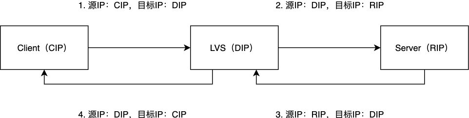
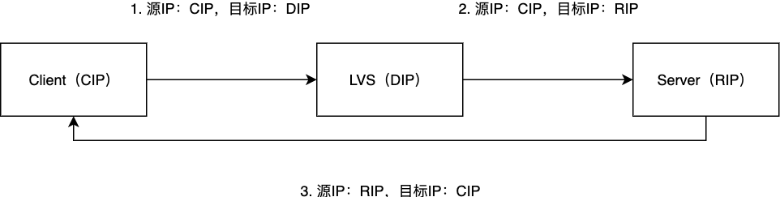
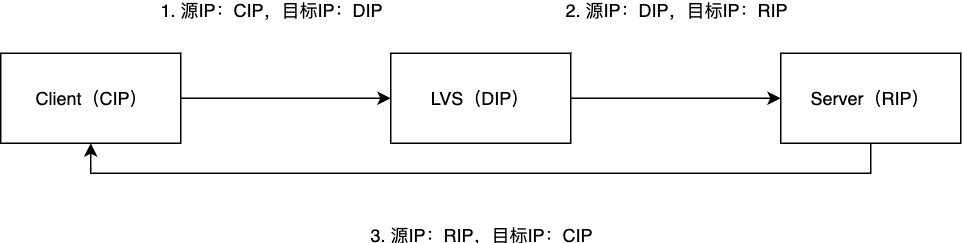

# LVS系统

LVS是采用IP层负载均衡技术的硬件设备。

## 部署模式

### LVS/NAT

LVS/NAT模式下LVS设备会把客户端的请求转发给后端服务器，服务器响应后数据包会先回到LVS，LVS再把数据包返回给客户端。该模式的缺点是由于出口流量也要通过LVS设备，LVS的带宽有可能成为瓶颈。

### LVS/DR

LVS/DR模式下，当LVS设备把请求转发给后端服务器时，会保留源IP为客户端的IP地址，后端服务器响应后根据客户端的IP直接返回客户端，不经过LVS。该模式的缺点是LVS设备和后端服务器必须处在一个局域网中。

### LVS/TUN

LVS/TUN模式下后端服务器也是直接把响应返回给客户端，不经过LVS，它和LVS/DR模式的区别是LVS设备不会修改源IP，而是把客户端的IP和后端服务器的IP再封装一层发送给后端服务器，后端服务器再对数据包进行解析得到真正的源IP。该模式的缺点是后端服务器必须支持隧道传输协议从而可以提取出真正的IP地址。

