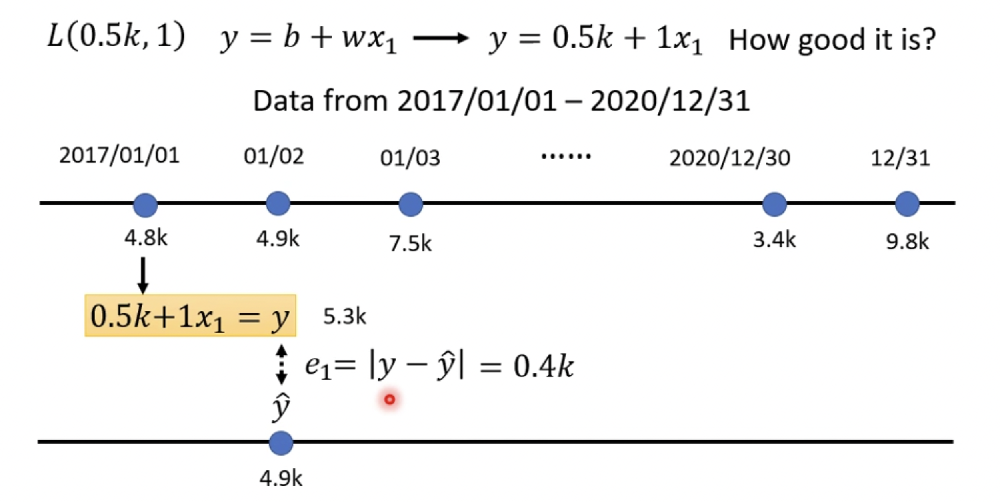
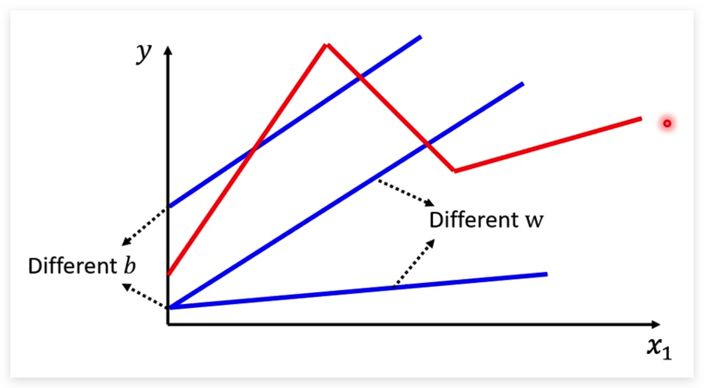

# 概念

## 机器学习

机器学习的目的是自动寻找一个适合的函数来解决某个特定问题。深度学习是机器学习的一种方式。

函数的输入可以是一个向量、矩阵、序列，输出可以是一个数字（regression）、类别（classification）或者其他形式的数据（比如文档、图形）。
根据输入和输出的类型可以对这些函数进行分类：

- Regression
输出一个数字。例如通过过去几天的气温数值预测明天的气温。
- Classification
从给定的几个选项中输出一个选项。例如判断一个邮件是不是垃圾邮件，函数输出一个布尔值。
- Structed Learning
输出结构化的数据，例如文档、图形。例如让机器产出一篇文章。

- Supervised Learning
- Self-supervised Learning
- Unsupervised Learning
- Reinforcement Learning
- Meta Learning：学习如何学习。

## 机器学习的步骤

### 建模

在进行机器学习时首先需要对问题进行建模，即寻找一个可能的公式。例如，通过历史的视频点击量来预测第二天的点击量，我们可以寻找如下的公式：

> $y = b + wx_1$

这样的一个公式也可以称为`Model`，它仅仅是我们猜想的一种可能满足上述场景的公式，当然也可以存在其他形式的公式。公式中的x1表示上一天的视频点击量，y表示下一天的视频点击量。
公式中的已知参数称为`Feature`，如上述公式中的x1；与`Feature`相乘的未知参数称为`Weight`，如上述公式中的w；没有和`Feature`相乘的未知参数称为`Bias`，如上述公式中的b。

### 定义Loss函数

寻找一个函数L(b,w)，函数的值代表参数b、w的优劣。针对上述模型，假设给定一组参数b、w，通过输入历史的每一天的视频点击量即可以计算出第二天的点击量$y$，再把计算值和实际的点击量$\hat{y}$作比较（比如两者相减后取绝对值），就可以得到这一天的偏差量$e_i$。

> 我们把实际的值称为Label。

Loss：L = 所有数据的偏差值的平均数$\displaystyle\frac{1}{N}\sum_{n=1}e_n$。Loss越大说明参数b、w的效果越差。通过穷举不同的b、w的值，计算所有的L，使得L尽可能的小。

我们可以有多种方法计算每一个数据的偏差值，上述例子用的是相减后取绝对值的方式$|(y-\hat{y})|$，这种方式称为MAE（Mean Absolute Error）；还可以用$(y-\hat{y})^2$的方式，这种方式称为MSE（Mean Square Error）。

### 最优控制

找出一组w、b能使得L最小，满足条件的w、b记为w*、b*。

梯度下降

hyperparameters 

### 线性模型

### 非线性模型

线性模型的问题是y和x的关系总是一条直线，导致x和y的趋势始终保持一致，例如x越大，y总是越大。这并不能满足所有场景的需求，例如在实际情况下x和y可能是这样的关系（下图红色线段所示）：

很显然我们无法用一个线性模型来表示上图中的分段函数。