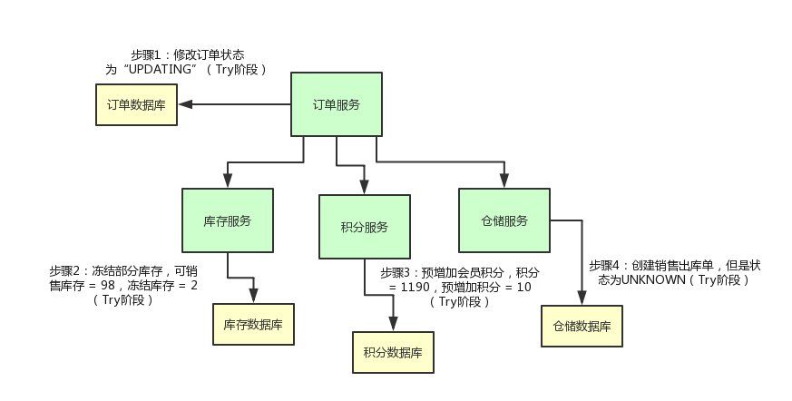
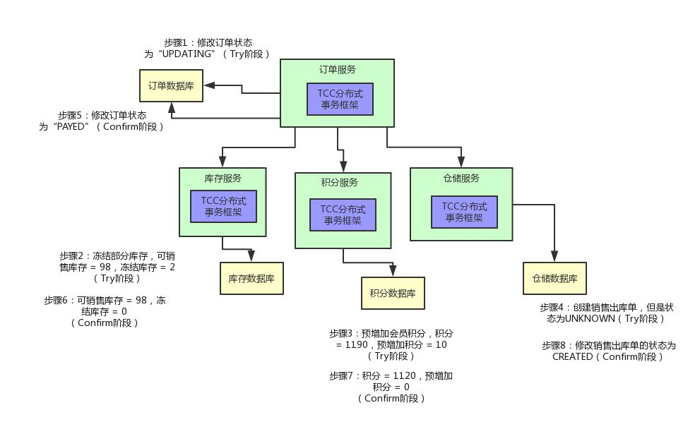

# TCC

TCC（Try-Confirm-Cancel）是一种分布式事务的实现方式，最早由支付宝提出。TCC和2PC很类似，Try-Confirm-Cancel对应2PC中的Prepare-Commit-Rollback，区别是2PC是资源层的（数据库），而TCC是应用层的，我们可以把TCC看成是应用层的2PC。

一个TCC事务中有以下3个步骤。

- Try

尝试执行业务。完成所有业务检查并预留业务所需的资源，在这一步中不会直接执行业务逻辑。

- Confirm

确认执行业务逻辑。这一步会真正执行业务，并且不做任何业务检查，在业务执行过程中只会使用Try步骤中预留的资源。

- Cancel

取消执行业务逻辑。释放Try步骤中预留的资源。

## 业务场景

下面我们来看一个电商系统的场景。在用户支付后我们需要完成以下几个步骤。

1. 订单服务：更改订单的状态为已支付。
2. 库存服务：更新商品库存。
3. 积分服务：给用户增加积分。
4. 仓储服务：创建出库单通知仓库发货。

上述几个步骤，要么都执行，要么都不执行，这就是一个典型的分布式事务。如果我们只是简单的通过订单系统调用其它三个服务的接口，那么只要其中一个接口挂了，就会导致数据不一致，显然不满足需求，下面我们来看看TCC事务是如何应用的。

### 实现Try

首先在TCC的Try阶段，我们不能直接执行业务逻辑，而是要把业务中所需要的资源预留出来并做记录，比如不能直接把订单状态设为已支付，而是设为正在更新；库存服务预留出订单中商品的数量，比如数据库中有一列称为冻结库存；积分服务也不能直接加到用户账号中，也可以在数据库中增加一列预增加积分；仓储服务也类似，可以把出库单状态设置为未知。

### 实现Confirm

如果Try阶段各个服务执行成功，那么接下来就会进入Confirm阶段。每个服务需要完成自己的业务逻辑，比如订单服务需要把订单状态更改为已支付；库存服务需要把冻结的库存从剩余库存中扣去；积分服务需要预增加的积分真正增加到用户账户中；存储服务需要把出库单状态改为已创建。

### 实现Cancel

如果Try阶段有一个服务执行失败，那么接下来会进入Cancel阶段。各个服务需要对之前的操作进行回滚，比如订单服务把订单状态设置为已取消；库存服务把冻结的库存清零；积分服务把预增加的积分清零；仓储服务把出库单状态设为已取消。

## 参考

1. [《TCC事务的学习和理解》](https://blog.souche.com/tccshi-wu-de-xue-xi-he-li-jie/)
2. [《终于有人把“TCC分布式事务”实现原理讲明白了！》](http://developer.51cto.com/art/201811/587425.htm)
3. [《大规模SOA系统中的分布事务处事》](resources/try_confirm_cancel_1.pdf)
