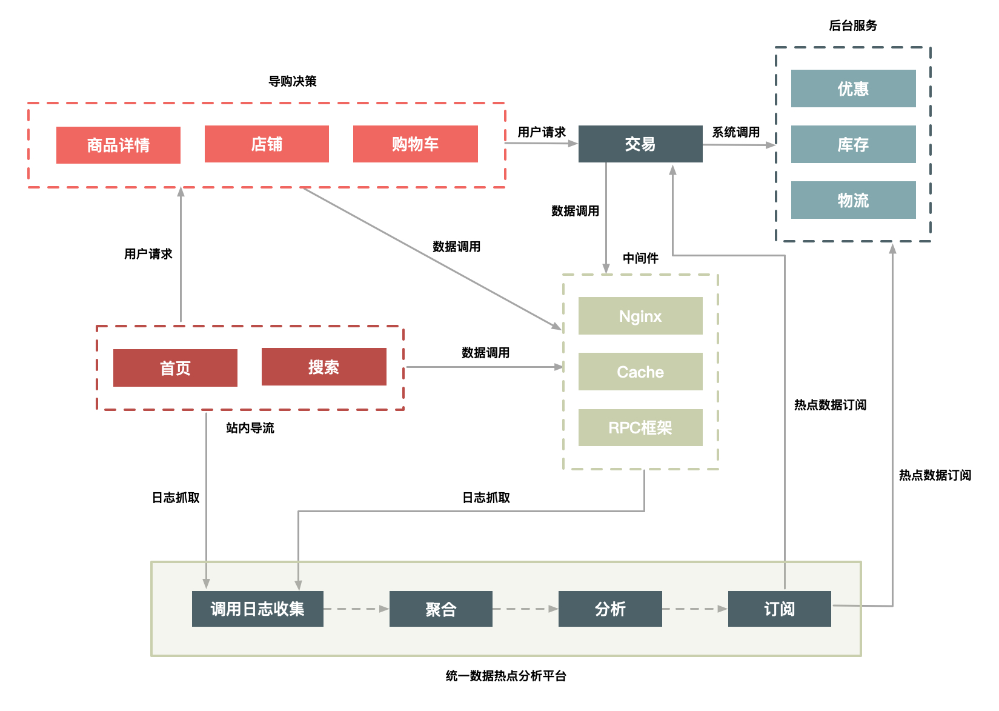
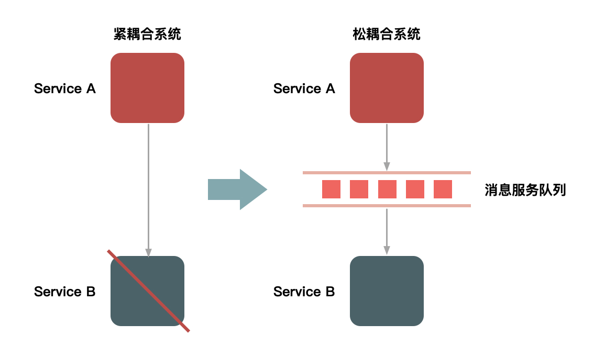

# 秒杀

## 热点商品

秒杀的商品属于热点商品。热点商品又可以分为静态热点商品和动态热点商品，前者是指能够提前预测的商品，后者是指不能提前预测的商品。针对这两种情况我们可以有不同的对策。

### 静态热点商品

针对静态热点商品，我们可以在业务上让卖家提前进行标记，或者通过系统自动计算出卖家商铺中排名最靠前（销量、浏览量）的几件商品，对于这些预先标记的商品我们就可以提交进行缓存。

### 动态热点商品

针对动态热点商品，我们需要构建一个可以自动发现热点商品的系统，大致思路是在上游中间件中（如Nginx）对热点数据进行统计（如Url），然后通知下游服务提前做好应对（如提前进行缓存）。



## 流量削峰

假设下游某个服务每秒只能处理1000个请求，秒杀开始的瞬间上游服务向该下游服务发起了10万个请求，那么一定有大量的连接被阻塞，因为下游服务处理不过来，而此时秒杀活动还在进行，请求不断积压，导致上游服务资源也被耗尽，引起雪崩。

解决方法就是对流量进行削峰，使服务端处理变得更加平稳。最普遍的方法是利用消息队列，上游服务把请求放入消息队列，下游从消息队列中取出请求进行处理，在这里消息队列起到了缓冲的作用。



除了技术上的手段，在业务上也可以利用验证码、答题等方法把请求的时间分散，比如本来10万个请求在1秒内发出，现在变成5秒内发出。

## 下单减库存

秒杀商品的数量通常比较少，因此大部分请求其实是无效的，比如商品总共100件，但是有10万个用户参与秒杀，最多也就100人可以抢到商品，针对这种情况我们可以在上游服务进行拦截，不让这部分流量达到下游的数据层。比如在下单接口中我们可以在Redis中记录一个阈值，每收到一次秒杀请求就自增1，如果达到了一定的阈值就直接返回秒杀结束，如果没有达到阈值就放入消息队列，请求通过消息队列再被下游的服务进行处理。阈值上限必须比商品库存大，以防止写入消息队列失败等情况导致阈值已经到达设定的上限，而商品还没有售完，比如在更新Redis中的阈值后服务发生宕机，因此没有写入消息队列。

### 库存

在更新库存时我们可以同时更新Redis中的库存，这样客户端如果需要显示真实库存数量就可以直接读Redis，减少数据库的压力。

### 超卖

超卖就是卖出的商品数量超过了预先设置的库存数，通过在SQL语句中增加更新条件可以防止超卖。

```sql
UPDATE item SET inventory = inventory - 1 WHERE id = 1 AND inventory >= 1;
```

### 数据一致性

由于下单和减库存操作通常是归属于订单和库存两个服务，因此这里存在一个分布式事务数据一致性的问题，比如减库存操作成功但是订单创建失败，可以参考[TCC](https://github.com/pojozhang/playground/blob/master/problems/architecture/try-confirm-cancel.md)一文解决此类问题。
