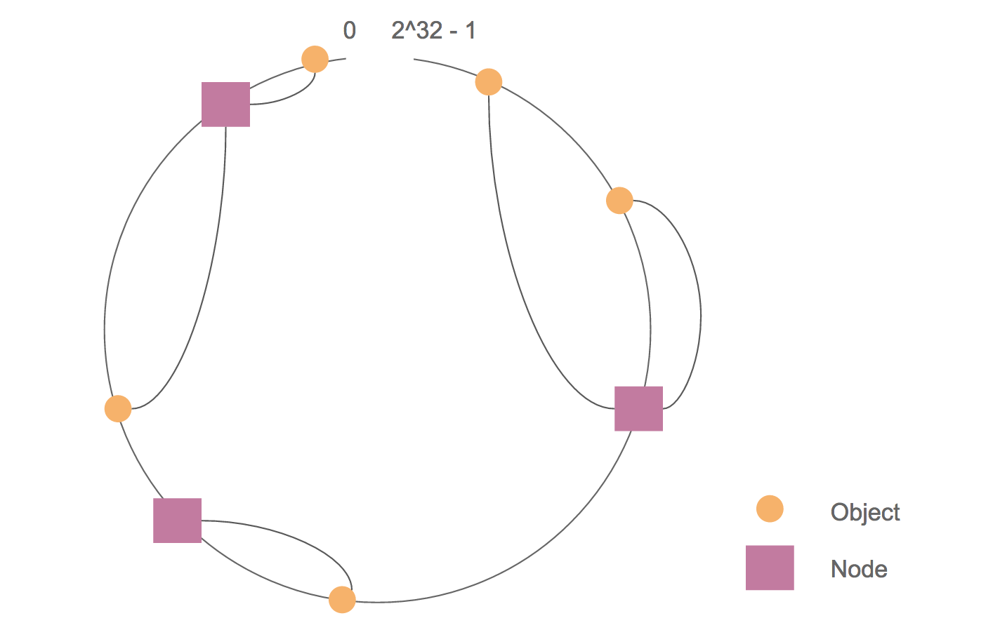
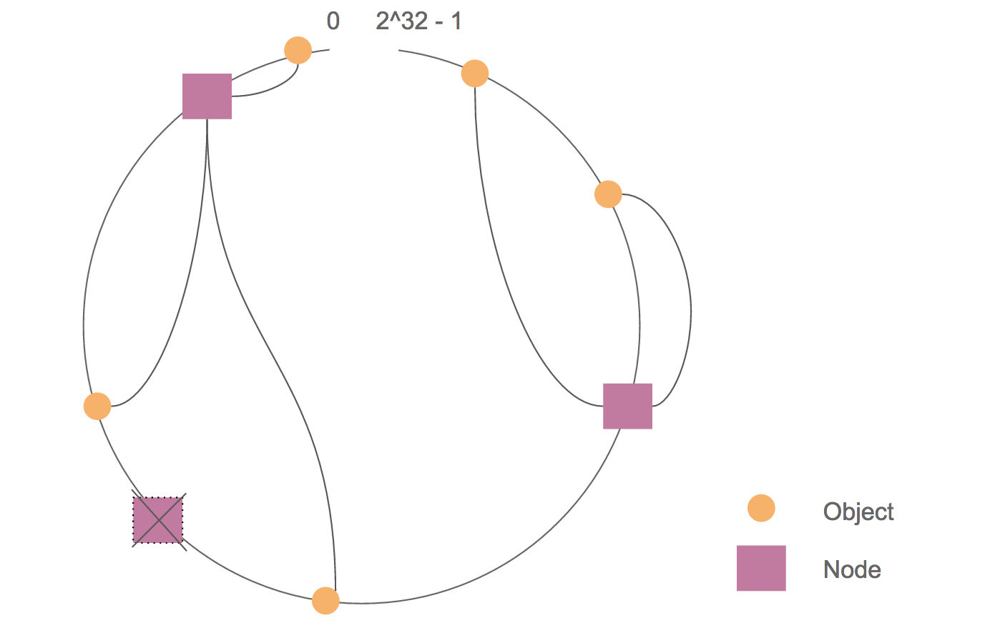
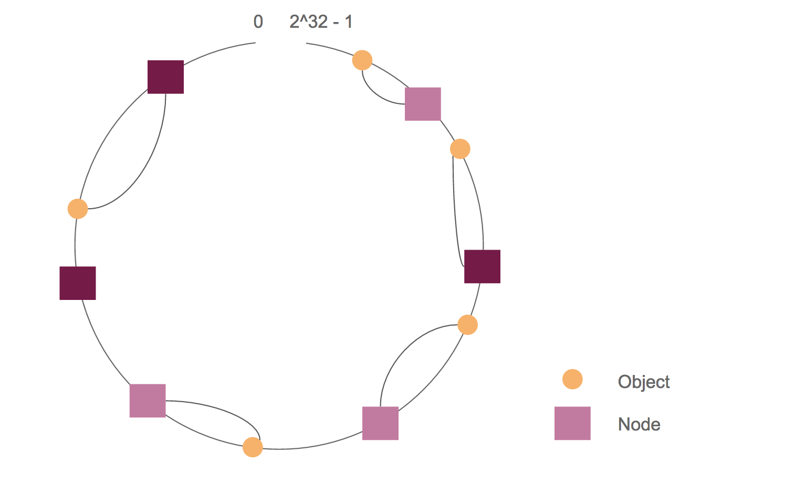

# 一致性哈希

在数据量较大的系统中，单一服务器的性能以及容量都无法支撑庞大的访问量和数据量，通常我们会把数据进行水平拆分，分散地存储在不同的节点中，那么这时我们怎么知道数据存储在哪个节点上呢？

比如现在需要读取一个缓存项，缓存的`key`是`cache_key`，我们需要通过`cache_key`获取对应的值，那么现在我们必须知道`key`是`cache_key`的缓存存储在哪一个节点上，这样我们才能向那台服务器发送请求。

通常的做法是我们会有一个服务器列表`nodeList`，这个列表可以是硬编码在配置中的，也可以是通过某个接口获取的。假设有`A`、`B`、`C`三个节点。我们可以通过以下的公式计算出缓存在哪一个节点上，公式中的`hash`是一个哈希算法，目前比较常用的是MurmurHash算法，相比`MD5`、`SHA-1`等算法速度更快；`N`是节点的数量，这里等于3。

```go
node := nodeList[hash(key) % N]
```

这种方式存在的问题是，一旦节点数量增加或减少了，那么缓存`key`和节点的映射关系就需要改动，这会导致几乎所有的缓存同时失效。

## 原理

一致性哈希解决了以上的问题，其原理如下。

- 每个节点根据IP地址、主机名等属性映射到[0, 2^32 - 1]数值范围内。
- 每个节点同样映射到[0, 2^32 - 1]数值范围内。
- 对于缓存的某个`key`，经过哈希后的值记为`hash(key)`，节点`node`经过哈希后的值记为`hash(node)`，那么`key`对应的缓存项会被存储在满足`hash(node) <= hash(key)`的节点中`hash(node)`最大的那个节点，如果不存在满足`hash(node) <= hash(key)`的节点，那么就找`hash(node)`最小的节点。



我们可以把[0, 2^32 - 1]数值范围看成一个环，逆时针方向从0增大到2^32-1，数据和节点分为位于经过哈希计算后的位置。由于我们要找到满足`hash(node) <= hash(key)`的节点中`hash(node)`最大的那个节点，因此需要顺时针找最近的一个节点。

当一个节点宕机或被删除时，该节点上的数据会被重新哈希到相邻节点上，其它的节点则不受影响。



同样的道理，当新增一个节点时，也只需相邻节点上的部分数据需要重新哈希到新的节点上，其它的节点不受影响。


## 虚节点

由于哈希算法得到的值分布并不均匀，因此我们很有可能得到类似下图中的布局。


其结果会导致节点间负载不均衡。我们可以通过引入虚节点来解决这个问题。
虚节点就是在物理节点上虚拟出来的节点，一个物理节点可以有多个虚节点，如下图中有2个物理节点，每个节点有3个虚节点（2种不同的颜色），虚拟节点越多，节点在整个环上的分布就越均匀。



## 参考

1. [《理解Consistent Hashing》](http://wsfdl.com/algorithm/2017/01/28/%E7%90%86%E8%A7%A3%E4%B8%80%E8%87%B4%E6%80%A7%E5%93%88%E5%B8%8C.html)
2. [《Consistent Hashing: Algorithmic Tradeoffs》](https://medium.com/@dgryski/consistent-hashing-algorithmic-tradeoffs-ef6b8e2fcae8)
