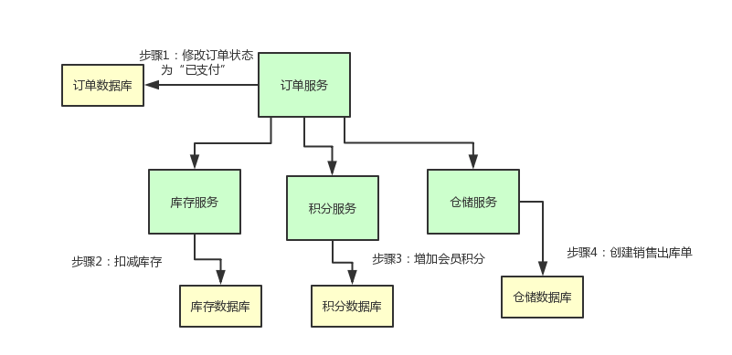
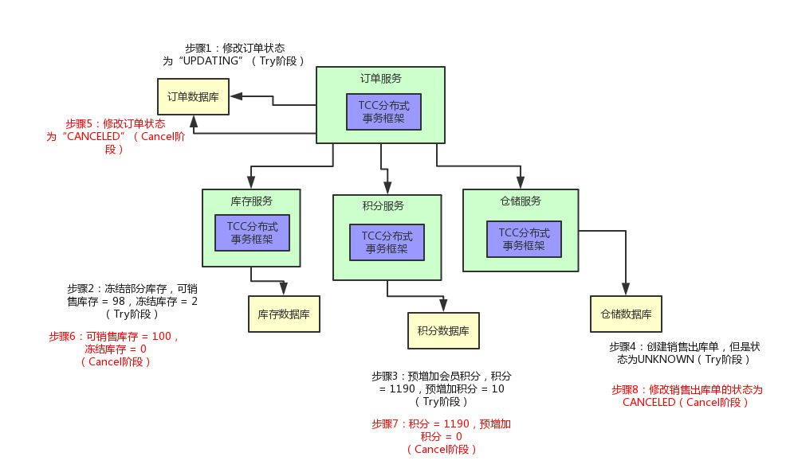
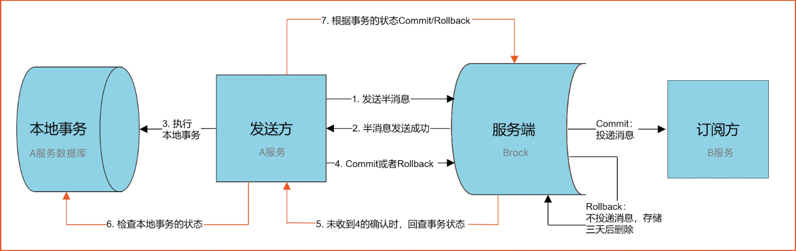

# 分布式事务

## TCC

TCC（Try-Confirm-Cancel）是一种分布式事务的实现方式。TCC和2PC非常类似，Try-Confirm-Cancel对应2PC中的Prepare-Commit-Rollback，区别是2PC是资源层的（数据库），而TCC是应用层的，我们可以把TCC看成是应用层的2PC。

一个TCC事务中有以下3个步骤（对一个业务功能来说相当于三个接口）。

- Try

尝试执行业务。完成所有业务检查并预留业务所需的资源，在这一步中不会直接执行业务逻辑。

- Confirm

确认执行业务逻辑。这一步会真正执行业务，并且不做任何业务检查，在业务执行过程中只会使用Try步骤中预留的资源。

- Cancel

取消执行业务逻辑。释放Try步骤中预留的资源。

### 业务场景

下面我们来看一个电商系统的场景。在用户支付后我们需要完成以下几个步骤。

1. 订单服务：更改订单的状态为已支付。
2. 库存服务：更新商品库存。
3. 积分服务：给用户增加积分。
4. 仓储服务：创建出库单通知仓库发货。

上述几个步骤，要么都执行，要么都不执行，这就是一个典型的分布式事务。如果我们只是简单的通过订单系统调用其它三个服务的接口，那么只要其中一个接口挂了，就会导致数据不一致，显然不满足需求。

下面我们来看看TCC事务是如何应用的。

#### 实现Try

首先在TCC的Try阶段，我们不能直接执行业务逻辑，而是要把业务中所需要的资源预留出来并做记录，比如不能直接把订单状态设为已支付，而是设为正在更新；库存服务预留出订单中商品的数量，比如数据库中有一列称为冻结库存；积分服务也不能直接加到用户账号中，也可以在数据库中增加一列预增加积分；仓储服务也类似，可以把出库单状态设置为未知。

#### 实现Confirm

如果Try阶段各个服务执行成功，那么接下来就会进入Confirm阶段。每个服务需要完成自己的业务逻辑，比如订单服务需要把订单状态更改为已支付；库存服务需要把冻结的库存从剩余库存中扣去；积分服务需要预增加的积分真正增加到用户账户中；存储服务需要把出库单状态改为已创建。

#### 实现Cancel

如果Try阶段有一个服务执行失败，那么接下来会进入Cancel阶段。各个服务需要对之前的操作进行回滚，比如订单服务把订单状态设置为已取消；库存服务把冻结的库存清零；积分服务把预增加的积分清零；仓储服务把出库单状态设为已取消。

#### 幂等

在实际场景中，不可能保证上述的几个步骤一定能执行成功，比如在调用下游服务的Confirm接口时因为网络原因导致请求超时，这个时候我们就无法确定事务的状态，可能执行成功，也可能下游服务根本没有收到请求，这个时候调用方就需要不断进行重试，直到调用成功。因此**下游服务的接口必须保证幂等性**，保证一次请求和多次请求的结果是一致的。

## 事务消息

该方案是利用消息队列（例如：RocketMQ）的特性来实现分布式事务。事务消息和普通消息的区别是：普通消息发送成功后立刻就被消费者消费；事务消息发送成功后，消息处于半提交状态，不会立刻被消费者消费，直到发送方进行二次确认。

通过事务消息实现分布式事务的流程如下：

1. 事务发起者发送事务消息到消息队列。
2. 消息队列把消息持久化并返回ACK给事务发起者，此时消息为半提交状态。如果ACK发送失败，那么事务发起者取消本地事务。
3. 事务发起者根据是否收到ACK结果分别进行操作。
   - 收到ACK，事务发起者执行本地事务，并对事务消息进行二次确认。
   - 未收到ACK，事务发起者应取消本地事务。
4. 消息队列根据二次确认的结果进行操作。
   - 二次确认是提交，那么投递事务消息。
   - 二次确认是回滚，那么删除事务消息。
   - 未收到二次确认，消息队列会向事务发起者查询事务执行的结果再次发起对事务消息的二次确认。
5. 下游消费者收到事务消息后执行各自的本地事务。
   - 本地事务执行成功，向消息队列返回ACK。
   - 本地事务执行失败，消息队列重新投递消息进行重试。
   - 结果未知（例如：ACK丢失、消费超时），消息队列重新投递消息进行重试。

上述一些步骤存在消息重新投递的情况，因此需要保证业务操作具备幂等性。

## 本地消息表

该方案需要在事务发起方维护一张消息表，对业务表的操作和对消息表的操作需要在同一个事务内进行以保证原子性，再通过定时任务将消息表中的消息投递到下游消费者。

通过本地消息表实现分布式事务的流程如下：

1. 事务发起者执行本地事务，并在同一个事务中持久化本地消息表记录。
2. 定时任务扫描待发送的本地消息，将其发送到消息队列。
   - 发送成功，则标记为已发送。
   - 发送失败，重试直到发送成功。
3. 消息队列投递消息到下游消费者。
4. 消费者收到消息后执行本地事务。
   - 事务执行成功，向消息队列返回ACK。
   - 事务执行失败，消息队列重新投递消息进行重试。
   - 结果未知（例如：ACK丢失、消费超时），消息队列重新投递消息进行重试。

## 参考

1. [《TCC事务的学习和理解》](https://blog.souche.com/tccshi-wu-de-xue-xi-he-li-jie/)
2. [《终于有人把“TCC分布式事务”实现原理讲明白了！》](http://developer.51cto.com/art/201811/587425.htm)
3. [《大规模SOA系统中的分布事务处事》](resources/try_confirm_cancel_1.pdf)
