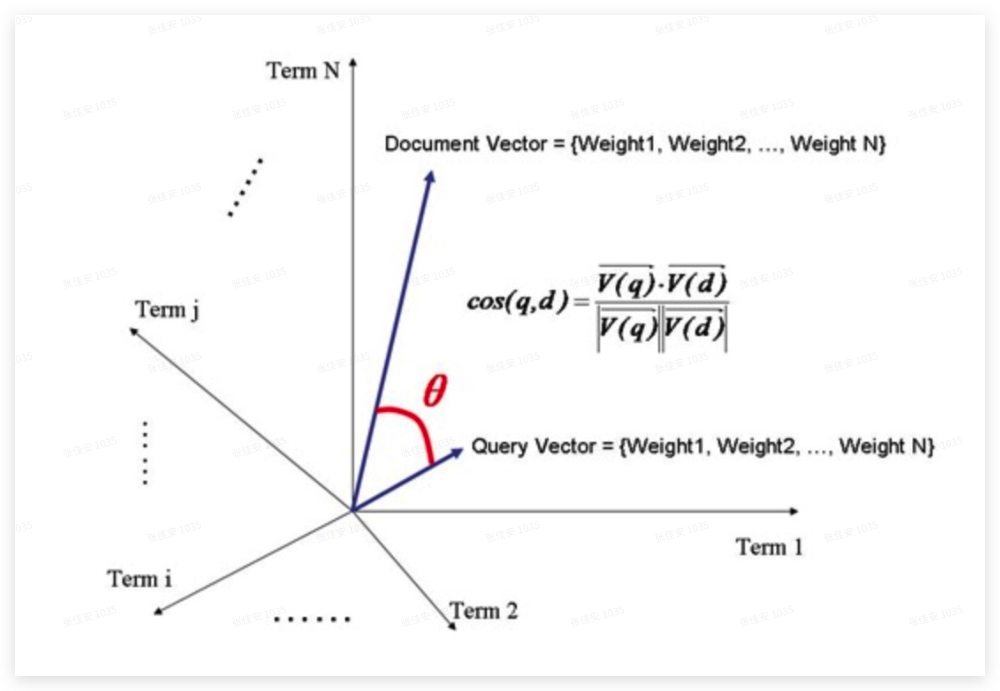

# 倒排索引

倒排索引是指通过文档内容找到文档ID，相对应的正排索引是指通过文档ID找到文档内容。

例如以下的文档，记录了一些人的名字和年龄：

| 文档ID | 名字  | 年龄 |
|--------|-------|------|
| 1      | Peter | 16   |
| 2      | Peter | 12   |
| 3      | Sara  | 12   |
| 4      | Jack  | 28   |

对上面的文档建立索引后会得到如下的倒排索引：

| 名字  | 文档ID |
|-------|--------|
| Peter | [1, 2] |
| Sara  | 3      |
| Jack  | 4      |

| 年龄 | 文档ID |
|------|--------|
| 16   | 1      |
| 12   | [2, 3] |
| 28   | 4      |

可以看到Elasticsearch会对文档中的每个字段建立一个倒排索引，当然在使用时我们可以指定字段是否需要被索引，没有索引的字段无法被搜索。

倒排索引包含以下两个部分：

1. 单词词典
记录了文档中的所有词汇（Term）以及词汇到倒排列表的关联关系。
2. 倒排列表
记录了词汇对应的倒排索引的集合，每一项倒排索引包含了文档ID、词频、词汇位置、词汇偏移量等信息。

## 创建索引

为一个文档创建索引有以下几个步骤：

1. 分词

把原始文档交给分词器进行分词，分词后得到的一个个单词称为词元（Token）。

- 把原始文档划分成一个个独立的单词。
- 去除标点符号。
- 去除停词（stop word）。停词指一些常见的、没有特殊含义的词，在英语语境下有“the、a、this、that”等。

2. 转换

分词完成后的词元交给语言处理组件进行一些语言相关的处理，处理完成后的结果称为词（Term）。

- 转为小写。
- 将单词转变为词根形式，这里又可以分成2步：1是把单词复数形式转为单数形式，称为stemming；2是形态的转换，例如过去时专成一般现在时、“am、is、are”转为“be”，这一步称为lemmatization。

3. 建立索引

为经过分词、转换处理后的词建立倒排索引，即记录每一个词所在的文档ID、词频、位置等信息。

## 相关性计算

在查询时，需要把于查询语句相关性越高的文档排在最前面，否则可能会查询到一些看似相关实则无关的文档，例如想在微软找一份工作，于是查询“Microsoft job”，结果排在前面的文档都是“Microsoft does a good job at software industry”。

ES通过一种叫做[向量空间模型VSM](https://blog.csdn.net/weixin_42398658/article/details/85063004)的算法计算词和文档的相关性。

1. 计算权重

影响一个词在一篇文档中的重要性主要有两个因素：

- Term Frequency (tf)：词在文档中出现了多少次，出现的越多说明词越重要，说明词是这篇文档的重点。
- Document Frequency (df)：有多少文档包含该词，文档越多说明词越不重要。这是因为包含词的文档越多说明词越普遍，比如“the、this”。

一个计算词在文档中的权重的典型公式是：

$w_t,_d = tf_t,_d * \log(n/df_t)$

- $w_t,_d$：词t在文档d中的权重。
- $tf_t,_d$：词t在文档d中出现的次数。
- $n$：文档总数。
- $df_t$：包含词t的文档的数量。

以上公式在不同的全文检索系统中并不一致，在此仅作参考。

2. 计算词和文档的相关性

我们把一篇文档看成是一个词的集合，即Document = { $t_1, t_2, ..., t_n$ }，该文档中每个词以及它的权重关系构成n维的向量$w_1,w_2, ..., w_n$（$t_k的权重记为w_k$），每个词对应一根坐标轴。

这些向量构成文档的向量Document Vector = { $w_1,w_2, ..., w_n$ }，其中每个$w_k$就是一个数字，例如 ( $x$, $y$, $z$ ) = ( 1, 2, 3 ) 代表3维坐标系上的一个点，那么 ( $w_1$, $w_2$, ..., $w_n$ ) 就是n维坐标系上的一个点。把查询的文本也看成是一个文档，同样也可以得到向量Query Vector = { $w_1,w_2 ,..., w_n$ }。

通过判断两个向量夹角的大小来判断词和文档的相关性，即夹角越大则相关性越低；夹角越小则相关性越高。
