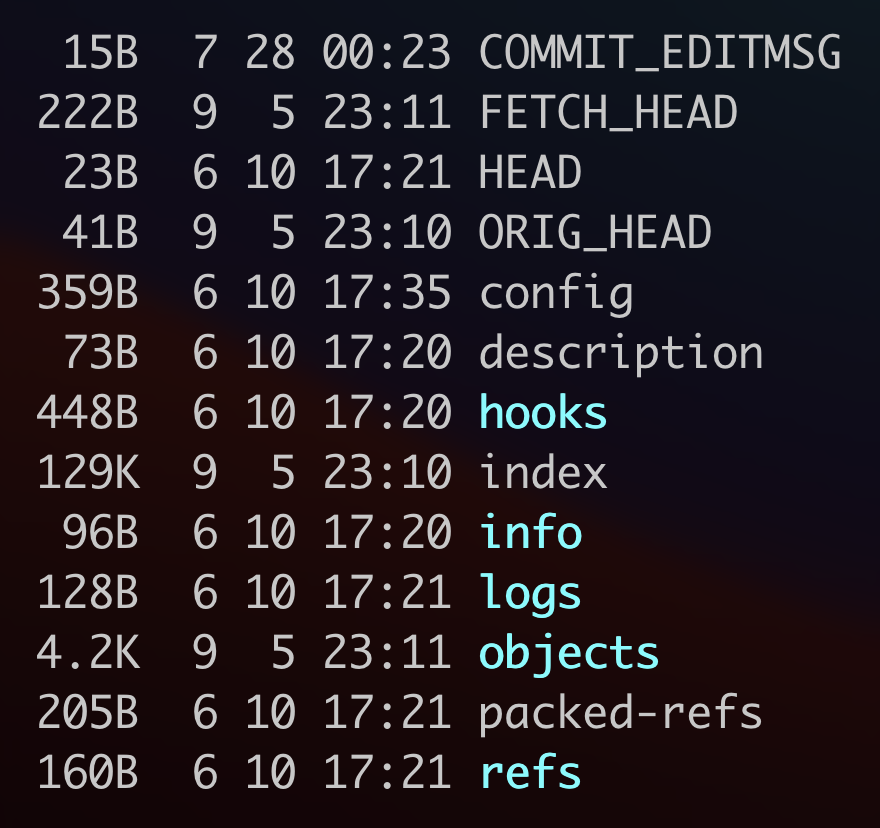
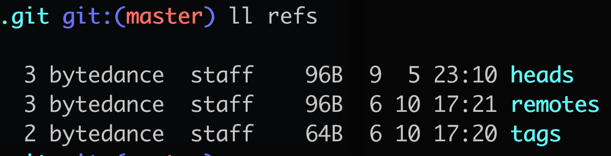
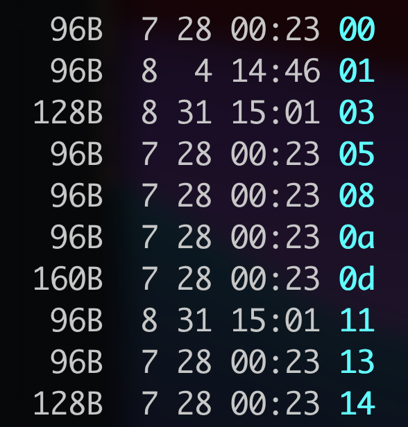

# .git

## 目录结构



- HEAD

文本文件，记录了当前工作分支，例如`ref: refs/heads/master`。当执行`checkout`命令切换分支时其实就是修改HEAD文件的内容。

- config

文本文件，记录了当前仓库的配置信息。

```ini
[core]
	repositoryformatversion = 0
	filemode = true
	bare = false
	logallrefupdates = true
	ignorecase = true
	precomposeunicode = true
[remote "origin"]
	url = git@github.com:pojozhang/playground.git
	fetch = +refs/heads/*:refs/remotes/origin/*
[branch "master"]
	remote = origin
	merge = refs/heads/master
[user]
	name = tony
	email = pojo.zhang@gmail.com
```

- refs

目录，通过多级目录的方式记录了各个分支、标签指向的commit。



上面的HEAD文件中`ref: refs/heads/master`其实就是指向refs目录中的一个文件，比如这里`refs/heads/master`文件中存储的值是`2ffb2fcee2dd4d74e69e88c0ae0c97e509e9967d`，通过以下命令可以查看该哈希值所指的对象的类型。

```bash
git cat-file -t 2ffb2fcee2dd4d74e69e88c0ae0c97e509e9967d #这里实际上不需要输入完整的哈希值，只要git可以唯一识别到一个对象即可
commit
```

可以看到哈希值指向的是一个commit。

- objects

文件目录，用来存储git中的所有对象。在进入后可以看到很多由2个字符组成的子目录：



我们任意选择一个目录`e8`进入后，可以看到一个文件名疑似是一个哈希值的文件。


把`e8`和该文件名拼接后用以下命令查看它的类型。

```bash
git cat-file -t e86c5040d2198357c624f6881498b85ad63b22cc
tree
```

可以看到是一棵树。

## Commit/Tree/Blob

Git中有三种对象：commit、tree和blob。commit就是一次提交，一个commit会关联一颗树，这个树记录了提交时所有文件的一个快照，除此之外，树也表示一个目录。blob对象保存了文件的内容，在Git中，只要文件内容一致，那么就是同一个blob，即使文件名不同只要内容相同就是同一个blob。实际上我们可以发现文件名是存在tree对象中的。


