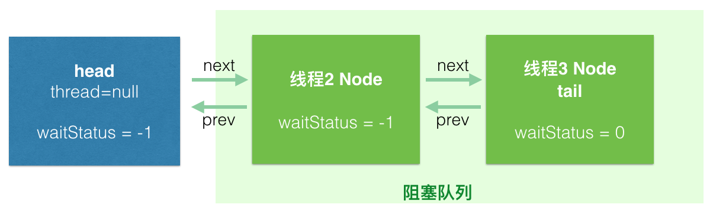

# AQS


`AQS`是队列同步器`AbstractQueuedSynchronizer`类的缩写，它本身是一个抽象类，提供了一种框架来实现锁（如`ReentrantLock`、`ReentrantReadWriteLock`）和同步器（如`Semaphore`、`CountDownLatch`）。

`AbstractQueuedSynchronizer`类主要有以下几个字段。

```java
private volatile int state;
private transient volatile Node head;
private transient volatile Node tail;
```

`state`字段的值如果大于0表示锁已经被占用，等于0则表示锁未被占用。`head`和`tail`分别指向一个双向链表的首尾节点，这个双向链表的功能是作为线程等待队列，当锁已经被占用时，获取锁失败的线程就会被插入到队列的末尾，在代码实现上`head`是一个空节点。



队列中的每个节点代表一个线程，其数据结构如下所示。

```java
// java.util.concurrent.locks.AbstractQueuedSynchronizer.Node
static final class Node {

    // 线程的等待状态，初始值为0。
    volatile int waitStatus;

    // 前驱节点。
    volatile Node prev;

    // 后继节点。
    volatile Node next;

    // 指向线程。
    volatile Thread thread;

    // 指向下一个等待条件的节点或表示模式：排他或共享模式。
    Node nextWaiter;
}
```

`AQS`支持两种模式：排他模式和共享模式。排他模式是指一次只有一个线程能获得锁，也就是互斥，比如`ReentrantLock`。在另一个场景中，锁也可以被多个线程同时获取，比如读写锁的读锁可以同时被多个线程获取，这个时候就会用到`AQS`的共享模式。

## 排他模式

### 排他模式下锁的获取

调用`acquire()`方法获取互斥锁。

```java
public final void acquire(int arg) {
    if (!tryAcquire(arg) &&
        // EXCLUSIVE是Node类的一个静态变量，表示排他模式。
        acquireQueued(addWaiter(Node.EXCLUSIVE), arg))
        // 如果获取锁失败并且需要被中断，那么就中断当前线程。
        selfInterrupt();
}
```

线程首先会调用`tryAcquire()`方法获取锁，该方法需要子类自己实现，这里用到了模板方法的设计模式。如果方法返回`true`就表示成功拿到锁，由于`&&`短路的原理后面的条件就不用执行了；如果没有拿到锁那么就调用`addWaiter()`方法创建一个代表当前线程的`Node`对象并放到队列的末尾。

```java
private Node addWaiter(Node mode) {
    // 把选择的模式重新封装成一个Node对象。
    // 参数mode赋值给nextWaiter字段。
    // 构造方法中会通过线程的静态方法Thread.currentThread()把当前线程的引用绑定到thread字段上。
    Node node = new Node(mode);

    for (;;) {
        Node oldTail = tail;
        if (oldTail != null) {
            // 把node插入到队列末尾，使用CAS更新tail。
            // 如果更新失败就继续循环，直到成功。
            node.setPrevRelaxed(oldTail);
            if (compareAndSetTail(oldTail, node)) {
                oldTail.next = node;
                return node;
            }
        } else {
            // 如果tail是null，那么需要初始化队列。
            initializeSyncQueue();
        }
    }
}

private final void initializeSyncQueue() {
    Node h;
    // 初始化head和tail为空节点。
    // 这里对head和tail的更新并不是原子操作，CAS操作只能原子地更新head，而不能同时更新head和tail。
    // 因此在外层代码中需要在死循环中判断tail是否为null，如果为null，则表示还没有初始化完成。
    if (HEAD.compareAndSet(this, null, (h = new Node())))
        tail = h;
}

// addWaiter()中用到的构造方法。
Node(Node nextWaiter) {
    this.nextWaiter = nextWaiter;
    THREAD.set(this, Thread.currentThread());
}
```

当添加完节点后，再调用`acquireQueued()`方法，如果节点的前驱节点是`head`节点，那么当前线程会进行自旋再次尝试拿锁，因为在节点加入到队列的这段时间锁可能已经被释放。

```java
final boolean acquireQueued(final Node node, int arg) {
    boolean interrupted = false;
    try {
        for (;;) {
            // p是前驱节点。
            final Node p = node.predecessor();
            // 如果p是队列的首节点，那么就再次尝试获得锁。
            if (p == head && tryAcquire(arg)) {
                // 如果成功拿到了锁，那么就把head指向当前线程的节点。
                setHead(node);
                p.next = null;
                return interrupted;
            }
            // 判断线程是否应该被挂起。
            if (shouldParkAfterFailedAcquire(p, node))
                // 挂起线程。
                // 当线程被唤醒时才会进入下一次的循环。
                interrupted |= parkAndCheckInterrupt();
        }
    } catch (Throwable t) {
        cancelAcquire(node);
        if (interrupted)
            selfInterrupt();
        throw t;
    }
}

// 更新head。
private void setHead(Node node) {
    head = node;
    node.thread = null;
    node.prev = null;
}
```

如果自旋失败了，那么调用`shouldParkAfterFailedAcquire()`方法判断是否需要挂起当前线程，该方法主要是以节点的`waitStatus`字段为依据进行判断，除了刚加入队列时的初始值0以外，还有以下几种取值情况。

```java
// 线程超时或被中断。
static final int CANCELLED =  1;
// 当节点状态是SIGNAL时，当后续节点加入队列时需要把后续节点的线程挂起，解锁时需要把后续节点的线程唤醒。
static final int SIGNAL    = -1;
// 线程正在等待条件。
static final int CONDITION = -2;
// 状态需要向后传播。
static final int PROPAGATE = -3;
```

只有当前驱节点的等待状态是SIGNAL时才需要挂起当前线程。

```java
private static boolean shouldParkAfterFailedAcquire(Node pred, Node node) {
    int ws = pred.waitStatus;
    // 如果前驱节点的等待状态是SIGNAL，那么需要挂起当前线程。
    if (ws == Node.SIGNAL)
        return true;
    // waitStatus大于0说明节点被取消了，那么就把它从队列中移除。
    if (ws > 0) {
        // 移除队列中所有被取消的节点。
        do {
            node.prev = pred = pred.prev;
        } while (pred.waitStatus > 0);
        pred.next = node;
    } else {
        // 修改前驱节点的waitStatus为SIGNAL，使得下次判断时把当前节点的线程挂起。
        pred.compareAndSetWaitStatus(ws, Node.SIGNAL);
    }
    return false;
}
```

调用`LockSupport.park()`方法挂起线程。

```java
private final boolean parkAndCheckInterrupt() {
    // 挂起线程，保持阻塞直到调用LockSupport.unpark()或线程被中断。
    LockSupport.park(this);
    return Thread.interrupted();
}
```

关于`LockSupport`，我写了一个简单的例子展示它的用法。

```java
public static void main(String[] args) {
    Object blocker = new Object();
    Thread thread = new Thread(() -> {
        LockSupport.park(blocker);
        System.out.println(Thread.currentThread().isInterrupted());
    });
    thread.start();

    // 情况一：thread会打印false，说明线程没有被中断。
    LockSupport.unpark(thread);
    // 情况二：thread会打印true，说明线程被中断。
    thread.interrupt();
    // 情况三：thread会阻塞在LockSupport.park(blocker)。
    thread.join();
}
```

### 排他模式下锁的释放

调用`release()`方法释放互斥锁。`tryRelease()`方法同样需要子类自己实现，当`tryRelease()`返回`true`时表示解锁成功，此时需要唤醒后续节点的线程。

```java
public final boolean release(int arg) {
    if (tryRelease(arg)) {
        Node h = head;
        if (h != null && h.waitStatus != 0)
            // 唤醒后续节点。
            unparkSuccessor(h);
        return true;
    }
    return false;
}

private void unparkSuccessor(Node node) {
    int ws = node.waitStatus;
    if (ws < 0)
        node.compareAndSetWaitStatus(ws, 0);

    // 找到第一个waitStatus小于等于0的节点。
    Node s = node.next;
    if (s == null || s.waitStatus > 0) {
        s = null;
        for (Node p = tail; p != node && p != null; p = p.prev)
            if (p.waitStatus <= 0)
                s = p;
    }
    // 唤醒节点对应的线程。
    if (s != null)
        LockSupport.unpark(s.thread);
}
```

## 共享模式

### 共享模式下锁的获取

调用`acquireShared()`方法获取共享锁。这里同样用到了模板方法的设计模式，子类需要自己实现`tryAcquireShared()`方法。

```java
public final void acquireShared(int arg) {
    if (tryAcquireShared(arg) < 0)
        doAcquireShared(arg);
}
```

如果`tryAcquireShared()`方法返回值大于等于0，说明成功获取锁，否则继续调用`doAcquireShared()`方法。

```java
private void doAcquireShared(int arg) {
    // addWaiter的逻辑和排他模式中是一样的，为当前线程创建一个对应的Node对象，并放到队列的末尾。
    // Node.SHARED表示节点是共享模式。
    final Node node = addWaiter(Node.SHARED);
    boolean interrupted = false;
    try {
        for (;;) {
            // 变量p是node的前驱节点。
            final Node p = node.predecessor();
            if (p == head) {
                // 如果p是首节点，那么node就是队列中第一个等待获取锁的节点。
                // 再次尝试获取锁。
                int r = tryAcquireShared(arg);
                if (r >= 0) {
                    // 如果成功获取锁，则更新head节点并唤醒后续的节点。
                    // 唤醒的过程是一个递归的过程，当前线程获取锁后，会设置head为当前node，然后唤醒下一个共享模式的节点，下一个节点对应的线程从parkAndCheckInterrupt()方法中恢复后进入下一个循环，它的前驱节点就是当前的node，也正是head节点，因此又会递归的调用setHeadAndPropagate()方法，设置新的head，唤醒下一个共享模式的节点，循环往复下去，唤醒所有连续的共享节点。
                    setHeadAndPropagate(node, r);
                    p.next = null;
                    return;
                }
            }
            // 判断线程是否应该被挂起。
            if (shouldParkAfterFailedAcquire(p, node))
                // 线程进入阻塞状态直到被唤醒。
                interrupted |= parkAndCheckInterrupt();
        }
    } catch (Throwable t) {
        cancelAcquire(node);
        throw t;
    } finally {
        if (interrupted)
            selfInterrupt();
    }
}

// 更新head节点并唤醒后续的节点。
private void setHeadAndPropagate(Node node, int propagate) {
    Node h = head;
    // 设置新的首节点。
    setHead(node);
    if (propagate > 0 || h == null || h.waitStatus < 0 ||
        (h = head) == null || h.waitStatus < 0) {
        Node s = node.next;
        // 唤醒后续的共享模式的节点。
        if (s == null || s.isShared())
            doReleaseShared();
    }
}

private void doReleaseShared() {
    for (;;) {
        Node h = head;
        if (h != null && h != tail) {
            int ws = h.waitStatus;
            // 如果首节点的waitStatus是SIGNAL，尝试用CAS修改waitStatus。
            // 如果更新成功，那么就唤醒后续的节点。
            if (ws == Node.SIGNAL) {
                if (!h.compareAndSetWaitStatus(Node.SIGNAL, 0))
                    continue;
                // 唤醒后续节点。
                unparkSuccessor(h);
            }
            // 如果首节点的waitStatus是0，那么用CAS修改为PROPAGATE。
            // PROPAGATE的值为-3，在setHeadAndPropagate中如果首节点的waitStatus小于0，那么就会唤醒后续节点。
            else if (ws == 0 &&
                        !h.compareAndSetWaitStatus(0, Node.PROPAGATE))
                continue;
        }
        // 如果首节点变了，则继续循环。
        if (h == head)
            break;
    }
}
```

### 共享模式下锁的释放

调用`releaseShared()`方法释放共享锁，子类需要自己实现`tryReleaseShared()`方法。

```java
public final boolean releaseShared(int arg) {
    if (tryReleaseShared(arg)) {
        doReleaseShared();
        return true;
    }
    return false;
}
```

## 参考

1. [《深入学习java同步器AQS》](https://zhuanlan.zhihu.com/p/27134110)
2. [《深入浅出java同步器AQS》](https://www.jianshu.com/p/d8eeb31bee5c)
