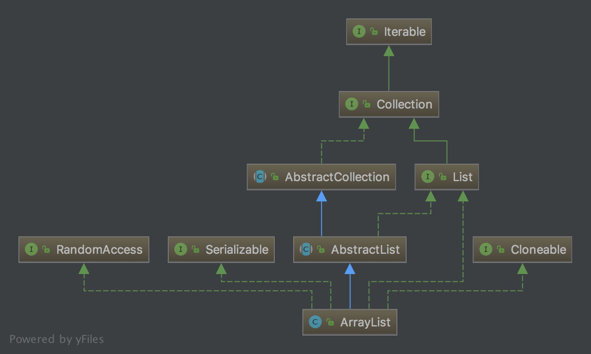

# ArrayList

`ArrayList`是最常用的集合类之一，它实现了`RandomAccess`、`Cloneable`、`Serializable`接口，说明它具备随机访问、可复制、可序列化的功能，通过IDE我们可以看到该类的层次结构如下图所示：



我们知道普通数组缺点的是其大小是固定的，如果数组内的元素变少了或增多了数组的大小并不会随之缩小或扩大，使用的时候不够灵活，`ArrayList`通过在内部动态的调整数组的大小解决了这个问题。

下面我们从构造方法看起，源码出自JDK10。

## ArrayList()

```java
public ArrayList() {
    this.elementData = DEFAULTCAPACITY_EMPTY_ELEMENTDATA;
}
```

这是我们最常用的构造方法，这里的`elementData`就是`ArrayList`用来存储元素的数组，`DEFAULTCAPACITY_EMPTY_ELEMENTDATA`是一个大小为0的空数组，因此该构造方法就是把`elementData`初始化为一个空数组。

```java
private static final Object[] DEFAULTCAPACITY_EMPTY_ELEMENTDATA = {};
transient Object[] elementData;
```

## ArrayList(int)

第二个构造方法和第一个类似，只是可以为数组指定一个初始大小。

```java
public ArrayList(int initialCapacity) {
    if (initialCapacity > 0) {
        this.elementData = new Object[initialCapacity];
    } else if (initialCapacity == 0) {
        this.elementData = EMPTY_ELEMENTDATA;
    } else {
        throw new IllegalArgumentException("Illegal Capacity: "+
                                               initialCapacity);
    }
}
```

## ArrayList(Collection)

第三个构造方法把`Collection`转成数组赋值给`elementData`，如果`Collection`是空集合那么就把`elementData`初始化为空数组。

```java
public ArrayList(Collection<? extends E> c) {
    elementData = c.toArray();
    if ((size = elementData.length) != 0) {
        // 如果类型不是Object[].class就用Arrays.copyOf()转成Object[].class
        // 这其实是为了修复一个久远的bug，https://bugs.openjdk.java.net/browse/JDK-6260652
        // 在Collection接口的文档中写着toArray(new Object[0])和toArray()两个方法是完全一致的，但是在某些情况下，在参数相同的情况下两者返回值的类型却不一样，toArray(new Object[0])总是返回Object[]类型，而toArray()有时候会返回实际类型，如String[]。这段代码修复了这个问题，但由于时间久远，在JDK10中我没能复现这个问题。
        if (elementData.getClass() != Object[].class)
            elementData = Arrays.copyOf(elementData, size, Object[].class);
    } else {
        this.elementData = EMPTY_ELEMENTDATA;
    }
}
```

## add(E)

```java
public boolean add(E e) {
    modCount++;
    add(e, elementData, size);
    return true;
}
```

该方法用于把元素放到列表的末位。其中，`size`是`int`类型的字段，表示当前列表实际的元素个数而 **不是** `elementData`的容量。其内部调用以下方法：

```java
private void add(E e, Object[] elementData, int s) {
    // 当元素个数等于底层数组的长度时调用grow()方法进行扩容。
    if (s == elementData.length)
        elementData = grow();
    elementData[s] = e;
    size = s + 1;
}

private Object[] grow() {
    return grow(size + 1);
}

private Object[] grow(int minCapacity) {
    return elementData = Arrays.copyOf(elementData, newCapacity(minCapacity));
}

private int newCapacity(int minCapacity) {
    // 记录当前容量
    int oldCapacity = elementData.length;
    // 新的容量 = 当前容量 * 150%
    int newCapacity = oldCapacity + (oldCapacity >> 1);
    // 如果新的容量不大于参数所要求的最小容量，
    if (newCapacity - minCapacity <= 0) {
        // 并且elementData是空数组，那么就返回DEFAULT_CAPACITY和minCapacity较大的数，
        // DEFAULT_CAPACITY是值为10的常量，因此当数组为空时，首次扩容后的大小至少是10.
        if (elementData == DEFAULTCAPACITY_EMPTY_ELEMENTDATA)
            return Math.max(DEFAULT_CAPACITY, minCapacity);
        // 如果minCapacity小于0，说明minCapacity值太大导致溢出。
        if (minCapacity < 0)
            throw new OutOfMemoryError();
        return minCapacity;
    }
    // 如果新的容量大于参数所要求的最小容量，
    return (newCapacity - MAX_ARRAY_SIZE <= 0)
        ? newCapacity
        : hugeCapacity(minCapacity);
}
```

## modCount

`modCount`是一个int类型的字段，

## add(int, E)

## remove(Object)