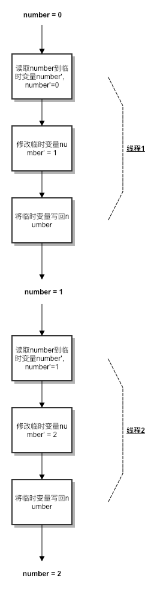
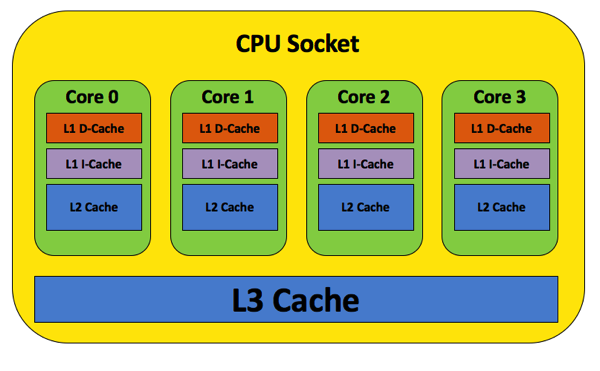
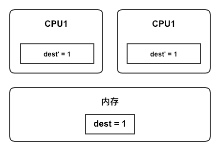
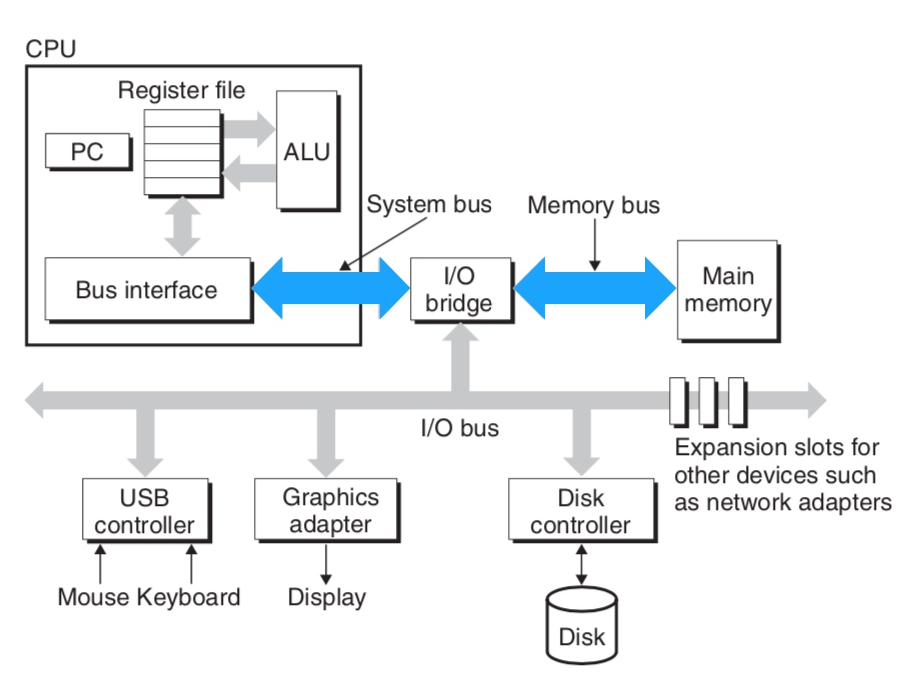
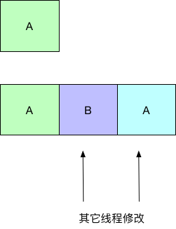

# CAS

CAS，全称CompareAndSwap（或CompareAndSet），即比较并交换，是并发编程中经常用到的一种技术。

## 原理

我们经常在多线程环境下对一个字段进行自增操作，比如以下代码。

```java
public class Test {

    private int number;

    public void inc() {
        number++;
    }
}
```

但是由于自增操作不是一个原子操作，它分为`读取-修改-写回`三个步骤，在多线程环境下就有可能导致这三个步骤互相交错的执行，从而导致结果不正确。比如有两个线程同时执行自增操作，我们期望的执行过程和结果是这样的。



但实际上它有可能是这样的。


由于线程1和线程2的代码交错执行，导致最后的结果不正确。

通常我们可以用`synchronized`和简单的解决这个问题。

```java
public class Test {

    private int number;

    public synchronized void inc() {
        number++;
    }
}
```

但是`synchronized`关键字需要进行加锁操作，效率不高，因此JDK1.5引入了CAS，它不需要加锁，效率更高并且易于使用。

```java
public class Test {

    private AtomicInteger number = new AtomicInteger();

    public void inc() {
        number.incrementAndGet();
    }
}
```

现在我们来看看它是如何实现的。

```java
// java.util.concurrent.atomic.AtomicInteger#incrementAndGet
private static final long VALUE;

public final int incrementAndGet() {
    return U.getAndAddInt(this, VALUE, 1) + 1;
}
```

代码中的`U`是一个`Unsafe`类的实例，之所以叫`Unsafe`是因为它提供了一些比较底层的操作，比如可以直接读写内存地址。

```java
private static final jdk.internal.misc.Unsafe U = jdk.internal.misc.Unsafe.getUnsafe();
```

代码中的`VALUE`是一个`long`型的静态常量，它的值是在静态块中被初始化的。

```java
private static final long VALUE;

static {
    try {
        VALUE = U.objectFieldOffset
            (AtomicInteger.class.getDeclaredField("value"));
    } catch (ReflectiveOperationException e) {
        throw new Error(e);
    }
}
```

方法`jdk.internal.misc.Unsafe#objectFieldOffset`用来获取一个字段相对于对象的起始内存地址的字节偏移量。这里的偏移量是一个相对值，因此对于同一个类型下的不同对象，同一个字段的偏移量是一样的。

下面我们进入`jdk.internal.misc.Unsafe#getAndAddInt`方法。

```java
// jdk.internal.misc.Unsafe#getAndAddInt
public final int getAndAddInt(Object o, long offset, int delta) {
    int v;
    do {
        // jdk.internal.misc.Unsafe#getIntVolatile是一个本地方法，直接从主存中获取对象指定偏移量处的int值。
        // 本例中获取到的是Test对象中number字段的最新值。
        v = getIntVolatile(o, offset);
    } while (!weakCompareAndSetInt(o, offset, v, v + delta));
    return v;
}

public final boolean weakCompareAndSetInt(Object o, long offset,
                                          int expected,
                                          int x) {
    // 调用本地方法jdk.internal.misc.Unsafe#compareAndSetInt。
    return compareAndSetInt(o, offset, expected, x);
}
```

方法`jdk.internal.misc.Unsafe#weakCompareAndSetInt`又调用了一个本地方法`jdk.internal.misc.Unsafe#compareAndSetInt`。

```cpp
// jdk.internal.misc.Unsafe#compareAndSetInt
UNSAFE_ENTRY(jboolean, Unsafe_CompareAndSetInt(JNIEnv *env, jobject unsafe, jobject obj, jlong offset, jint e, jint x)) {
  oop p = JNIHandles::resolve(obj);
  jint* addr = (jint *)index_oop_from_field_offset_long(p, offset);

  return (jint)(Atomic::cmpxchg(x, addr, e)) == e;
} UNSAFE_END
```

主要是通过`Atomic::cmpxchg`这个方法来进行比较和交换，然而这个方法在不同硬件平台下有不同的实现，比如Windows、Solaris在x86上的实现、Linux在ARM上的实现等。

这里我们只看下Linux在x86架构上的实现，你可以在[这里](https://github.com/unofficial-openjdk/openjdk/blob/jdk9/jdk9/hotspot/src/os_cpu/linux_x86/vm/atomic_linux_x86.hpp)找到源码。

```cpp
inline jint Atomic::cmpxchg (jint exchange_value, volatile jint* dest, jint compare_value, cmpxchg_memory_order order) {
  // 判断是不是多处理器环境。
  int mp = os::is_MP();
  // __asm__表示在C++中嵌入汇编语言。
  // volatile表示禁止指令重排序。
  __asm__ volatile (LOCK_IF_MP(%4) "cmpxchgl %1,(%3)"
                    : "=a" (exchange_value)
                    : "r" (exchange_value), "a" (compare_value), "r" (dest), "r" (mp)
                    : "cc", "memory");
  return exchange_value;
}

#define LOCK_IF_MP(mp) "cmp $0, " #mp "; je 1f; lock; 1: "
```

C++中嵌入汇编语言的格式如下。

```x86asm
asm ( assembler template
      : output operands                  /* optional */
      : input operands                   /* optional */
      : list of clobbered registers      /* optional */
    );
```

- template
  模板。本例中的模板是`cmpxchgl %1,(%3)`。`%1`是指第2个操作数，`%3`是指第4个输入操作数。操作数包括输出操作数和输入操作数，编号从`0`开始，按照先输出操作数，后输入操作数的顺序进行编号。
- output operands
  输出操作数。这里是`=a`，对应`eax`寄存器。
- input operands
  输入操作数。按照顺序，第1个是`exchange_value`，第2个是`compare_value`，第3个是`dest`，第4个是`mp`。`r`代表任意寄存器，`a`代表`eax`寄存器。
- list of clobbered registers
  额外的参数。`cc`参数表示编译器`cmpxchgl`的执行将影响到标志寄存器；`memory`参数是让编译器重新从内存中读取变量的值。

`cmpxchgl %1,(%3)`其实就是`cmpxchgl exchange_value,dest`，它的原型是`CMPXCHG <dest>,<src>`。`cmpxchgl`会比较`eax`寄存器中的值和`dest`的值，如果相等那么就把`exchange_value`赋值给`dest`，否则把`dest`的值赋值给`eax`寄存器。通过`"a" (compare_value)`可以知道，`eax`寄存器里的值就是`compare_value`，因此这里就会判断`compare_value`和`dest`的值是否相等，这其实就是汇编层面的CAS操作。

`LOCK_IF_MP`是C++中的宏，它的作用是，如果当前程序运行在一个多核环境中，那么就在`cmpxchgl`指令前加上`lock`指令。

那么为什么这里需要`lock`呢？这要从CPU的缓存说起。

现代的CPU通常会有多个核心，每个核心有独立的L1、L2缓存以及共享的L3缓存。当CPU访问内存时，它会首先查询缓存，如果缓存中存在那么就直接返回，否则从内存中读取并载入到缓存中，最后返回给CPU。



以`cmpxchgl`指令为例，假设有2个核心同时执行，那么每个核心的缓存中都有和内存中`dest`值相同的副本`dest'`，如果两次调用的`compare_value`也一样，那么对于上层来说这两个CAS操作都成功了，但是我们要的是只有一个能成功。



解决方法就是加上`lock`指令，它可以保证在多核心环境下让某个核心独占使用一部分共享内存。
在早期的CPU中是通过锁定总线的方式实现的。总线是CPU和其它组件进行数据传输的通道，当某个核心要锁定总线时，它会发出一个信号，总线仲裁器会以轮流的策略选择一个核心独占，一但某个核心锁定了总线，那么其余的核心就无法在总线上和内存之间进行数据传输，从而达到原子性的目的。这种做法效率较低，真正做到“一核有难，九核围观”。



现代处理器通过缓存一致性协议来实现同样的功能，比如X86使用基于`MESI`协议改进后的`MESIF`协议。其主要思路是每个核心都知道其它核心的缓存状态，当多个核心同时执行`cmpxchgl`指令时，它们都会试图去修改同一内存地址在各自缓存中的副本，这时它们都会向环形总线（Ring Bus）发送消息，让其它核心这部分的缓存失效。环形总线会进行仲裁，决定是哪个核心可以使其它核心的缓存失效，没有被选中的那个核心会让自己的缓存失效，并且读取被选中的核心修改后的值。


## 存在的问题

### A-B-A问题

CAS操作需要先进行对比，然后进行交换，但是如果一个值从A变成B又立刻变回A那么就有可能存在问题。



通常的解决方法是增加一个版本号，每次值变化都要更新版本号，并且在对比时也要对比版本号。


Java中可以使用`java.util.concurrent.atomic.AtomicStampedReference`类解决。
**对于一般的场景，CAS是CPU执行的原子操作，因此通常不必担心会遇到A-B-A的问题。**

### CPU负载问题

在高并发环境下，由于CAS操作不断的自旋，可能会引起CPU负载过高。

## 参考

1. [《Java CAS底层实现详解》](https://www.jianshu.com/p/0e312402f6ca)
2. [《Java CAS 原理剖析》](https://juejin.im/post/5a73cbbff265da4e807783f5)
3. [《Java CAS 原理分析》](https://segmentfault.com/a/1190000014858404)
4. [《浅论Lock 与X86 Cache 一致性》](https://zhuanlan.zhihu.com/p/24146167)
5. [《理解 CPU Cache》](http://wsfdl.com/linux/2016/06/11/%E7%90%86%E8%A7%A3CPU%E7%9A%84cache.html)
6. [《JAVA中CAS-ABA的问题解决方案》](https://juejin.im/entry/5a7288645188255a8817fe26)