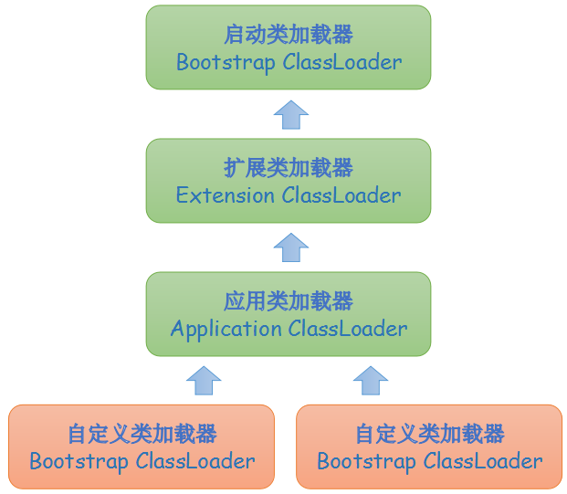

# 类加载机制

本文介绍虚拟机类加载机制，其中部分概念涉及到[类文件结构](classfile.md)，建议先了解相关内容。

## 类加载过程

类加载过程可以分为3步，分别是加载、连接和初始化，其中连接又可分为3步，分别是验证、准备和解析。

### 加载

加载阶段有以下3个步骤。

1. 获取定义类的二进制字节流。我们可以通过各种渠道获得类的二进制字节流，如`.jar`、`.war`文件或是动态生成的字节流（比如动态代理技术）。
2. 将字节流代表的静态存储结构转化为虚拟机方法区的运行时数据结构。
3. 生成一个代表该类的`java.lang.Class`对象。

### 连接

#### 验证

这一阶段是为了保证类文件中的信息符合虚拟机的要求，有以下4个步骤。

1. 文件格式验证。比如类文件中的魔数是否正确，主次版本号是否在当前虚拟机支持的范围内，常量池中是否有不被支持的常量类型等。
2. 元数据验证。对字节码进行语义分析，已确保其符合Java语言规范。比如类是否继承了不允许被继承的类，一个抽象类是否实现了所有的接口等。
3. 字节码验证。通过数据流和控制流分析，确定字节码语义的合法性。比如确保不会发生这样的情况：在操作栈中放入一个`int`类型的数据，取出时却按`long`类型来操作。
4. 符号引用验证。用来确保虚拟机在解析阶段将符号引用转为直接引用的操作能正常进行，比如验证通过类的全限定名能否找到对应的类。这里的符号引用是指值常量池中`CONSTANT_Class_info`、`CONSTANT_Methodref_info`、`CONSTANT_Fieldref_info`等类型的常量；而直接引用就是指向目标对象的指针。

#### 准备

在这一阶段，虚拟机会为静态变量在方法区中分配内存并设置**零值**，每种类型都有自己的零值，如下表所示。

|  类型      |   零值   |
| --------- | -------- |
| boolean   | false    |
| byte      | 0        |
| char      | '\u0000' |
| short     | 0        |
| int       | 0        |
| long      | 0        |
| float     | 0.0      |
| double    | 0.0      |
| reference | null     |

下面的代码，**在这一阶段过后**`value`的值会是`0`而不是`123`。

```java
public static int value = 123;
```

但是下面这行代码在准备阶段过后，字段`value`的值就已经是`123`了。仔细对比你可以发现，下面的字段是被`final`修饰的常量并且它是基本类型，在[类文件结构](classfile.md/#constant-value)中提到过，在编译阶段编译器会为基本类型（或`String`类型）的常量增加一个`ConstantValue`的属性，虚拟机会在准备阶段就把`ConstantValue`属性的值赋给常量。

```java
public static final int value = 123;
```

此外，虚拟机**不会**在这个阶段为非静态变量在方法区中分配内存或赋值，这部分变量会在对象实例化时被分配到堆中。

#### 解析

在解析阶段，虚拟机会把常量池内的符号引用替换为直接引用。下面我们看一个字段解析的例子。

```java
public class Test {

    private int m;

    public int getM() {
        return m;
    }
}
```

编译后其生成的字节码如下（截取了一部分字节码）。

```java
Constant pool:
   #1 = Methodref          #4.#15         // java/lang/Object."<init>":()V
   #2 = Fieldref           #3.#16         // playground/Test.m:I
   #3 = Class              #17            // playground/Test
   #4 = Class              #18            // java/lang/Object
   #5 = Utf8               m
   #6 = Utf8               I
  #16 = NameAndType        #5:#6          // m:I
  #17 = Utf8               playground/Test
  #18 = Utf8               java/lang/Object

public int getM();
  descriptor: ()I
  Code:
    stack=1, locals=1, args_size=1
        0: aload_0
        1: getfield      #2                  // Field m:I
        4: ireturn
```

当我们执行`getM()`方法时，第2行字节码`getfield`的参数引用了常量池中第2个常量，这是一个`CONSTANT_Fieldref_info`类型的常量，假设这是首次运行程序（虚拟机会有缓存，并不是每次都会进行解析），我们需要对该常量进行解析。

一个`CONSTANT_Fieldref_info`类型的常量结构如下。

|  长度（字节） |    1    |                2                   |                   2                       |
| ----------- | ------- | ---------------------------------- | ----------------------------------------- |
|  名称        | tag     |              index                 |                 index                    |
|  描述        | 固定值9  | 指向一个CONSTANT_Class_info类型的常量 | 指向一个CONSTANT_NameAndType_info类型的常量 |

解析步骤如下。

1. 解析第1个`index`指向的`CONSTANT_Class_info`类型的常量。虚拟机会把`CONSTANT_Class_info`类型常量表示的全限定名交给类加载器加载目标类，这一过程中可能需要加载基类和接口，因此这是一个递归的过程。如果目标类是数组类型，虚拟机还会进行额外的处理。
2. 虚拟机会在上一步解析完成的类中搜索简单名称和描述符斗鱼目标字段匹配的字段，如果存在就返回这个字段的直接引用。
3. 否则，虚拟机会从目标类的接口中进行查找，按照继承关系，从下往上递归搜索，如果存在就返回这个字段的直接引用。
4. 否则，虚拟机会从目标累的基类中进行查找，按照继承关系，从下往上递归搜索，直到`java.lang.Object`，如果存在就返回这个字段的直接引用。
5. 如果找不到匹配的字段，就抛出`java.lang.NoSuchFieldError`异常。
6. 如果找到了匹配的字段，就会检查是否具备对该字段的访问权限，如果不符合则抛出`java.lang.IllegalAccessError`异常。

虚拟机规范并没有规定何时进行解析，它只规定了在执行某些字节码指令时需要对符号引用进行解析，上文的`getfield`指令是其中之一。

虽然从虚拟机的解析过程来看，如果在一个类的基类和接口中存在同名字段，虚拟机会优先使用接口中的字段，但实际上，编译器会阻止这一行为。以下代码无法通过编译，因为编译无法确定引用哪一个字段。

```java
interface I {
    int number = 1;
}

class A {
    public int number = 3;
}

class B extends A implements I {
}

public static void main(String[] args) {
    System.out.println(new B().number);
}
```

### 初始化

初始化阶段，虚拟机会执行`<clinit>()`方法。该方法是编译器自动收集类中所有静态变量的赋值语句和静态语句块中的语句后合并产生的。

```java
public class Test {

    public static int A = 0;

    static {
        A = 1;
    }
}
```

需要注意的是，当我们使用`javap`工具查看字节码时，`<clinit>()`方法被美化成了`static{}`，上面代码段的`<clinit>()`方法对应的字节码如下所示。

```java
static {};
    descriptor: ()V
    flags: (0x0008) ACC_STATIC
    Code:
      stack=1, locals=0, args_size=0
         0: iconst_0
         1: putstatic     #2                  // Field A:I
         4: iconst_1
         5: putstatic     #2                  // Field A:I
         8: return
```

虚拟机会保证在执行当前类的`<clinit>()`方法之前父类的`<clinit>()`方法已经执行完毕。

#### 接口的初始化

接口中不能有静态语句块，但是可以用静态常量，因此编译器仍旧会为其生成`<clinit>()`方法。与类不同的是，一个接口在初始化时，如果它没有引用父接口中的常量，那么该父接口就不会被初始化。

#### 初始化的时机

虚拟机规范中规定只有以下5种情况会立刻对类进行初始化。

1. 遇到以下几个字节码指令。
    - `new`，使用`new`关键字实例化对象。
    - `getstatic`，读取一个类的静态字段（被`final`修饰的、已在编译器把结果存入常量池的除外）。
    - `putstatic`，设置一个类的静态字段。
    - `invokestatic`，调用一个类的静态方法。
2. 使用反射对类进行操作。
3. 当初始化一个类时，如果基类还没有初始化那么需要先初始化其基类。
4. 优先初始化`main()`方法所在的类。
5. 在使用JDK1.7动态语言特性时，如果一个`java.lang.invoke.MethodHandle`实例最后的解析结果`REF_getStatic`、`REF_putStatic`、`REF_invokeStatic`的方法句柄并且这个方法句柄所对应的类没有进行过初始化，那么要先对其初始化。

以上5种情况称为**主动引用**，除此之外所有的情况都不会触发初始化，称为**被动引用**，比如以下几种情况。

- 通过子类引用基类的静态字段，子类不会初始化，基类会初始化。

```java
// 以下代码会打印“Parent static{}”，说明子类没有被初始化，基类进行了初始化。
class Parent {

    public static Object F = new Object();

    static {
        System.out.println("Parent static{}");
    }
}

class Child extends Parent {
    static {
        System.out.println("Child static{}");
    }
}

public static void main(String[] args) {
    Object o = Child.F;
}
```

- 在声明数组时不会对数组元素所在的类进行初始化。

```java
// 以下代码不会打印任何内容。
class A {

    static {
        System.out.println("A static{}");
    }
}

public static void main(String[] args) {
    A[] array = new A[10];
}
```

- 当我们引用编译期间就放入类文件常量池的常量时，由于并不需要用到类相关的信息，因此也不会触发初始化过程。

```java
// 以下代码不会打印任何内容。
class A {

    public static final String CONSTANT = "A";

    static {
        System.out.println("A static{}");
    }
}

public static void main(String[] args) {
    String constant = A.CONSTANT;
}
```

但是如果我们修改常量的类型为`java.lang.Object`，由于无法把一个`Object`类型放入常量池中，因此会触发类的初始化过程。

```java
public static final Object CONSTANT = new Object();
```

如果我们把常量类型改为`int`，那么也不会触发类的初始化，这是因为`100`直接被编译成了字节码指令中的参数，因此没有必须对类进行初始化。

```java
public static final int CONSTANT = 100;
```

上述方法对应的字节码中，第一行`bipush`后面的`100`就是上面的`CONSTANT`常量。

```java
0: bipush        100
2: invokestatic  #3                  // Method java/lang/Integer.valueOf:(I)Ljava/lang/Integer;
5: astore_1
6: return
```

> 当一个类的初始化没有被触发时，不代表其加载和验证的过程也没有被触发，虚拟机规范中并没有规定这一点，因此这取决于各个虚拟机的实现。

## 类加载器

类加载器分为以下3类，对于HotSpot而言，启动类加载器是用C++实现的，作为虚拟机的一部分；其它类加载器是由Java实现的。

- 启动类加载器（Bootstrap ClassLoader）

负责加载`$JAVA_HOME/lib`目录下或者由`-Xbootclasspath`参数指定路径下的类库，并且这些类库的名字必须是虚拟机可以识别的，比如`rt.java`，否则即使放在正确的目录下也不会被加载。

- 扩展类加载器（Extension ClassLoader）

负责加载`$JAVA_HOME/lib/ext`目录下或由`java.ext.dirs`环境变量指定的路径下的类库。

- 应用程序类加载器（Application ClassLoader）

有时候也称为系统类加载器，负责加载用户类路径（ClassPath）下的类库，是程序中的默认类加载器，我们可以通过以下代码获取应用程序类加载器。

```java
ClassLoader.getSystemClassLoader();
```

### 双亲委派模型

如果一个类加载器收到了类加载的请求，它并不会直接去加载目标类，而是委托给父类加载器去加载，最后由启动类加载器进行处理。只有当父类加载器都无法加载时（在搜索范围内没有找到所需类），子类加载器才会自己去加载。



需要注意的是，这里的委托不是用继承实现的，而是用组合实现的。下面是JDK中的源码。

```java
// java.lang.ClassLoader#loadClass(java.lang.String, boolean)
protected Class<?> loadClass(String name, boolean resolve)
        throws ClassNotFoundException
{
    synchronized (getClassLoadingLock(name)) {
        // 检查目标类是否已经被加载。
        Class<?> c = findLoadedClass(name);
        // 如果c是null，则表示没有被加载。
        if (c == null) {
            long t0 = System.nanoTime();
            try {
                if (parent != null) {
                    // 委托父加载器进行加载。
                    c = parent.loadClass(name, false);
                } else {
                    // 如果父加载器为空，则委托给启动类加载器加载。
                    c = findBootstrapClassOrNull(name);
                }
            } catch (ClassNotFoundException e) {
                // 如果父加载器无法加载会抛出异常，这里直接忽略异常。
            }

            if (c == null) {
                long t1 = System.nanoTime();

                // 如果父类没有完成加载，那么就自己尝试加载。
                c = findClass(name);

                // 一些统计操作。
                PerfCounter.getParentDelegationTime().addTime(t1 - t0);
                PerfCounter.getFindClassTime().addElapsedTimeFrom(t1);
                PerfCounter.getFindClasses().increment();
            }
        }
        if (resolve) {
            resolveClass(c);
        }
        return c;
    }
}

双亲委派模型的好处是可以避免一个类被重复加载，比如`java.lang.Object`类，任何类加载器想要加载它最终都会委托给启动类加载器，因此只会加载一次。
```

## 加载类的方式

有以下几种方法可以加载一个类。

- 程序启动时由虚拟机进行加载。
- 通过`Class.forName()`方法动态加载。
- 通过`java.lang.ClassLoader#loadClass(...)`方法动态加载。

## 类的唯一性

对于任意一个类来说，它的类加载器和它本身共同确定它在虚拟机中的唯一性。也就是说如果两个类都在同一个类加载器下，来自同一个类文件，那么它们就是相同的，否则，在不同类加载器下，即使来自同一个类文件，它们也是两个不同的类。我们可以把类加载器看成类文件的命名空间，不同命名空间中类相互是没有关系的。

下面来看一个例子。首先我们创建一个空的类`ClassLoaderTest`，用`javac`进行编译后得到`ClassLoaderTest.class`文件。

```java
public class ClassLoaderTest {
}
```

在另一个测试类中实现一个自定义的类加载器，并且载入上一步中得到的`ClassLoaderTest.class`文件，最后利用`instanceof`关键字进行类的唯一性测试。

```java
public class Test {

    public static void main(String[] args) throws ClassNotFoundException, IllegalAccessException, InstantiationException {
        // 自定义类加载器。
        ClassLoader classLoader = new ClassLoader() {
            @Override
            public Class<?> loadClass(String name) {
                InputStream inputStream = getClass().getResourceAsStream(name.substring(name.lastIndexOf(".") + 1) + ".class");
                try {
                    // ClassLoaderTest的基类是java.lang.Object，因此这里会递归的加载Object类。
                    // Object类文件和ClassLoaderTest在不同目录下，因此当加载Object类时inputStream是null。
                    // 委托给启动类加载器加载Object类。
                    if (inputStream == null)
                        return super.loadClass(name);
                    byte[] bytes = new byte[inputStream.available()];
                    inputStream.read(bytes);
                    return defineClass(name, bytes, 0, bytes.length);
                } catch (IOException | ClassNotFoundException e) {
                }
                return null;
            }
        };

        Object t = classLoader.loadClass("playground.ClassLoaderTest").newInstance();

        System.out.println(t.getClass());// 此处打印“class playground.ClassLoaderTest”。
        System.out.println(t instanceof ClassLoaderTest);// 此处打印“false”。这是因为实例t的类来自我们自定义的类加载器，而instanceof关键字后面的类来自默认的应用类加载器。
    }
}
```

最后结果显示，此`ClassLoaderTest`非彼`ClassLoaderTest`，说明不同类加载器下载入同一个类文件，它们也是不同的。
