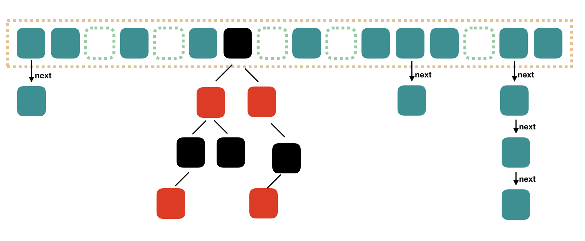

# ConcurrentHashMap


`ConcurrentHashMap`具有`HashMap`同样的功能，但它是线程安全的，其层次结构如下。


在JDK1.8（包括）之后，在结构上`ConcurrentHashMap`和`HashMap`非常类似，也是采用了`数组+链表+红黑数`的形式，但是采用了额外的策略来保证线程安全。



下面我们从构造函数看起。

## ConcurrentHashMap()

无参构造器是一个空方法。

```java
public ConcurrentHashMap() {
}
```

## ConcurrentHashMap(int)

该构造方法可以根据传入的初始容量设置字段`sizeCtl`的值。

```java
public ConcurrentHashMap(int initialCapacity) {
    // 检查参数合法性。
    if (initialCapacity < 0)
        throw new IllegalArgumentException();
    int cap = ((initialCapacity >= (MAXIMUM_CAPACITY >>> 1)) ?
                MAXIMUM_CAPACITY :
                // 取大于等于（initialCapacity*1.5+1）的最小的2的幂数。
                // 比如initialCapacity=10，那么cap等于16，因为大于等于（10*1.5+1）的最小的2的幂数是2^4。
                tableSizeFor(initialCapacity + (initialCapacity >>> 1) + 1));
    this.sizeCtl = cap;
}

// 该方法和HashMap中的同名方法是一样的。
// 返回大于等于cap的最小的2的幂数。
// 当 cap = 2 时，方法返回值为2，因为 2 ^ 1 = 2。
// 当 cap = 31 时，方法返回值是32，因为 2 ^ 4 = 16 < 31 而 2 ^ 5 = 32 > 31。
private static final int tableSizeFor(int c) {
    int n = c - 1;
    n |= n >>> 1;
    n |= n >>> 2;
    n |= n >>> 4;
    n |= n >>> 8;
    n |= n >>> 16;
    return (n < 0) ? 1 : (n >= MAXIMUM_CAPACITY) ? MAXIMUM_CAPACITY : n + 1;
}
```

字段`sizeCtl`的信息如下所示。

```java
private transient volatile int sizeCtl;
```

它用来控制底层数组的初始化和扩容，不同的取值范围代表不同的情况。

1. -1，表示数组正在被初始化。
2. 小于-1，表示有一个或多个线程正在进行扩容。
3. 大于等于0，当数组未初始化时表示需要初始化的大小，否则表示需要对数组进行扩容的阈值。

## ConcurrentHashMap(int, float)

该构造方法内部调用了另一个构造方法。

```java
public ConcurrentHashMap(int initialCapacity, float loadFactor) {
    this(initialCapacity, loadFactor, 1);
}

public ConcurrentHashMap(int initialCapacity,
                         float loadFactor, int concurrencyLevel) {
    // 检查参数合法性。
    if (!(loadFactor > 0.0f) || initialCapacity < 0 || concurrencyLevel <= 0)
        throw new IllegalArgumentException();
    // 这段代码的目的也是设置sizeCtl字段的值。
    if (initialCapacity < concurrencyLevel)
        initialCapacity = concurrencyLevel;
    long size = (long)(1.0 + (long)initialCapacity / loadFactor);
    int cap = (size >= (long)MAXIMUM_CAPACITY) ?
        MAXIMUM_CAPACITY : tableSizeFor((int)size);
    this.sizeCtl = cap;
}
```

## ConcurrentHashMap(Map<? extends K, ? extends V>)

该构造方法把一个`Map`对象放入当前`ConcurrentHashMap`中。

```java
public ConcurrentHashMap(Map<? extends K, ? extends V> m) {
    this.sizeCtl = DEFAULT_CAPACITY;
    putAll(m);
}

public void putAll(Map<? extends K, ? extends V> m) {
    // 扩容。
    tryPresize(m.size());
    // 遍历源map，通过putVal()方法把键值对放入当前map中。
    for (Map.Entry<? extends K, ? extends V> e : m.entrySet())
        putVal(e.getKey(), e.getValue(), false);
}
```

## put(K, V)

该方法把键值对放入map中，内部调用`putVal()`方法。

```java
public V put(K key, V value) {
    return putVal(key, value, false);
}

final V putVal(K key, V value, boolean onlyIfAbsent) {
    // 键和值都不能是null。
    if (key == null || value == null) throw new NullPointerException();
    // 获得哈希值。
    int hash = spread(key.hashCode());
    int binCount = 0;
    for (Node<K,V>[] tab = table;;) {
        Node<K,V> f; int n, i, fh; K fk; V fv;
        // 如果table数组是空的，那么就进行初始化。
        if (tab == null || (n = tab.length) == 0)
            tab = initTable();
        // 通过Unsafe类获得tab[i]处的节点。
        else if ((f = tabAt(tab, i = (n - 1) & hash)) == null) {
            // 当节点不存在时，用CAS在table[i]处创建新节点，只有当table[i]原本是null时才能创建成功。
            if (casTabAt(tab, i, null, new Node<K,V>(hash, key, value)))
                break;
        }
        // 节点正在扩容。
        else if ((fh = f.hash) == MOVED)
            tab = helpTransfer(tab, f);
        // 键值对已存在。
        else if (onlyIfAbsent
                    && fh == hash
                    && ((fk = f.key) == key || (fk != null && key.equals(fk)))
                    && (fv = f.val) != null)
            return fv;
        else {
            V oldVal = null;
            synchronized (f) { // 获取首节点的锁。
                if (tabAt(tab, i) == f) {
                    // fh大于等于0表示首节点是链表节点，也就是说table[i]处是一个链表。
                    if (fh >= 0) {
                        binCount = 1;
                        // 遍历链表。
                        for (Node<K,V> e = f;; ++binCount) {
                            K ek;
                            // 如果要插入的键已经存在并且onlyIfAbsent是false，那么就更新键对应的值，否则中断遍历。
                            if (e.hash == hash &&
                                ((ek = e.key) == key ||
                                    (ek != null && key.equals(ek)))) {
                                oldVal = e.val;
                                if (!onlyIfAbsent)
                                    e.val = value;
                                break;
                            }
                            Node<K,V> pred = e;
                            // 遍历到最后一个节点并创建新的节点。
                            if ((e = e.next) == null) {
                                pred.next = new Node<K,V>(hash, key, value);
                                break;
                            }
                        }
                    }
                    // 首节点是红黑树节点。
                    else if (f instanceof TreeBin) {
                        Node<K,V> p;
                        binCount = 2;
                        // 把键值对插入到红黑树中。
                        if ((p = ((TreeBin<K,V>)f).putTreeVal(hash, key,
                                                        value)) != null) {
                            oldVal = p.val;
                            if (!onlyIfAbsent)
                                p.val = value;
                        }
                    }
                    else if (f instanceof ReservationNode)
                        throw new IllegalStateException("Recursive update");
                }
            }
            if (binCount != 0) {
                // 如果table[i]处节点个数达到或超过了TREEIFY_THRESHOLD，就把链表转成红黑树。
                // TREEIFY_THRESHOLD是值为8的常量。
                if (binCount >= TREEIFY_THRESHOLD)
                    treeifyBin(tab, i);
                if (oldVal != null)
                    return oldVal;
                break;
            }
        }
    }
    // 更新计数。
    // 对table扩容的逻辑也在addCount()方法中。
    addCount(1L, binCount);
    return null;
}

// Hash算法。
static final int spread(int h) {
    return (h ^ (h >>> 16)) & HASH_BITS;
}

// 初始化table数组。
private final Node<K,V>[] initTable() {
    Node<K,V>[] tab; int sc;
    while ((tab = table) == null || tab.length == 0) {
        if ((sc = sizeCtl) < 0)
            // 如果sizeCtl<0，则表示table数组正在被初始化，因此当前线程应该让出CPU时间。
            Thread.yield();
        // 否则使用CAS把sizeCtl设为-1。
        else if (U.compareAndSetInt(this, SIZECTL, sc, -1)) {
            // 如果CAS操作成功，那么操作线程就对table数组进行初始化操作，其它线程就会在下一个循环中执行上面的分支，让出CPU时间。
            try {
                if ((tab = table) == null || tab.length == 0) {
                    // 初始化table数组。
                    int n = (sc > 0) ? sc : DEFAULT_CAPACITY;
                    Node<K,V>[] nt = (Node<K,V>[])new Node<?,?>[n];
                    table = tab = nt;
                    sc = n - (n >>> 2);
                }
            } finally {
                // 设置新的阈值为0.75*table.length。
                sizeCtl = sc;
            }
            break;
        }
    }
    return tab;
}

// 通过Unsafe类获得tab[i]处的节点。
static final <K,V> Node<K,V> tabAt(Node<K,V>[] tab, int i) {
    return (Node<K,V>)U.getObjectAcquire(tab, ((long)i << ASHIFT) + ABASE);
}

// 通过CAS设置tab[i]处的节点。
static final <K,V> boolean casTabAt(Node<K,V>[] tab, int i,
                                    Node<K,V> c, Node<K,V> v) {
    return U.compareAndSetObject(tab, ((long)i << ASHIFT) + ABASE, c, v);
}
```

## addCount(long, int)

增加计数并在满足条件的情况下调用`transfer()`方法对数组进行扩容。

```java
private final void addCount(long x, int check) {
    CounterCell[] as; long b, s;
    // baseCount用来记录键值对的数量，它的类型是private transient volatile long baseCount;
    // x表示增量，比如x = 1时表示键值对数量增加1。
    // 尝试用CAS更新baseCount = baseCount + x。
    if ((as = counterCells) != null ||
        !U.compareAndSetLong(this, BASECOUNT, b = baseCount, s = b + x)) {
        // 在高并发情况下只有一个线程可以成功执行CAS操作，其余线程执行失败。
        // 执行失败的线程就把增量写到各自的CounterCell对象中。
        // counterCells维护这些CounterCell对象，它的类型是private transient volatile CounterCell[]。
        CounterCell a; long v; int m;
        boolean uncontended = true;
        // 如果counterCells是空的，或者counterCells[ThreadLocalRandom.getProbe() & m]是null，或者CAS更新CounterCell的value字段失败，那么调用fullAddCount()进一步处理。
        // fullAddCount()方法会初始化counterCells，并通过死循环保证增量写入CounterCell或者baseCount，相关代码较多，这里不再具体展开，可以查看参考文档中的（3）。
        // ThreadLocalRandom.getProbe()产生一个随机数，因此ThreadLocalRandom.getProbe() & m的意思是随机找一个索引。
        // 因为索引是随机的，因此多个线程可能会共享同一个CounterCell对象，所以这里需要通过CAS对CounterCell中的value字段进行更新。
        if (as == null || (m = as.length - 1) < 0 ||
            (a = as[ThreadLocalRandom.getProbe() & m]) == null ||
            !(uncontended =
                U.compareAndSetLong(a, CELLVALUE, v = a.value, v + x))) {
            fullAddCount(x, uncontended);
            return;
        }
        if (check <= 1)
            return;
        // 计算键值对总数，赋值给变量s。
        s = sumCount();
    }

    // 下面这部分代码的作用是判断是否需要对table数组进行扩容，如果需要，那么就调用transfer()方法进行扩容。
    if (check >= 0) {
        Node<K,V>[] tab, nt; int n, sc;
        // 键值对数量大于等于阈值sizeCtl那么就进行扩容。
        while (s >= (long)(sc = sizeCtl) && (tab = table) != null &&
                (n = tab.length) < MAXIMUM_CAPACITY) {
            // 获得一个扩容标志，具体可以看后文对该方法的解释。
            // 如果入参n相同，那么得到的结果相同；如果参数不同，那么得到的结果也不同。
            int rs = resizeStamp(n);
            // sizeCtl小于0表示正在扩容。
            if (sc < 0) {
                // 扩容已结束或参与的线程数达到最大值，则中断循环。
                // sizeCtl的高16位记录的就是resizeStamp(n)的值。
                if ((sc >>> RESIZE_STAMP_SHIFT) != rs || sc == rs + 1 ||
                    sc == rs + MAX_RESIZERS || (nt = nextTable) == null ||
                    transferIndex <= 0)
                    break;
                // 扩容线程的数量加1。
                if (U.compareAndSetInt(this, SIZECTL, sc, sc + 1))
                    // 扩容。
                    transfer(tab, nt);
            }
            // sizeCtl大于等于0，表示还没有线程参与扩容，当前线程第一个监测到需要扩容。
            // 关于这段代码的解释可以查看对resizeStamp()方法的解释。
            else if (U.compareAndSetInt(this, SIZECTL, sc,
                                            (rs << RESIZE_STAMP_SHIFT) + 2))
                // 扩容。
                transfer(tab, null);
            // 重新统计键值对个数，进入下一个循环。
            s = sumCount();
        }
    }
}

// 计算baseCount和所有CounterCell的总和。
final long sumCount() {
    CounterCell[] as = counterCells; CounterCell a;
    long sum = baseCount;
    if (as != null) {
        for (int i = 0; i < as.length; ++i) {
            if ((a = as[i]) != null)
                sum += a.value;
        }
    }
    return sum;
}

// java.util.concurrent.ConcurrentHashMap.CounterCell
@jdk.internal.vm.annotation.Contended static final class CounterCell {
    volatile long value;
    CounterCell(long x) { value = x; }
}
```

## resizeStamp(int)

这个方法比较难理解，它的执行过程是根据传入的参数`n`（`n`是`table`数组的长度）进行位运算，然后返回计算结果。

```java
static final int resizeStamp(int n) {
    // RESIZE_STAMP_BITS是值为16的常量。
    return Integer.numberOfLeadingZeros(n) | (1 << (RESIZE_STAMP_BITS - 1));
}
```

在理解该方法的功能之前，我们先举一个例子。假设n=16时，其二进制表示是`0000000000000000 0000000000010000`,`Integer.numberOfLeadingZeros(n)`方法的作用是获取参数`n`的二进制表示中从最左边开始连续的0的个数，因此这里`Integer.numberOfLeadingZeros(16)`的值是27，其二进制表示是`0000000000000000 0000000000011011`。`1 << (RESIZE_STAMP_BITS - 1)`的值是32768，其二进制表示是`0000000000000000 1000000000000000`，`27 | 32768`的值的二进制表示是`0000000000000000 1000000000011011`。那么这个看似毫无意义的二进制有什么用呢？我们回过头来看`addCount()`方法中的一段代码。

```java
// RESIZE_STAMP_SHIFT是值为16的常量。
if (U.compareAndSetInt(this, SIZECTL, sc, (rs << RESIZE_STAMP_SHIFT) + 2))
    // 扩容。
    transfer(tab, null);
```

代码中变量`rs`的值就是`resizeStamp(n)`的返回值，假设`rs`的值就是上面的那串二进制，那么`rs << RESIZE_STAMP_SHIFT`的二进制是`1000000000011011 0000000000000000`，`(rs << RESIZE_STAMP_SHIFT) + 2`的值是`1000000000011011 0000000000000010`，这个32位的整数实际上要分为两部分看，高16位和低16位（左高右低），高16位表示对长度为n的`table`数组进行扩容的标志，低16位表示有多少个线程正在对`table`进行扩容，这里的计数从1开始，实际参与扩容的线程数需要减1，因为当低16位的值等于1的时候，表示`table`数组正在被初始化，所以上面这段代码在`(rs << RESIZE_STAMP_SHIFT)`后加2表示有1个线程在进行扩容。

## tryPresize(int)

```java
private final void tryPresize(int size) {
    // 计算扩容后的目标大小。
    int c = (size >= (MAXIMUM_CAPACITY >>> 1)) ? MAXIMUM_CAPACITY :
        tableSizeFor(size + (size >>> 1) + 1);
    int sc;
    while ((sc = sizeCtl) >= 0) {
        // table是底层数组。
        // 它的类型是transient volatile Node<K,V>[] table;
        Node<K,V>[] tab = table; int n;
        // table没有被初始化或者是空的，那么进行初始化。
        if (tab == null || (n = tab.length) == 0) {
            n = (sc > c) ? sc : c;
            // 用CAS把sizeCtl赋值为-1，以表示正在对数组进行初始化。
            // 当多个线程并发执行时，只有一个能成功把sizeCtl赋值为-1。
            if (U.compareAndSetInt(this, SIZECTL, sc, -1)) {
                try {
                    // 初始化table。
                    if (table == tab) {
                        Node<K,V>[] nt = (Node<K,V>[])new Node<?,?>[n];
                        table = nt;
                        // n - (n >>> 2) 等价于 n - (n / 4)，也就是 0.75 * n。
                        sc = n - (n >>> 2);
                    }
                } finally {
                    // 下一次扩容的阈值是0.75 * n。
                    sizeCtl = sc;
                }
            }
        }
        else if (c <= sc || n >= MAXIMUM_CAPACITY)
            // 容量足够或已达到最大容量，不进行扩容。
            break;
        else if (tab == table) {
            int rs = resizeStamp(n);
            // 扩容线程的数量加1。
            if (U.compareAndSetInt(this, SIZECTL, sc,
                                    (rs << RESIZE_STAMP_SHIFT) + 2))
                // 扩容。
                transfer(tab, null);
        }
    }
}
```

## transfer(Node<K,V>[], Node<K,V>[])

该方法用于扩容，其大致步骤是：先创建一个大小是`table`两倍的`nextTable`数组，再把`table`中的所有键值对复制到`nextTable`中。需要注意的是，`ConcurrentHashMap`的扩容操作是可以有多个线程同时参与的，而不是`HashMap`那样只有单线程进行扩容。

```java
private final void transfer(Node<K,V>[] tab, Node<K,V>[] nextTab) {
    int n = tab.length, stride;
    // NCPU是CPU核心数，它的值被初始化为Runtime.getRuntime().availableProcessors()，这里的核心数不是物理核心数，比如对于一颗支持超线程技术的双核CPU，该方法可能会返回4。
    // 变量stride的中文意思是步进，是指每个CPU核心需要对数组中多少节点进行处理（这里只看首节点），最少每个核心需要处理MIN_TRANSFER_STRIDE个节点，MIN_TRANSFER_STRIDE是值为16的常量。
    if ((stride = (NCPU > 1) ? (n >>> 3) / NCPU : n) < MIN_TRANSFER_STRIDE)
        stride = MIN_TRANSFER_STRIDE;
    // 如果nextTable是空的，那么就创建一个大小是table数组两倍的新数组。
    // 当多个线程对nextTable进行初始化时，transfer()方法的调用者会用CAS保证只有单个线程会对其进行初始化。
    if (nextTab == null) {
        try {
            Node<K,V>[] nt = (Node<K,V>[])new Node<?,?>[n << 1];
            nextTab = nt;
        // 这里可能发生OOM异常。
        } catch (Throwable ex) {
            // 扩容失败，中断操作。
            sizeCtl = Integer.MAX_VALUE;
            return;
        }
        nextTable = nextTab;
        // transferIndex表示当前正在转移的数组中节点的下标。
        transferIndex = n;
    }
    int nextn = nextTab.length;
    // ForwardingNode节点用来占位，当其它线程发现数组中某个首节点是ForwardingNode类型的，那么就跳过该节点。
    ForwardingNode<K,V> fwd = new ForwardingNode<K,V>(nextTab);
    // 每个线程需要处理数组中多个位置的节点。
    // advance表示是否还要处理数组中的下一个位置。
    boolean advance = true;
    // 扩容结束标志，true表示扩容结束。
    boolean finishing = false;
    // 每个数组会被分配数组上的一个区间，互相不重叠。
    // i是当前线程正在转移的索引，bound是当前线程需要进行转移的最小索引。
    for (int i = 0, bound = 0;;) {
        Node<K,V> f; int fh;
        while (advance) {
            int nextIndex, nextBound;
            // 如果i-1小于bound，说明之前分配给线程的区间已经完成转移了，上面提到过bound是需要转移的最小的索引，因此小于bound自然
            if (--i >= bound || finishing)
                advance = false;
            // 这里会把transferIndex的值赋给nextIndex。
            else if ((nextIndex = transferIndex) <= 0) {
                i = -1;
                advance = false;
            }
            // CAS修改transferIndex=transferIndex-stride。
            else if (U.compareAndSetInt
                        (this, TRANSFERINDEX, nextIndex,
                        nextBound = (nextIndex > stride ?
                                    nextIndex - stride : 0))) {
                bound = nextBound;
                i = nextIndex - 1;
                advance = false;
            }
        }
        if (i < 0 || i >= n || i + n >= nextn) {
            int sc;
            // 扩容完成。
            if (finishing) {
                // 更新table和重置nextTable。
                nextTable = null;
                table = nextTab;
                // 更新阈值。
                sizeCtl = (n << 1) - (n >>> 1);
                return;
            }
            // 参与扩容的线程数减1。
            if (U.compareAndSetInt(this, SIZECTL, sc = sizeCtl, sc - 1)) {
                // 在介绍resizeStamp()方法时说过如果有1个线程参与扩容，那么sizeCtl = ( resizeStamp(n) << RESIZE_STAMP_SHIFT ) + 2，因此这里if中的条件说明还有其它线程参与扩容，因此还不能结束。
                if ((sc - 2) != resizeStamp(n) << RESIZE_STAMP_SHIFT)
                    return;
                // 上面的if语句没有执行，那么说明没有其它线程进行扩容了，可以把finishing设为true以结束扩容。
                finishing = advance = true;
                i = n;
            }
        }
        // CAS设置首节点为ForwardingNode节点。
        // 这里同时也把table[i]处的首节点赋值给了变量f。
        else if ((f = tabAt(tab, i)) == null)
            advance = casTabAt(tab, i, null, fwd);
        // MOVED是值为-1的常量，哈希值是-1表示该下标处的节点已经由其它线程处理过了。
        // ForwardingNode节点的哈希就是MOVED，因此也表示这是一个ForwardingNode节点。
        else if ((fh = f.hash) == MOVED)
            advance = true;
        else {
            // 代码执行到这里才算真正开始转移节点。
            // 获取首节点的锁。
            synchronized (f) {
                // 双重检查。
                if (tabAt(tab, i) == f) {
                    Node<K,V> ln, hn;
                    // 哈希值大于0表示是链表。
                    if (fh >= 0) {
                        // 根据fh & table.length算法把链表中的节点进行分组，由于table的长度是2的幂次，因此fh & table.length只可能是0或1。
                        int runBit = fh & n;
                        Node<K,V> lastRun = f;
                        // 遍历链表。
                        // lastRun记录最后一个runBit发生变化的节点，之后的所有节点的fh & table.length值不变。
                        for (Node<K,V> p = f.next; p != null; p = p.next) {
                            int b = p.hash & n;
                            if (b != runBit) {
                                runBit = b;
                                lastRun = p;
                            }
                        }
                        // 如果最后更新的runBit是0，那么就把lastRun赋值给ln，ln代表低位。
                        if (runBit == 0) {
                            ln = lastRun;
                            hn = null;
                        }
                        // 反之就把lastRun赋值给hn，hn代表高位。
                        else {
                            hn = lastRun;
                            ln = null;
                        }
                        // 再次遍历。
                        // 把节点按之前的规则分为两组。
                        for (Node<K,V> p = f; p != lastRun; p = p.next) {
                            int ph = p.hash; K pk = p.key; V pv = p.val;
                            if ((ph & n) == 0)
                                ln = new Node<K,V>(ph, pk, pv, ln);
                            else
                                hn = new Node<K,V>(ph, pk, pv, hn);
                        }
                        // 设置新数组i处的元素为低位链表。
                        setTabAt(nextTab, i, ln);
                        // 设置新数组i+n处的元素为高位链表。
                        // 之所以是i+n是因为高位链表中的节点从原数组i处转移到新书组i+n处时正好可以命中哈希。
                        setTabAt(nextTab, i + n, hn);
                        // 把原来数组的i处节点更新为占位符。
                        setTabAt(tab, i, fwd);
                        advance = true;
                    }
                    // 下面是红黑树的情况。
                    else if (f instanceof TreeBin) {
                        TreeBin<K,V> t = (TreeBin<K,V>)f;
                        TreeNode<K,V> lo = null, loTail = null;
                        TreeNode<K,V> hi = null, hiTail = null;
                        int lc = 0, hc = 0;
                        // 遍历红黑树。
                        // 和链表同样的逻辑分为两组。
                        for (Node<K,V> e = t.first; e != null; e = e.next) {
                            int h = e.hash;
                            TreeNode<K,V> p = new TreeNode<K,V>
                                (h, e.key, e.val, null, null);
                            if ((h & n) == 0) {
                                if ((p.prev = loTail) == null)
                                    lo = p;
                                else
                                    loTail.next = p;
                                loTail = p;
                                ++lc;
                            }
                            else {
                                if ((p.prev = hiTail) == null)
                                    hi = p;
                                else
                                    hiTail.next = p;
                                hiTail = p;
                                ++hc;
                            }
                        }
                        // 如果节点数量小于UNTREEIFY_THRESHOLD，那么就转化成链表，反之创建一颗新的树。
                        // UNTREEIFY_THRESHOLD是值为6的常量。
                        ln = (lc <= UNTREEIFY_THRESHOLD) ? untreeify(lo) :
                            (hc != 0) ? new TreeBin<K,V>(lo) : t;
                        hn = (hc <= UNTREEIFY_THRESHOLD) ? untreeify(hi) :
                            (lc != 0) ? new TreeBin<K,V>(hi) : t;
                        // 设置新数组i处的元素为低位树。
                        setTabAt(nextTab, i, ln);
                        // 设置新数组i+n处的元素为高位树。
                        setTabAt(nextTab, i + n, hn);
                        // 把原来数组的i处节点更新为占位符。
                        setTabAt(tab, i, fwd);
                        advance = true;
                    }
                }
            }
        }
    }
}
```

## get(Object)

该方法通过键查找对应的值。

```java
public V get(Object key) {
    Node<K,V>[] tab; Node<K,V> e, p; int n, eh; K ek;
    // 计算键对应的哈希值。
    int h = spread(key.hashCode());
    // 如果table是空的，或者table[(table.length - 1) & h)]处没有节点，那么方法返回null。
    if ((tab = table) != null && (n = tab.length) > 0 &&
        (e = tabAt(tab, (n - 1) & h)) != null) {
        // 对比首节点的键是否匹配目标键，如果匹配那么直接返回首节点的值。
        if ((eh = e.hash) == h) {
            if ((ek = e.key) == key || (ek != null && key.equals(ek)))
                return e.val;
        }
        // 首节点哈希值小于0表示该节点是一个红黑树节点或者正在扩容。
        else if (eh < 0)
            return (p = e.find(h, key)) != null ? p.val : null;
        // 其它情况下遍历链表，寻找匹配的键。
        while ((e = e.next) != null) {
            if (e.hash == h &&
                ((ek = e.key) == key || (ek != null && key.equals(ek))))
                return e.val;
        }
    }
    // 找不到匹配的键，返回null。
    return null;
}
```

## remove(Object)

删除键值对，内部调用`replaceNode()`方法。

```java
public V remove(Object key) {
    return replaceNode(key, null, null);
}

final V replaceNode(Object key, V value, Object cv) {
    int hash = spread(key.hashCode());
    for (Node<K,V>[] tab = table;;) {
        Node<K,V> f; int n, i, fh;
        if (tab == null || (n = tab.length) == 0 ||
            (f = tabAt(tab, i = (n - 1) & hash)) == null)
            break;
        else if ((fh = f.hash) == MOVED)
            tab = helpTransfer(tab, f);
        else {
            V oldVal = null;
            boolean validated = false;
            synchronized (f) {
                if (tabAt(tab, i) == f) {
                    if (fh >= 0) {
                        validated = true;
                        for (Node<K,V> e = f, pred = null;;) {
                            K ek;
                            if (e.hash == hash &&
                                ((ek = e.key) == key ||
                                    (ek != null && key.equals(ek)))) {
                                V ev = e.val;
                                if (cv == null || cv == ev ||
                                    (ev != null && cv.equals(ev))) {
                                    oldVal = ev;
                                    if (value != null)
                                        e.val = value;
                                    else if (pred != null)
                                        pred.next = e.next;
                                    else
                                        setTabAt(tab, i, e.next);
                                }
                                break;
                            }
                            pred = e;
                            if ((e = e.next) == null)
                                break;
                        }
                    }
                    else if (f instanceof TreeBin) {
                        validated = true;
                        TreeBin<K,V> t = (TreeBin<K,V>)f;
                        TreeNode<K,V> r, p;
                        if ((r = t.root) != null &&
                            (p = r.findTreeNode(hash, key, null)) != null) {
                            V pv = p.val;
                            if (cv == null || cv == pv ||
                                (pv != null && cv.equals(pv))) {
                                oldVal = pv;
                                if (value != null)
                                    p.val = value;
                                else if (t.removeTreeNode(p))
                                    setTabAt(tab, i, untreeify(t.first));
                            }
                        }
                    }
                    else if (f instanceof ReservationNode)
                        throw new IllegalStateException("Recursive update");
                }
            }
            if (validated) {
                if (oldVal != null) {
                    if (value == null)
                        addCount(-1L, -1);
                    return oldVal;
                }
                break;
            }
        }
    }
    return null;
}
```

## size()

返回键值对的数量，内部调用`sumCount()`方法。

```java
public int size() {
    long n = sumCount();
    return ((n < 0L) ? 0 :
            (n > (long)Integer.MAX_VALUE) ? Integer.MAX_VALUE :
            (int)n);
}
```

## Nullable

对于`ConcurrentHashMap`中的项，键和值**都不能**是`null`。

```java
public static void main(String[] args) {
    Map<String, String> map = new ConcurrentHashMap<>();
    // 以下三种用法都是不允许的，会抛出java.lang.NullPointerException异常。
    map.put(null, "hello");
    map.put("hello", null);
    System.out.println(map.get(null));
}
```

## 参考

1. [《Java7/8 中的 HashMap 和 ConcurrentHashMap 全解析》](https://javadoop.com/post/hashmap#Java8%20ConcurrentHashMap)
2. [《深入浅出ConcurrentHashMap1.8》](https://www.jianshu.com/p/c0642afe03e0)
3. [《谈谈ConcurrentHashMap1.7和1.8的不同实现》](https://www.jianshu.com/p/e694f1e868ec)
4. [《为并发而生的 ConcurrentHashMap（Java 8）》](https://cloud.tencent.com/developer/article/1013643)
5. [《java8集合框架(三)－Map的实现类（ConcurrentHashMap）》](http://wuzhaoyang.me/2016/09/05/java-collection-map-2.html)
6. [《并发编程——ConcurrentHashMap#transfer() 扩容逐行分析》](https://juejin.im/post/5b00160151882565bd2582e0)
