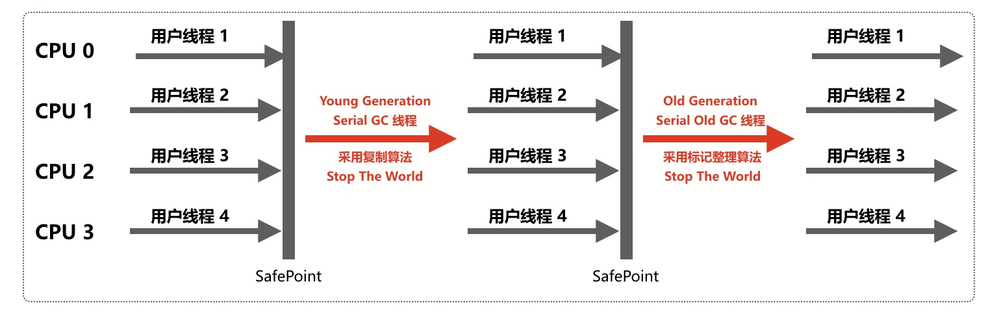
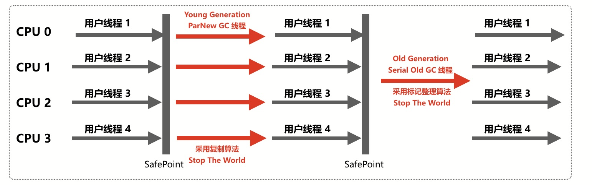
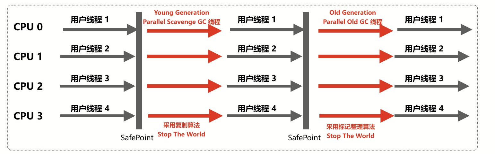
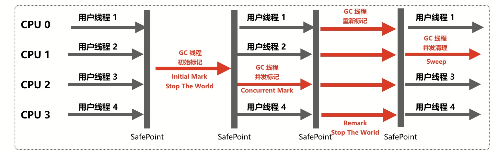
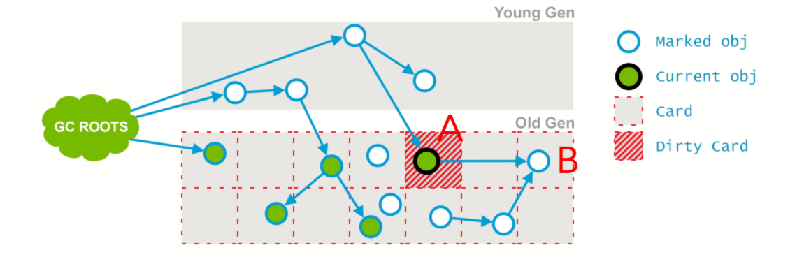
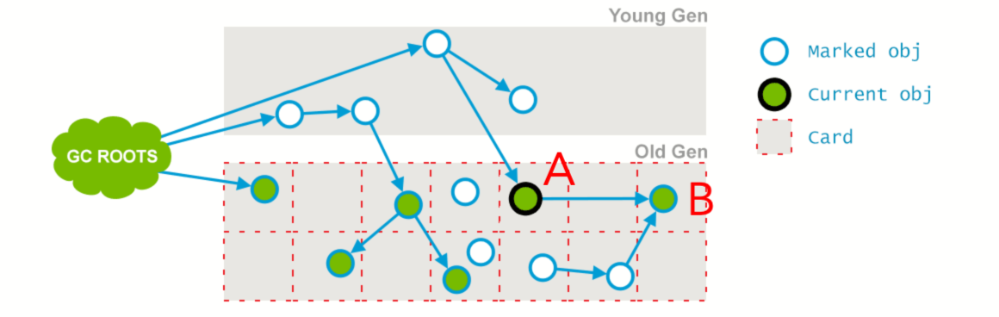

# 垃圾回收机制

## 可达性分析

Java中有一些对象称为`GC Roots`，如果一个`GC Roots`对象引用了某个对象，那么它们之间就存在一条引用链，当一个对象到任意一个`GC Roots`都没有引用链连接时，即表示该对象不可达，进入可回收状态。

下图中右侧部分的三个对象均不可能，因为没有与之关联的`GC Roots`。


以下几种类型的对象可以作为`GC Roots`。

1. 虚拟机栈中引用的对象。
2. 方法区中静态属性引用的对象。
3. 方法区中常量引用的对象。
4. 本地方法栈中JNI引用的对象。

## 对象的自救

一旦对象经过可达性分析后被判定为不可达，虚拟机不会立刻进行回收，对象还有机会进行自救。虚拟机会检查这部分对象是否有必要执行`finalize()`方法，如果对象没有覆盖`finalize()`方法或者该方法已经被调用过了，那么虚拟机就认为没必要再执行，这种情况下对象会被放入待回收集合，无法自救；否则，虚拟机会把符合条件的对象放到`F-Queue`队列中并用一个专门的线程去执行这些对象的`finalize()`方法，之后虚拟机会再次对队列中的对象进行可达性分析，如果依然判定为不可达，那么就放入待回收集合。由于每个对象的`finalize()`方法只会被虚拟机调用一次，因此对象只有1次自救的机会。


对象自救的方法就是在`finalize()`方法中重新与某个`GC Roots`对象进行关联，下面是一个例子。

```java
public class Test {

    static Test HOOK = null;

    @Override
    protected void finalize() throws Throwable {
        super.finalize();
        HOOK = this;
        System.out.println("finalize()");
    }

    public static void main(String[] args) throws InterruptedException {
        HOOK = new Test();
        HOOK = null;
        System.gc();

        // 等待对象自救。
        while (HOOK == null) {
            Thread.sleep(500);
        }
        // 自救成功，打印“save”。
        System.out.println("save");

        HOOK = null;
        System.gc();
        Thread.sleep(1000);
        if (HOOK == null) {
            // 自救失败。
            System.out.println("can not save");
        } else {
            System.out.println("save");
        }
    }
}

// 输出：
// finalize()
// save
// can not save
```

通过以上输出可以看到，`finalize()`方法只被调用了一次，因此第一次对象自救成功，第二次自救失败。

## 垃圾收集算法

### 标记-清除

标记-清除算法分为标记和清除两个阶段。首先把所有待回收的对象进行标记，然后再统一对标记的对象的内存进行清除。缺点是回收后的内存空间可能不是连续的（内存碎片），当需要存储内存上连续的大对象时（比如一个容量较大的数组对象），可能需要再触发一次GC。


虚拟机需要维护一个单向链表来记录空闲的内存块，当为新建的对象分配内存时，假设对象大小为`size`，虚拟机需要遍历单向链表，找到能大于等于`size`的内存块，最坏情况下可能要遍历到链表的最后一个节点，效率较低。

### 复制

复制算法是把内存空间等分为2个大小一样的区域，每次只用1个区域存储对象，如果当前区域的内存用完了就把存活的对象复制到另一个区域内，然后把当前区域清空，它不存在标记-清除算法中会留下内存碎片的问题，其缺点是可用的内存是原来的一半。


### 标记-整理

标记-整理算法分为标记、整理和清除三个阶段。首先把所有待回收的对象进行标记，然后将存活对象都朝一端移动（即整理），最后直接清除掉整理完的边界以外的内存。


## 分代收集

分代收集是指根据对象的存活周期的长短将内存划分为几块，目前普遍的做法是分为新生代和老年代。通常每次垃圾收集时都会有大批对象死去，只有少部分可以存活，对于那些死去的对象，我们把它放在新生代的内存区域中并采用复制算法进行回收，而把另一些经历了多次GC依然存活的对象放在老年代中并采用标记-清除或标记-整理算法进行回收。

### Minor GC

### MajorGC(Full GC)

## Stop-The-World(STW)

在进行垃圾收集前，虚拟机需要进入一个稳定的状态，在垃圾收集的过程中对象的引用关系不能发生变化，就好像整个系统在某个时间点上冻结了，这就要求除了GC线程以外其它所有的线程必须被暂停，这就是`Stop-The-World`的由来。
`Stop-The-World`是通过安全点（safepoint）机制实现的。安全点是指代码中的一些特定位置，当线程运行到这些位置时线程的状态是确定的，需要等到所有的线程抵达安全点GC才能进行，安全点主要有以下几个位置。

- 方法返回前。
- 调用方法后。
- 抛出异常的位置。
- 循环的末位。

选择这些位置主要考虑的因素是避免线程长时间不进入安全点，从而导致GC一直无法进行。

## 垃圾收集器

本文将介绍以下几种垃圾收集器，如图所示，两个垃圾收集器之间的连线表示它们可以搭配使用。


### Serial/Serial Old

Serial是单线程的垃圾收集器，是采用复制算法的新生代收集器，它工作时需要暂停所有非GC线程直到垃圾收集工作完成。
Serial Old是Serial的老年代版本，采用标记-整理算法。



### ParNew

ParNew是Serial的多线程版本，两者在垃圾收集算法、Stop-The-World、对象分配规则等部分完全一致，ParNew也是一个新生代的垃圾收集器。



### Parallel Scavenge/Parallel Old

Parallel Scavenge（/ˈskavənj/，清除）是一个多线程的新生代垃圾收集器，它也采用复制算法进行垃圾回收。Parallel Scavenge和ParNew的区别是，Parallel Scavenge关注的是提高吞吐量，适合程序在后台运算而不需要和用户频繁交互的场景，它关注的是一段时间内垃圾收集的总时间；ParNew关注的是尽量缩短Stop-The-World的时间，适合程序需要和用户频繁交互的场景，停顿时间越短那么对用户请求响应的速度就越快。

> 吞吐量 = CPU运行用户代码的时间 / （CPU运行用户代码的时间 + 垃圾收集时间），假设虚拟机总归运行100分钟，其中垃圾收集时间是1分钟，那么运行用户代码时间就是99分钟，那么吞吐量就是99%。

Parallel Old是Parallel Scavenge的老年代版本，是一个多线程的采用标记-整理算法的收集器。



### CMS

CMS，全称Concurrent Mark Sweep，是一种支持并发的采用标记-清除算法的老年代垃圾收集器。



它的收集过程分为以下几个步骤。

1. 初始标记

  这一步会标记在老年代中与GC Roots**直接**关联的或者被新生代中存活对象引用到的老年代对象。这一阶段会引发STW，但时间比较短暂。

  

2. 并发标记

  通过上一阶段中找出的对象递归的找出所有存活对象。这一阶段是和用户线程并发执行的，不会中断用户线程，垃圾收集的代码和用户的代码是交错执行的，因此在标记过程中对象的引用状态可能会发生变化。下面的预清理和可中止的预清理这两个步骤也属于并发标记阶段。

  

3. 预清理

  在这个阶段会标记上一阶段中遗漏的存活对象。由于并发标记阶段垃圾收集和用户代码是交替执行的，因此在垃圾收集的同时引用可能发生变化，部分存活对象会被遗漏。比如上一阶段中的A、B对象，原本对象B到GC Roots不可达，因此没有被标记，而在之后的过程中因为没有STW，对象B又可能被对象A引用，这就出现了漏标的现象，如果此时进行回收，那么对象B就会被清除，但实际上此时对象B是可达的。

  为了防止遗标，最简单的方法是扫描整个堆，但是这样做效率太低，虚拟机采用了一种优化的机制，它使用两种数据结构来记录并发标记期间引用的变化，分别是`Mod Union Table`和`Card Table`，前者用来记录在并发标记阶段Minor GC导致的引用变化，后者用来记录用户线程导致的引用变化。虚拟机通过检查这两个数据结构就能知道哪里的引用发生了变化，比如图中的A、B对象，在对象A引用了对象B后，就会把`Card Table`中对象A对应的`Card`标为`Dirty`。

  

  最后对象B就会被标记为可达。

  

4. 可中止的预清理

  这一阶段是对上一阶段预清理的延续，由于在并发标记过程中不断有新生代的对象晋升到老年代，虚拟机会不断的执行预清理的步骤直到Eden区的空间使用率达到一定的百分比（可以通过`-XX:CMSScheduleRemarkEdenPenetration`设置，默认是50%），然后再进入下面的重新标记阶段。
  此外，CMS还会在一段时间内等待Minor GC的发生，因为在接下来的重新标记阶段虚拟机需要扫描整个堆中的存活对象，如果在那之前执行了Minor GC，那么会过滤掉大部分死亡的对象，为此CMS提供了`-XX:CMSMaxAbortablePrecleanTime`参数，默认是5秒，如果在这段时间内没有发生Minor GC，那么就进入重新标记阶段。还有一个参数`-XX:CMSScavengeBeforeRemark`，可以在重新标记之前强制进行Minor GC，代价是由于重新标记需要STW，而Minor GC也需要STW，那么停顿时间就会比较久。

5. 重新标记

  这一阶段的目的是标记所有老年代的存活对象。该阶段会引发STW，然后扫描新生代和老年代中所有存活对象，因为老年代中的对象有可能被新生代中的对象所引用。从这里可以看到上面的预清理和可中止的预清理都是为了尽可能减少重新标记引起的STW的停顿时间，因为它们是并发执行的，而重新标记会暂停所有的用户线程。

6. 并发清理

  并发清除掉死亡对象占用的空间，不存在STW。

  

#### Concurrent Mode Failure

### G1

## 参考

1. [《GC算法与种类》](https://www.cnblogs.com/qdhxhz/p/9211095.html)
2. [《GC算法之一 标记-清除算法》](https://zhuanlan.zhihu.com/p/51095294)
3. [《JVM安全点介绍》](https://www.ezlippi.com/blog/2018/01/safepoint.html)
4. [《Elasticsearch Log GC日志分析详解》](https://blog.csdn.net/ZYC88888/article/details/83023484)
5. [《图解CMS垃圾回收机制，你值得拥有》](https://www.jianshu.com/p/2a1b2f17d3e4)
6. [《CMS垃圾回收器详解》](https://blog.csdn.net/zqz_zqz/article/details/70568819)
7. [《GC Algorithms: Implementations》](https://plumbr.io/handbook/garbage-collection-algorithms-implementations)
8. [《[JVM]GC那些事(七)CMS》](https://htchz.me/4242301031.html)
