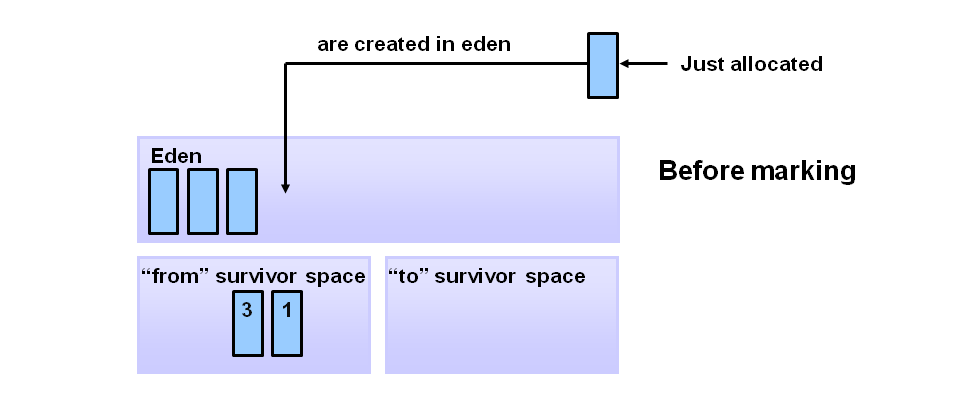
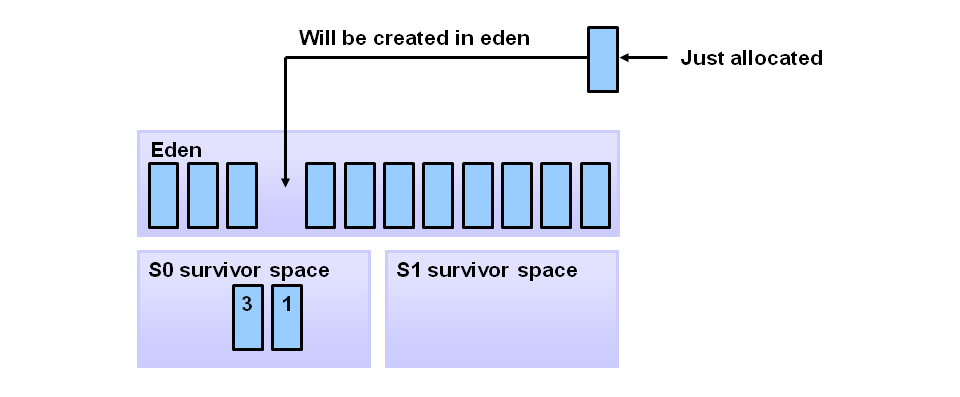
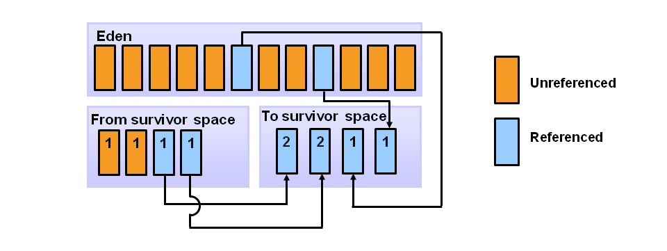
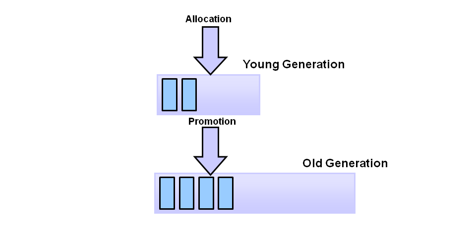
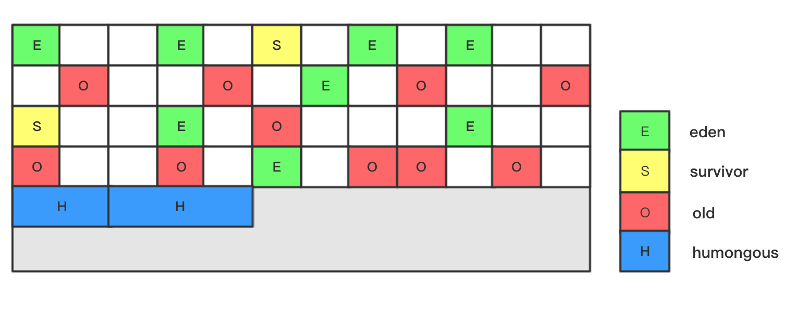
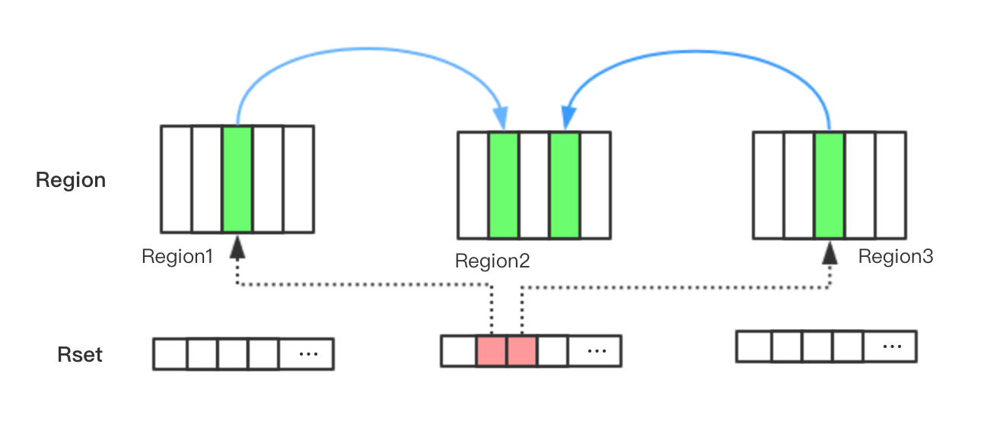
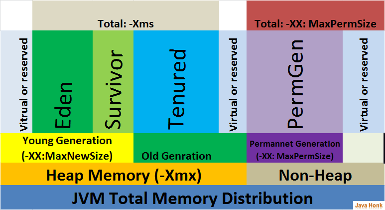

# 垃圾回收机制

## 可达性分析

Java中有一些对象称为`GC Roots`，如果一个`GC Roots`对象引用了某个对象，那么它们之间就存在一条引用链，当一个对象到任意一个`GC Roots`都没有引用链连接时，即表示该对象不可达，进入可回收状态。

下图中右侧部分的三个对象均不可能，因为没有与之关联的`GC Roots`。


以下几种类型的对象可以作为`GC Roots`。

1. 虚拟机栈中引用的对象。
2. 方法区中静态属性引用的对象。
3. 方法区中常量引用的对象。
4. 本地方法栈中JNI引用的对象。

## 对象的自救

一旦对象经过可达性分析后被判定为不可达，虚拟机不会立刻进行回收，对象还有机会进行自救。虚拟机会检查这部分对象是否有必要执行`finalize()`方法，如果对象没有覆盖`finalize()`方法或者该方法已经被调用过了，那么虚拟机就认为没必要再执行，这种情况下对象会被放入待回收集合，无法自救；否则，虚拟机会把符合条件的对象放到`F-Queue`队列中并用一个专门的线程去执行这些对象的`finalize()`方法，之后虚拟机会再次对队列中的对象进行可达性分析，如果依然判定为不可达，那么就放入待回收集合。由于每个对象的`finalize()`方法只会被虚拟机调用一次，因此对象只有1次自救的机会。


对象自救的方法就是在`finalize()`方法中重新与某个`GC Roots`对象进行关联，下面是一个例子。

```java
public class Test {

    static Test HOOK = null;

    @Override
    protected void finalize() throws Throwable {
        super.finalize();
        HOOK = this;
        System.out.println("finalize()");
    }

    public static void main(String[] args) throws InterruptedException {
        HOOK = new Test();
        HOOK = null;
        System.gc();

        // 等待对象自救。
        while (HOOK == null) {
            Thread.sleep(500);
        }
        // 自救成功，打印“save”。
        System.out.println("save");

        HOOK = null;
        System.gc();
        Thread.sleep(1000);
        if (HOOK == null) {
            // 自救失败。
            System.out.println("can not save");
        } else {
            System.out.println("save");
        }
    }
}

// 输出：
// finalize()
// save
// can not save
```

通过以上输出可以看到，`finalize()`方法只被调用了一次，因此第一次对象自救成功，第二次自救失败。

## GC的分类

按照垃圾收集在堆上的范围可以分为以下几类。

- Partial GC  
回收部分堆，又可以细分为几下几类。
    - Young GC  
    回收新生代，也称Minor GC。
    - Old GC  
    回收老年代，也称Major GC。
    - Mixed GC  
    回收整个新生代以及部分老年代。
- Full GC  
回收整个堆，包括新生代，老年代和永久代（或者元空间）。

## 垃圾收集算法

### 标记-清除

标记-清除算法分为标记和清除两个阶段。首先把所有待回收的对象进行标记，然后再统一对标记的对象的内存进行清除。缺点是回收后的内存空间可能不是连续的（内存碎片），当需要存储内存上连续的大对象时（比如一个容量较大的数组对象），可能需要再触发一次GC。


虚拟机需要维护一个单向链表来记录空闲的内存块，当为新建的对象分配内存时，假设对象大小为`size`，虚拟机需要遍历单向链表，找到能大于等于`size`的内存块，最坏情况下可能要遍历到链表的最后一个节点，效率较低。

### 复制

复制算法是把内存空间等分为2个大小一样的区域，每次只用1个区域存储对象，如果当前区域的内存用完了就把存活的对象复制到另一个区域内，然后把当前区域清空，它不存在标记-清除算法中会留下内存碎片的问题，其缺点是可用的内存是原来的一半。


### 标记-整理

标记-整理算法分为标记、整理和清除三个阶段。首先把所有待回收的对象进行标记，然后将存活对象都朝一端移动（即整理），最后直接清除掉整理完的边界以外的内存。


## 内存分配和回收策略

上面介绍的几种垃圾收集算法各有利弊，在性能方面复制算法效率最高，但需要浪费一半的内存空间，其余两个算法效率较低但不浪费内存空间，因此没有完美的算法。那么我们到底选择哪一种算法进行垃圾收集？

在实际的场景中，大部分对象的存活时间都非常短暂，只有一小部分的对象会长时间的存活，针对这种两种情况，我们可以区别对待，对于那些短暂存活的对象我们可以采用性能较好的复制算法进行回收，对于剩下的小部分对象就采用标记-清除或标记-整理算法进行回收。


根据这个思路，我们把堆分为两块区域，用来存放短暂存活对象的区域叫新生代，存放小部分长时间存活的对象的区域叫老年代。虚拟机通常把新生代进一步细分为三个区域：一个Eden区和两个Survivor区，两个Survivor区分别称为From和To。Eden区和单个Survivor区的大小比例默认是8:1，也就是说如果新生代总大小是10MB，那么Eden区分配8MB，两个Survivor区各1MB。


大部分情况下新对象会在Eden区内分配内存，经过上一次Young GC存活下来的对象会在From中（两个Survivor区域在一开始都是空的）。



当Eden区空间不足时会触发一次Young GC。



经过Young GC后，Eden和From中存活下来的对象会被复制到To中，然后把Eden和From区清空。



虚拟机会给每个存活对象一个年龄计数器，第一次经过Young GC生存下来后设置对象的初始年龄为1岁，之后每经历一次Young GC并生存下来年龄就增加1岁，增加到一定的年龄就把对象晋升到老年代，默认是15岁，可以通过`-XX:MaxTenuringThreshold`参数指定。



### 动态对象年龄判定

除了上面的年龄阈值，当Survivor区中对象的空间超过一定百分比（可以通过`-XX:TargetSurvivorRatio`设置，默认是50%）后，年龄较大的对象也会被晋升至老年代即使它还没有达到正常晋升所要求的年龄阈值。

### 空间分配担保

如果在经过一次Young GC后存活下来的对象太多，导致Survivor区放不下，那么就需要把这部分对象直接分配到老年代中。那么这里就需要判断老年代是否有足够的空间存放Survivor区放不下的对象，其做法是在发生Young GC之前，如果当前老年代的连续空间大于新生代对象总大小或历次Young GC的平均晋升大小，那么就会触发Young GC，否则转为触发Full GC以便让老年代腾出更多的空间。如果在Full GC后依然无法存放，那么就抛出`java.lang.OutOfMemoryError: Java heap space`异常。

### TLAB

在高并发情况下如果有大量线程同时在堆上给新创建的对象分配内存就会有线程安全问题，多个线程可能会申请到同一块内存，这个时候虚拟机会通过锁的方式避免以上的问题，但是会降低性能，因此引入了TLAB技术。

TLAB的全称是ThreadLocalAllocBuffer，是Eden区的一块内存。每个线程在初始化是会申请一块内存作为Buffer，只有线程自己可以在这个Buffer上进行操作，当Buffer容量不够的时候，再重新从Eden区域申请一块继续使用（这一步仍旧需要锁）。也就是说通过预先申请内存的方式降低了申请内存的次数，从而提升性能。

## Stop-The-World(STW)

在进行垃圾收集前，虚拟机需要进入一个稳定的状态，在垃圾收集的过程中对象的引用关系不能发生变化，就好像整个系统在某个时间点上冻结了，这就要求除了GC线程以外其它所有的线程必须被暂停，这就是`Stop-The-World`的由来。
`Stop-The-World`是通过安全点（safepoint）机制实现的。安全点是指代码中的一些特定位置，当线程运行到这些位置时线程的状态是确定的，需要等到所有的线程抵达安全点GC才能进行，安全点主要有以下几个位置。

- 方法返回前。
- 调用方法后。
- 抛出异常的位置。
- 循环的末尾。

选择这些位置主要考虑的因素是避免线程长时间不进入安全点，从而导致GC一直无法进行。

## 垃圾收集器

本文将介绍以下几种垃圾收集器，如图所示，两个垃圾收集器之间的连线表示它们可以搭配使用。


### Serial/Serial Old

Serial是单线程的垃圾收集器，是采用复制算法的新生代收集器，它工作时需要暂停所有非GC线程直到垃圾收集工作完成。
Serial Old是Serial的老年代版本，采用标记-整理算法。


### ParNew

ParNew是Serial的多线程版本，两者在垃圾收集算法、Stop-The-World、对象分配规则等部分完全一致，ParNew也是一个新生代的垃圾收集器。


### Parallel Scavenge/Parallel Old

Parallel Scavenge（/ˈskavənj/，清除）是一个多线程的新生代垃圾收集器，它也采用复制算法进行垃圾回收。Parallel Scavenge和ParNew的区别是，Parallel Scavenge关注的是提高吞吐量，适合程序在后台运算而不需要和用户频繁交互的场景，它关注的是一段时间内垃圾收集的总时间；ParNew关注的是尽量缩短Stop-The-World的时间，适合程序需要和用户频繁交互的场景，停顿时间越短那么对用户请求响应的速度就越快。

> 吞吐量 = CPU运行用户代码的时间 / （CPU运行用户代码的时间 + 垃圾收集时间），假设虚拟机总归运行100分钟，其中垃圾收集时间是1分钟，那么运行用户代码时间就是99分钟，那么吞吐量就是99%。

Parallel Old是Parallel Scavenge的老年代版本，是一个多线程的采用标记-整理算法的收集器。


### CMS

CMS，全称Concurrent Mark Sweep，是一种支持并发的采用标记-清除算法的老年代垃圾收集器。


它的收集过程分为以下几个步骤。

1. 初始标记

这一步会标记在老年代中与GC Roots**直接**关联的或者被新生代中存活对象引用到的老年代对象。这一阶段会引发STW，但时间比较短暂。


2. 并发标记

通过上一阶段中找出的对象递归的找出所有存活对象。这一阶段是和用户线程并发执行的，不会中断用户线程，垃圾收集的代码和用户的代码是交错执行的，因此在标记过程中对象的引用状态可能会发生变化。下面的预清理和可中止的预清理这两个步骤也属于并发标记阶段。


3. 预清理

在这个阶段会标记上一阶段中遗漏的存活对象。由于并发标记阶段垃圾收集和用户代码是交替执行的，因此在垃圾收集的同时引用可能发生变化，部分存活对象会被遗漏。比如上一阶段中的A、B对象，原本对象B到GC Roots不可达，因此没有被标记，而在之后的过程中因为没有STW，对象B又可能被对象A引用。虚拟机使用两种数据结构来记录并发标记期间引用的变化，分别是`Mod Union Table`和`Card Table`，前者用来记录在并发标记阶段Young GC导致的引用变化，后者用来记录用户线程导致的引用变化。虚拟机通过检查这两个数据结构就能知道哪里的引用发生了变化，比如图中的A、B对象，在对象A引用了对象B后，就会把`Card Table`中对象A对应的`Card`标为`Dirty`。


最后对象B就会被标记为可达。


4. 可中止的预清理

这一阶段是对上一阶段预清理的延续，由于在并发标记过程中不断有新生代的对象晋升到老年代，虚拟机会不断的执行预清理的步骤直到Eden区的空间使用率达到一定的百分比（可以通过`-XX:CMSScheduleRemarkEdenPenetration`设置，默认是50%），然后再进入下面的重新标记阶段。
  
此外，CMS还会在一段时间内等待Young GC的发生，因为在接下来的重新标记阶段虚拟机需要扫描整个堆中的存活对象，如果在那之前执行了Young GC，那么会过滤掉大部分死亡的对象，为此CMS提供了`-XX:CMSMaxAbortablePrecleanTime`参数，默认是5秒，如果在这段时间内没有发生Young GC，那么就进入重新标记阶段。还有一个参数`-XX:CMSScavengeBeforeRemark`，可以在重新标记之前强制进行Young GC，代价是由于重新标记需要STW，而Young GC也需要STW，那么停顿时间就会比较久。

5. 重新标记

这一阶段的目的是标记所有老年代的存活对象。该阶段会引发STW，然后扫描新生代和老年代中所有存活对象，因为老年代中的对象有可能被新生代中的对象所引用。从这里可以看到上面的预清理和可中止的预清理都是为了尽可能减少重新标记引起的STW的停顿时间，因为它们是并发执行的，而重新标记会暂停所有的用户线程。

6. 并发清理

并发清除掉死亡对象占用的空间，不存在STW。


#### Concurrent Mode Failure

由于CMS的垃圾收集线程是和用户线程一起并发执行的，在垃圾收集的同时会不断有对象从新生代晋升到老年代，如果这个时候老年代空间用完了，就会出现`Concurrent Mode Failure`错误，虚拟机会临时启用Serial Old收集器进行老年代的垃圾回收。参数`-XX:CMSInitiatingOccupancyFraction`可以指定当老年代空间使用率超过多少后启动CMS进行垃圾回收。

#### 内存碎片

由于CMS采用的是标记-清除算法，因此可能产生大量的内存碎片，导致无法给大对象找到足够大的连续内存空间，此时便会触发Full GC。CMS提供了`-XX:+UseCMSCompactAtFullCollection`参数用于在这种情况下进行内存碎片的合并整理，该参数默认是开启的。还有一个`-XX:CMSFullGCsBeforeCompaction`参数用来控制经过多少次不进行内存碎片整理的Full GC后紧跟着进行一次带内存碎片整理的Full GC，默认值是0，表示每次Full GC都要进行碎片整理。

### G1

G1的意思是Garbage First，是JDK9中的默认垃圾收集器，它的设计目标是取代CMS，尽管G1依然存在STW，但是它可以设置期望的STW时间，通过`-XX:MaxGCPauseMillis`参数进行设置，默认200毫秒。

#### Region

和其它垃圾收集器不同的是，G1把堆分为多个大小相等的Region（默认2048个），每个Region的大小只能是2的幂次方，比如1M、2M、4M、8M等，可以通过`-XX:G1HeapRegionSize`参数指定，不同Region之间的内存地址是不连续的。一个Region可以充当新生代的Eden区（E），新生代的Survivor区（S），老年代（O）以及存储巨型对象的老年代（H），巨型对象是指大小超过单个Region大小一半的对象，会直接分配在一个或多个连续的Region中，这些区域也属于老年代。



#### 垃圾回收模式

与之前介绍的几个垃圾回收器不同的是，G1同时支持对新生代和老年代进行垃圾回收。

当创建新对象时，虚拟机通常为其在Eden区分配空间（对于巨型对象则直接分配到老年代），当Eden区耗尽时就会触发Young GC，这个过程需要STW，存活下来的对象会被复制到Survivor区或者晋升到老年代的某个Region中。

当越来越多的对象晋升到老年代，并且老年代的空间使用率达到阈值后（通过`-XX:InitiatingHeapOccupancyPercent`设置阈值，默认45%），虚拟机会触发Mixed GC，这种GC方式会回收整个新生代和部分老年代，它分为两个阶段：全局并发标记（global concurrent marking）和拷贝存活对象（evacuation）。

全局并发标记阶段有以下几个步骤。

- 初始标记

标记GC Roots直接关联的对象，这个阶段需要STW。

- 并发标记

通过上一阶段中找出的对象递归的找出所有存活对象，和用户线程并发执行的，不需要STW。

- 最终标记

标记上两个阶段遗漏的对象，需要STW。

- 清理

统计每个Region中被标记为存活对象的数量，如果发现完全没有存活对象的Region，那么就会把它整体回收并放到空闲Region列表中。

拷贝存活对象阶段会根据**停顿预测模型**把一部分Region里的存活对象用复制算法拷贝到空闲Region中，停顿预测模型是根据GC的统计数据和用户期望的STW时间通过数学公式计算出本次GC需要回收的Region数量，这一阶段需要STW。

此外，由于G1也有并发收集的过程，因此也存在CMS中的Concurrent Mode Failure问题，G1中称为Allocation Failure。当Mixed GC来不及回收时，老年代空间被迅速填满，这时G1会临时用Serial Old收集器回收整个堆，也就是Full GC，这会造成长时间的停顿。

#### Remembered Set

G1在初始化每个Region时，同时还会初始化一个Remembered Set（RSet），用来记录其它Region指向当前Region中对象的引用，一个Region会被划分为多个Card，默认每个Card是512字节，下图中Region1和Region3分别引用了Region2里的对象，Region2的RSet里就会记录相关引用。处于性能考虑，虚拟机并不会在每次给引用类型的字段赋值后就立刻更新RSet，而是会把字段对应的Card放到队列中，由另外的线程进行RSet的更新工作。



RSet的作用是避免在可达性分析时进行全堆扫描，比如Region1中的对象A被Region2的对象B引用，假设对象B是GC根，那么对象A不能被回收，如果没有RSet，那么我们就不知道对象A被哪些对象引用了，那么就需要扫描所有的Region才能知道对象A是否可达，有了RSet，就可以直接找出引用A的对象，避免了全堆扫描。

## 常见参数



- Xms：初始堆大小。
- Xmx：最大对大小。
- Xmn：年轻代大小。

## 参考

1. [《GC算法与种类》](https://www.cnblogs.com/qdhxhz/p/9211095.html)
2. [《GC算法之一 标记-清除算法》](https://zhuanlan.zhihu.com/p/51095294)
3. [《JVM安全点介绍》](https://www.ezlippi.com/blog/2018/01/safepoint.html)
4. [《Elasticsearch Log GC日志分析详解》](https://blog.csdn.net/ZYC88888/article/details/83023484)
5. [《图解CMS垃圾回收机制，你值得拥有》](https://www.jianshu.com/p/2a1b2f17d3e4)
6. [《CMS垃圾回收器详解》](https://blog.csdn.net/zqz_zqz/article/details/70568819)
7. [《GC Algorithms: Implementations》](https://plumbr.io/handbook/garbage-collection-algorithms-implementations)
8. [《[JVM]GC那些事(七)CMS》](https://htchz.me/4242301031.html)
9. [《Major GC和Full GC的区别是什么》](https://www.zhihu.com/question/41922036)
10. [《Java Garbage Collection Basics》](https://www.oracle.com/webfolder/technetwork/tutorials/obe/java/gc01/index.html)
11. [《JVM源码分析之线程局部缓存TLAB》](https://www.jianshu.com/p/cd85098cca39)
12. [《Java Hotspot G1 GC的一些关键技术》](https://tech.meituan.com/g1.html)
13. [《G1垃圾收集器介绍》](https://www.jianshu.com/p/0f1f5adffdc1)
14. [《G1垃圾收集器之RSet》](https://www.jianshu.com/p/870abddaba41)
15. [《深入理解 Java G1 垃圾收集器》](http://blog.jobbole.com/109170/)
