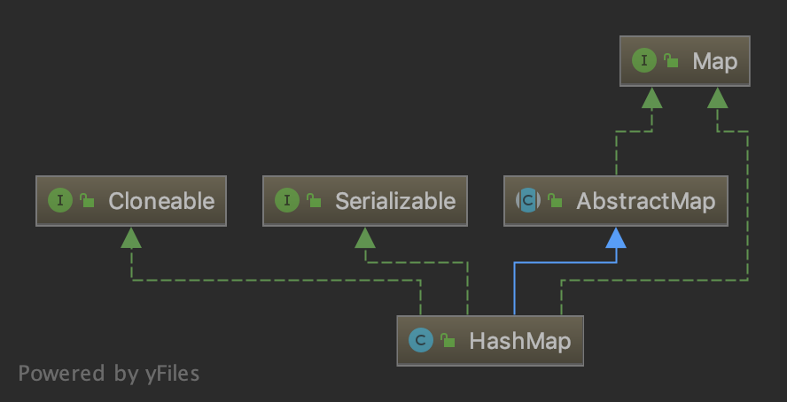
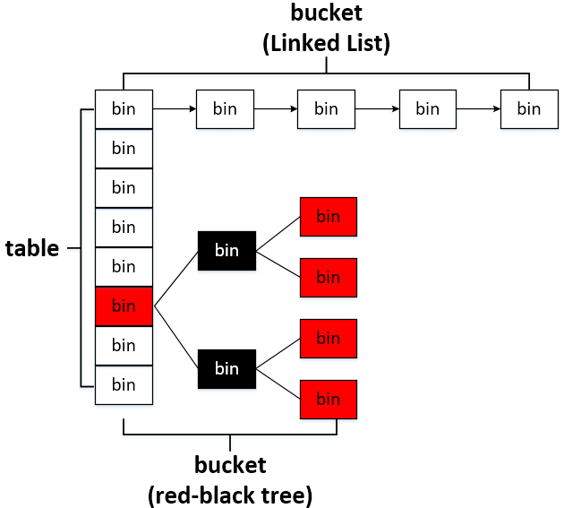
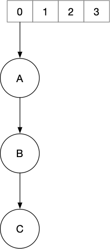
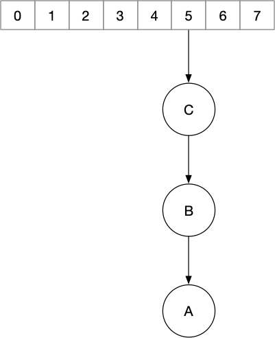
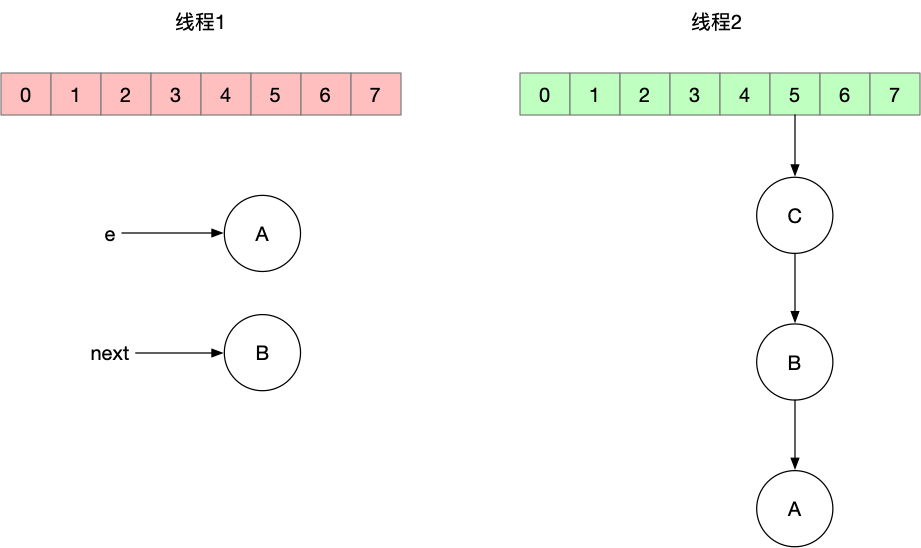
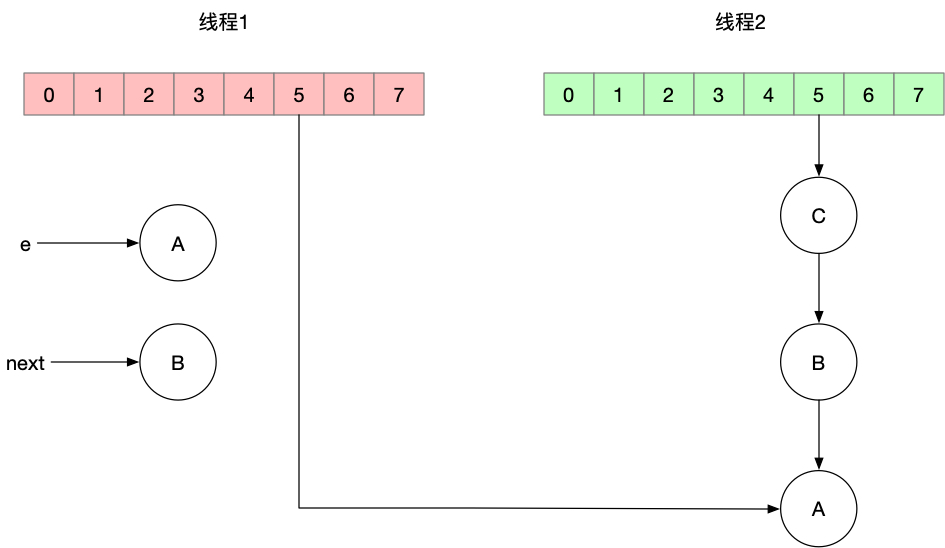
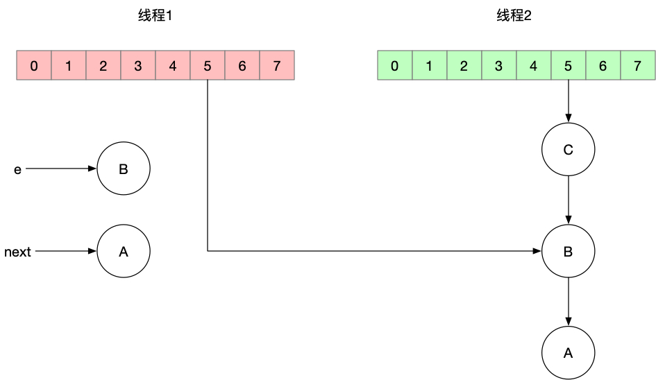
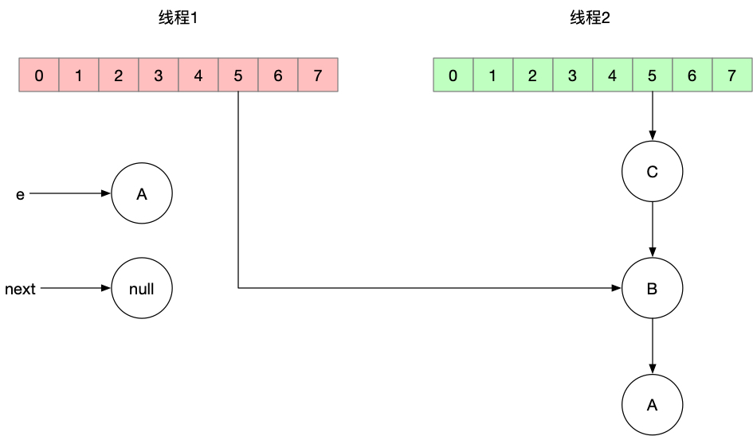
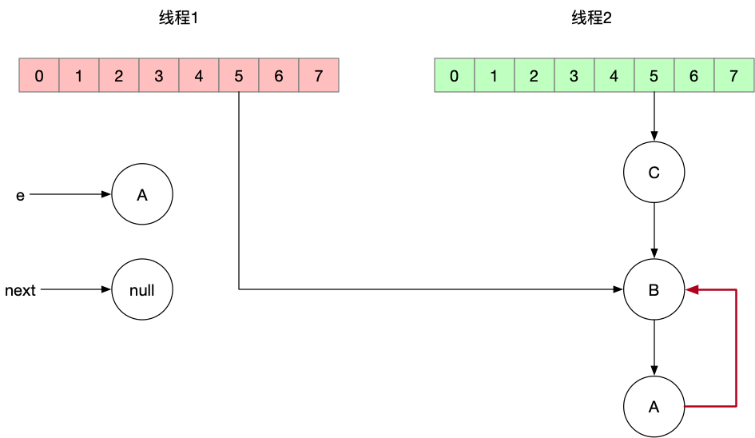

# HashMap


`HashMap`是一种常用的存储键值对数据结构，它实现了`Map`接口，可以在O(1)时间内找到键对应的值，其层次结构如下。



在JDK1.8之前它的底层实现是“数组+链表”的形式，从JDK1.8开始变成“数组+链表+红黑树”的形式，当一个链表中节点个数大于8时，该链表会转为红黑树。



下面我们从构造函数看起。

## HashMap()

默认的无参构造器仅仅设置了字段`loadFactor`的值，该字段表示负载因子，默认负载因子是`0.75`，我们先把它放在一边，之后会用到。

```java
static final float DEFAULT_LOAD_FACTOR = 0.75f;

public HashMap() {
    this.loadFactor = DEFAULT_LOAD_FACTOR;
}
```

## HashMap(int)

该构造方法可以设置底层数组的初始容量，在它的内部调用了另一个构造方法。

```java
public HashMap(int initialCapacity) {
    this(initialCapacity, DEFAULT_LOAD_FACTOR);
}

public HashMap(int initialCapacity, float loadFactor) {
    // 检查初始容量和负载因子的合法性。
    if (initialCapacity < 0)
        throw new IllegalArgumentException("Illegal initial capacity: " +
                                            initialCapacity);
    if (initialCapacity > MAXIMUM_CAPACITY)
        initialCapacity = MAXIMUM_CAPACITY;
    if (loadFactor <= 0 || Float.isNaN(loadFactor))
        throw new IllegalArgumentException("Illegal load factor: " +
                                            loadFactor);
    this.loadFactor = loadFactor;
    // threshold表示当元素数量达到多少后需要对底层数组重新调整大小。
    this.threshold = tableSizeFor(initialCapacity);
}

// 返回大于等于cap的最小的2的幂数。
// 当 cap = 2 时，方法返回值为2，因为 2 ^ 1 = 2。
// 当 cap = 31 时，方法返回值是32，因为 2 ^ 4 = 16 < 31 而 2 ^ 5 = 32 > 31。
static final int tableSizeFor(int cap) {
    int n = cap - 1;
    n |= n >>> 1;
    n |= n >>> 2;
    n |= n >>> 4;
    n |= n >>> 8;
    n |= n >>> 16;
    return (n < 0) ? 1 : (n >= MAXIMUM_CAPACITY) ? MAXIMUM_CAPACITY : n + 1;
}
```

## HashMap(Map<? extends K, ? extends V>)

该构造方法把一个`Map`对象放入当前`HashMap`中。

```java
public HashMap(Map<? extends K, ? extends V> m) {
    this.loadFactor = DEFAULT_LOAD_FACTOR;
    putMapEntries(m, false);
}

final void putMapEntries(Map<? extends K, ? extends V> m, boolean evict) {
    int s = m.size();
    if (s > 0) {
        // 当前hashmap未初始化。
        if (table == null) {
            // 根据待插入map的大小计算hashmap的容量。
            float ft = ((float)s / loadFactor) + 1.0F;
            int t = ((ft < (float)MAXIMUM_CAPACITY) ?
                        (int)ft : MAXIMUM_CAPACITY);
            if (t > threshold)
                // 找到比t大的最小的2的幂次。
                threshold = tableSizeFor(t);
        }
        else if (s > threshold)
            // 如果待插入的map的键值对数量大于阈值，那么就进行扩容。
            resize();

        // 遍历键值对，调用putVal()方法插入到当前hashmap中。
        for (Map.Entry<? extends K, ? extends V> e : m.entrySet()) {
            K key = e.getKey();
            V value = e.getValue();
            putVal(hash(key), key, value, false, evict);
        }
    }
}
```

## put(K, V)

该方法把键值对放入map中，内部调用`putVal()`方法。

```java
public V put(K key, V value) {
    return putVal(hash(key), key, value, false, true);
}
```

这里有一个非常重要的方法：`hash()`，利用它可以计算出键值对的哈希值。该方法内部主要调用了定义在`java.lang.Object`类中的`hashCode()`方法来获得对象的哈希值。

```java
static final int hash(Object key) {
    int h;
    return (key == null) ? 0 : (h = key.hashCode()) ^ (h >>> 16);
}
```

接下来我们看下`putVal()`方法。

```java
final V putVal(int hash, K key, V value, boolean onlyIfAbsent,
               boolean evict) {
    Node<K,V>[] tab; Node<K,V> p; int n, i;
    // table就是我们最开始介绍的“数组+链表+红黑树”中的数组部分。
    // table的类型是transient Node<K,V>[] table;
    // 当table未初始化时（null），或其容量为0时调用resize()方法进行初始化/扩容。
    if ((tab = table) == null || (n = tab.length) == 0)
        n = (tab = resize()).length;

    // 变量i代表插入到table数组中的位置，变量p就是该位置上的节点。
    // (n - 1) & hash 在这里等价于 hash % n，这个等价关系成立的条件是n是2的幂次，在HashMap的各个函数中都遵循这个要求，因此可以满足。
    // 这里用位运算的原因是，相比取模运算，位运算的效率更高。
    // 如果p == null表示数组的这一格是空的，那么就创建新的键值对节点，这里的节点类型是链表的节点，而不是红黑树的节点。
    if ((p = tab[i = (n - 1) & hash]) == null)
        tab[i] = newNode(hash, key, value, null);
    else {
        // 进入这个代码分支就表示table[i]处存在节点p了。
        Node<K,V> e; K k;

        // 如果table[i]处首节点p的键和我们要插入的键相同，就把变量p赋值给变量e。
        // 两个键相同的条件是键的哈希值相同，或者内存地址相同，或者通过equals()方法对比后相同。
        if (p.hash == hash &&
            ((k = p.key) == key || (key != null && key.equals(k))))
            e = p;
        else if (p instanceof TreeNode)
            // 如果table[i]处首节点p的键和我们要插入的键不相同，并且p是红黑树的节点类型，那么就把键值对插入到红黑树中。
            e = ((TreeNode<K,V>)p).putTreeVal(this, tab, hash, key, value);
        else {
            // 如果table[i]处首节点p的键和我们要插入的键不相同，并且p是链表的节点类型，那么就进入以下代码块。
            for (int binCount = 0; ; ++binCount) {
                if ((e = p.next) == null) {
                    // 把键值对插入到链表的末尾。
                    p.next = newNode(hash, key, value, null);
                    // 如果链表的节点数量超过了阈值，就把链表转为红黑树。
                    // TREEIFY_THRESHOLD的值是 static final int TREEIFY_THRESHOLD = 8;
                    if (binCount >= TREEIFY_THRESHOLD - 1)
                        treeifyBin(tab, hash);
                    break;
                }
                // 在遍历链变的过程中如果找到了一个节点的键和我们要插入的键相同，那么就中断循环。
                if (e.hash == hash &&
                    ((k = e.key) == key || (key != null && key.equals(k))))
                    break;
                p = e;
            }
        }


        // 变量e表示在插入键值对之前就已经存在的节点。
        // 如果e不为null，则表示之前相同的键已经存在了。
        if (e != null) {
            V oldValue = e.value;
            // 更新键对应的值。
            if (!onlyIfAbsent || oldValue == null)
                e.value = value;
            // 回调方法，默认是空方法。
            afterNodeAccess(e);
            // 返回更新之前的值。
            return oldValue;
        }
    }
    // modCount的类型是transient int modCount;
    // 表示map修改的次数，在用迭代器遍历map时用modCount检测map是否进行过修改。
    ++modCount;

    // 如果键值对数量超过了阈值，那么就要进行扩容。
    if (++size > threshold)
        resize();

    // 回调方法，默认是空方法。
    afterNodeInsertion(evict);
    return null;
}
```

上面代码中用到的链表节点对应的数据结构如下。

```java
// java.util.HashMap.Node
// 此处省略了构造方法和其它的方法。
static class Node<K,V> implements Map.Entry<K,V> {
    final int hash;
    final K key;
    V value;
    Node<K,V> next;
}
```

红黑树节点的数据结构如下，其中`TreeNode`继承自`LinkedHashMap.Entry`，而`LinkedHashMap.Entry`又继承自`HashMap.Node`，也就是说上面的`Node`是`TreeNode`的祖父类。

```java
static final class TreeNode<K,V> extends LinkedHashMap.Entry<K,V> {
    TreeNode<K,V> parent;
    TreeNode<K,V> left;
    TreeNode<K,V> right;
    TreeNode<K,V> prev;
    boolean red;
}
```

## resize()

对`table`数组进行扩容。

```java
final Node<K,V>[] resize() {
    // 当前table数组。
    Node<K,V>[] oldTab = table;
    // 当前table数组的容量。
    int oldCap = (oldTab == null) ? 0 : oldTab.length;
    // 当前扩容阈值。
    int oldThr = threshold;
    int newCap, newThr = 0;

    // 如果当前table数组非空，那么进入以下代码块。
    if (oldCap > 0) {
        // 如果当前容量大于等于MAXIMUM_CAPACITY，那么就把阈值设置为Integer.MAX_VALUE。
        // MAXIMUM_CAPACITY的值是1 << 30，即2^30。
        // 当HashMap中键值对的数量超过MAXIMUM_CAPACITY，就不会再为table数组扩容，因此这里直接return。
        if (oldCap >= MAXIMUM_CAPACITY) {
            threshold = Integer.MAX_VALUE;
            return oldTab;
        }
        // 这种情况下oldCap的最大值是(1 << 30) - 1 ，因此oldCap << 1的最大值是((1 << 30) - 1) << 1，不会溢出。
        // 新的容量newCap是当前容量的两倍。
        // DEFAULT_INITIAL_CAPACITY的值是16。
        else if ((newCap = oldCap << 1) < MAXIMUM_CAPACITY &&
                    oldCap >= DEFAULT_INITIAL_CAPACITY)
            // 新的阈值也是两倍。
            newThr = oldThr << 1;
    }
    // 这种情况下table还没有被初始化，在构造阶段设置了table数组的初始容量，比如使用了可以指定初始容量的构造器来创建对象。
    else if (oldThr > 0)
        newCap = oldThr;
    else {
        // 这是用户使用无参构造器创建对象的情况。
        newCap = DEFAULT_INITIAL_CAPACITY;
        // DEFAULT_LOAD_FACTOR的值是0.75。
        newThr = (int)(DEFAULT_LOAD_FACTOR * DEFAULT_INITIAL_CAPACITY);
    }

    // 在上面几种情况中，当满足if (oldThr > 0)时，newThr没被赋值，此时它的值是0。
    if (newThr == 0) {
        float ft = (float)newCap * loadFactor;
        newThr = (newCap < MAXIMUM_CAPACITY && ft < (float)MAXIMUM_CAPACITY ?
                    (int)ft : Integer.MAX_VALUE);
    }
    threshold = newThr;
    // 初始化新的table数组。
    Node<K,V>[] newTab = (Node<K,V>[])new Node[newCap];
    table = newTab;
    // 如果当前table还没有初始化，那么直接return。
    if (oldTab != null) {
        for (int j = 0; j < oldCap; ++j) {
            Node<K,V> e;
            if ((e = oldTab[j]) != null) {
                oldTab[j] = null;
                if (e.next == null)
                    // 如果在原table[j]的位置只有一个节点，那么就直接把该节点分配到新的table数组中。
                    newTab[e.hash & (newCap - 1)] = e;
                else if (e instanceof TreeNode)
                    // 将红黑树中的节点重新分配到新数组中。
                    ((TreeNode<K,V>)e).split(this, newTab, j, oldCap);
                else {
                    Node<K,V> loHead = null, loTail = null;
                    Node<K,V> hiHead = null, hiTail = null;
                    Node<K,V> next;
                    do {
                        // 对于链表节点的重新分配有特殊的算法。
                        next = e.next;
                        // 根据e.hash & oldCap的结果是否等于0把链表中所有的节点分为两个链表。
                        // loHead/loTail，hiHead/hiTail分别是两个链表的头尾指针。
                        // e.hash & oldCap为0的这部分节点在新的数组中的位置和原来的位置保持一致。
                        // e.hash & oldCap不为0的这部分节点在新的数组中的位置等于原来的位置加上原来数组容量的偏移量，比如原来在索引5的位置，原来数组的容量是16，那么在新数组中的索引号就是 5 + 16 = 21。
                        if ((e.hash & oldCap) == 0) {
                            if (loTail == null)
                                loHead = e;
                            else
                                loTail.next = e;
                            loTail = e;
                        }
                        else {
                            if (hiTail == null)
                                hiHead = e;
                            else
                                hiTail.next = e;
                            hiTail = e;
                        }
                    } while ((e = next) != null);
                    // 分配e.hash & oldCap为0的节点组成的链表。
                    if (loTail != null) {
                        loTail.next = null;
                        newTab[j] = loHead;
                    }
                    // 分配e.hash & oldCap不为0的节点组成的链表。
                    if (hiTail != null) {
                        hiTail.next = null;
                        newTab[j + oldCap] = hiHead;
                    }
                }
            }
        }
    }
    return newTab;
}
```

以下是重新分配链表节点的示意图。


从`resize()`方法中我们可以总结出一个公式：下一次调整数组大小的阈值`threshold` = 数组新的容量`newCap` * 负载因子`loadFactor`。负载因子过小会导致数组空闲位置太多，利用率太低；负载因子过大会导致哈希碰撞更频繁。

### 分组

对于迁移过程中发生的分组过程这里举一个例子，假设当前hashmap的容量是16，哈希值为34的节点位于34&(16-1)的索引处，也就是数组中索引为2的位置，经过扩容后hashmap容量为32，此时根据分组算法`hash&oldCap`，34&16的结果是0，因此该节点应该仍然位于新数组中索引为2的位置，而新的位置可以通过`hash&(n-1)`计算，得到的结果为34&(32-1)同样为2，因此可以判定当一个节点`hash&oldCap`的值为0时，其在新数组中的位置和远数组保持一直。再来看一个哈希值为50的节点的情况，假设hashmap的容量是16，则该节点位于50&(16-1)即数组中索引为2的位置，根据分组算法`hash&oldCap`，50&16的值不等于0，因此该节点应该位于新数组中原来的位置加上原来数组容量的偏移量的位置，也就是2+16即18，通过`hash&(n-1)`可以计算出该节点在新数组中的位置是50&(32-1)，确实是18。

## get(Object)

该方法通过键查找对应的值，内部调用`getNode()`方法。

```java
public V get(Object key) {
    Node<K,V> e;
    return (e = getNode(hash(key), key)) == null ? null : e.value;
}

final Node<K,V> getNode(int hash, Object key) {
    Node<K,V>[] tab; Node<K,V> first, e; int n; K k;
    // 如果table数组未初始化或者容量等于0，或者键对应的节点不存在，那么方法就返回null。
    if ((tab = table) != null && (n = tab.length) > 0 &&
        (first = tab[(n - 1) & hash]) != null) {
        // 如果首节点的键就是目标键，那么就返回首节点first。
        if (first.hash == hash &&
            ((k = first.key) == key || (key != null && key.equals(k))))
            return first;
        if ((e = first.next) != null) {
            // 如果首节点是红黑树的节点，那么就在红黑树中进一步查找。
            if (first instanceof TreeNode)
                return ((TreeNode<K,V>)first).getTreeNode(hash, key);

            // 如果首节点不是红黑树节点，那么就遍历链表寻找匹配的节点。
            do {
                if (e.hash == hash &&
                    ((k = e.key) == key || (key != null && key.equals(k))))
                    return e;
            } while ((e = e.next) != null);
        }
    }

    // 找不到匹配的节点，返回null。
    return null;
}
```

## getOrDefault(Object, V)

该方法用于查找键对应的值，如果键不存在就返回默认值。

```java
public V getOrDefault(Object key, V defaultValue) {
    Node<K,V> e;
    // 通过getNode()方法查找键对应的节点，如果节点不存在就返回事先定义的默认值，否则就返回节点的值。
    return (e = getNode(hash(key), key)) == null ? defaultValue : e.value;
}
```

## remove(Object)

删除键对应的键值对，内部调用`removeNode()`方法删除键对应的节点。

```java
public V remove(Object key) {
    Node<K,V> e;
    return (e = removeNode(hash(key), key, null, false, true)) == null ? null : e.value;
}

final Node<K,V> removeNode(int hash, Object key, Object value,
                           boolean matchValue, boolean movable) {
    Node<K,V>[] tab; Node<K,V> p; int n, index;
    // 如果table数组未初始化或者容量等于0，或者键对应的节点不存在，那么方法就返回null。
    if ((tab = table) != null && (n = tab.length) > 0 &&
        (p = tab[index = (n - 1) & hash]) != null) {
        Node<K,V> node = null, e; K k; V v;
        // 判断首节点p是否匹配，如果匹配那么把p赋值给变量node。
        if (p.hash == hash &&
            ((k = p.key) == key || (key != null && key.equals(k))))
            node = p;
        else if ((e = p.next) != null) {
            // 如果首节点不匹配并且它是红黑树的节点，那么就从红黑树中查找匹配的节点。
            if (p instanceof TreeNode)
                node = ((TreeNode<K,V>)p).getTreeNode(hash, key);
            else {
                // 否则遍历链表找到匹配的节点。
                do {
                    if (e.hash == hash &&
                        ((k = e.key) == key ||
                            (key != null && key.equals(k)))) {
                        node = e;
                        break;
                    }
                    p = e;
                } while ((e = e.next) != null);
            }
        }

        // 以上代码执行完毕后，如果变量node不为null，那么它就存储了匹配到的节点，也就是待删除的节点，如果node是null，则代表没有找到目标节点。
        if (node != null && (!matchValue || (v = node.value) == value ||
                                (value != null && value.equals(v)))) {
            if (node instanceof TreeNode)
                // 如果待删除节点是红黑树节点，那么就调用removeTreeNode()方法从红黑树中删除节点。
                ((TreeNode<K,V>)node).removeTreeNode(this, tab, movable);
            else if (node == p)
                // 如果待删除节点就是首节点，那么把首节点设置为链表的下一个节点。
                tab[index] = node.next;
            else
                // 如果待删除节点不是链表的首节点，那么就调整next指针把节点移除。
                p.next = node.next;
            ++modCount;
            --size;
            // 回调方法，默认是空方法。
            afterNodeRemoval(node);
            return node;
        }
    }
    return null;
}
```

## size()

返回键值对的数量。

```java
public int size() {
    return size;
}
```

## 迭代器

由于`HashMap`没有实现`Iterable`接口，因此我们无法直接遍历存储在map中的键值对，但我们可以通过`entrySet()`方法获得一个`Set<Map.Entry<K,V>>`类型的实例，由于`Set`接口继承自`Iterable`接口，因此我们可以通过它遍历map中所有的键值对。

```java
public Set<Map.Entry<K,V>> entrySet() {
    Set<Map.Entry<K,V>> es;
    return (es = entrySet) == null ? (entrySet = new EntrySet()) : es;
}
```

第一次调用该方法会创建一个`EntrySet`对象，缓存在`entrySet`字段中。`EntrySet`是`HashMap`的非静态内部类，实现了`Iterable`接口，因此拥有一个`iterator()`方法返回一个`EntryIterator`类型的对象。

```java
// java.util.HashMap.EntrySet
final class EntrySet extends AbstractSet<Map.Entry<K,V>> {

    public final Iterator<Map.Entry<K,V>> iterator() {
        return new EntryIterator();
    }

    // 省略了其它字段和方法。
}
```

`EntryIterator`同样也是`HashMap`的一个非静态内部类，它通过调用基类`HashIterator`中的方法`nextNode()`达到遍历的目的。

```java
// java.util.HashMap.EntryIterator
final class EntryIterator extends HashIterator
    implements Iterator<Map.Entry<K,V>> {
    public final Map.Entry<K,V> next() { return nextNode(); }
}

// java.util.HashMap.HashIterator#nextNode
final Node<K,V> nextNode() {
    Node<K,V>[] t;
    Node<K,V> e = next;
    // 检测在遍历时是否对hashmap进行了修改。
    if (modCount != expectedModCount)
        throw new ConcurrentModificationException();
    // 已遍历完所有的节点。
    if (e == null)
        throw new NoSuchElementException();
    // 如果下一个节点为空，那么在数组中寻找下一个不为null的格子。
    if ((next = (current = e).next) == null && (t = table) != null) {
        do {} while (index < t.length && (next = t[index++]) == null);
    }
    return e;
}
```

## Nullable

`HashMap`允许键和值是`null`。

```java
public static void main(String[] args) {
    Map<String, String> map = new HashMap<>();
    map.put(null, "hello");
    map.put("hello", null);
    System.out.println(map.get(null)); // 此处打印“hello”。
}
```

## 红黑树中节点的顺序

当链表中的元素到达一定的阈值时，链表会被转化为红黑树。红黑树中的节点按照以下规则排序。

1. 如果类实现了`Comparable`接口，并且`compareTo()`方法的返回值不为0，那么就根据`compareTo()`方法的返回值排序，否则使用步骤(2)中的规则。
2. 如果类名不同，就根据类名进行排序，如果类名相同，则使用步骤(3)中的规则。
3. 否则用`java.lang.System#identityHashCode`方法根据每个对象生成的哈希值进行排序。

## 死循环问题

在用JDK6版本的HashMap时，如果有多个线程并发访问可能会导致死循环的问题。

假设有一个HashMap，数组的容量为4，当前有3个键值对，已达到扩容的阈值，因此我们需要对它进行扩容。假设三个元素都在一个桶内，如下图所示。



以下是OpenJDK6中HashMap在扩容时进行键值对迁移的[源码](https://github.com/unofficial-openjdk/openjdk/blob/jdk6/jdk6/jdk/src/share/classes/java/util/HashMap.java)。

```java
void transfer(Entry[] newTable) {
    Entry[] src = table;                                // (1)
    int newCapacity = newTable.length;                  // (2)
    for (int j = 0; j < src.length; j++) {              // (3)
        Entry<K,V> e = src[j];                          // (4)
        if (e != null) {                                // (5)
            src[j] = null;                              // (6)
            do {                                        // (7)
                Entry<K,V> next = e.next;               // (8)
                int i = indexFor(e.hash, newCapacity);  // (9)
                e.next = newTable[i];                   // (10)
                newTable[i] = e;                        // (11)
                e = next;                               // (12)
            } while (e != null);                        // (13)
        }
    }
}
```

在单线程下，上面的代码会将图中的三个键值对进行迁移，假设迁移后三个键值对依然在同一个桶中，如下图所示。



那么在多线程下会发生什么呢？我们逐步进行分析。

假设有两个线程分别对HashMap中的元素进行迁移，线程1在执行到第(8)行代码时失去CPU时间，此时线程2加入，并完成迁移，但在把新的数组替换原数组之前丢失了CPU时间，此时这两个线程的状态如下所示。



此时线程1重新拿到了CPU时间，从第(9)行代码开始继续执行。

```java
e.next = newTable[i];
```

这里的`newTable`是局部变量，两个线程私有的，因此线程1中的`newTable[i]`为`null`，而`e`指向节点A，因此`e.next`等价于把节点A的`next`设置为`null`。第(11)行语句将`newTable[i]`指向节点A，此时两个线程的状态如下所示。



进入下一轮循环后，变量`e`和`next`发生了变化。


经过这一轮后线程1中的`newTable[i]`指向节点B。



继续下一轮循环，变量`e`和`next`再次发生了变化。



此时，重点来了，第10行代码`e.next = newTable[i];`将节点A的`next`指向了`newTable[i]`处的节点，也就是节点B。



最后`next`的值赋给变量`e`，此时`next`是`null`，因此`e`是`null`，循环结束。

可以看到在上面的例子中，节点A和节点B互相引用，形成了一个环，此时当我们调用`get()`方法取值时，如果键正好在节点A所在的链表中，那么对链表进行遍历搜索时就会造成死循环。

## 参考

1. [《JDK1.8--HashMap》](https://www.jianshu.com/p/3287cd3cec4b)
