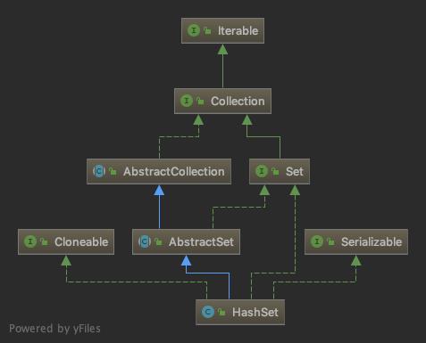

# HashSet


`HashMap`是一种常见的`Set`接口的实现，不包含重复的元素，其层次结构如下。



`HashSet`是基于`HashMap`实现的，因此`HashSet`代码量远少于`HashMap`。

## HashSet()

无参构造器和其它几个带参构造器的主要工作就是把`map`字段初始化为一个`HashMap`类型的实例。

```java
private transient HashMap<E,Object> map;

public HashSet() {
    map = new HashMap<>();
}
```

## HashSet(int, float, boolean)

该方法是唯一一个把`map`字段初始化为一个`LinkedHashMap`实例的构造器，`LinkedHashMap`是`HashMap`的子类。

```java
HashSet(int initialCapacity, float loadFactor, boolean dummy) {
    map = new LinkedHashMap<>(initialCapacity, loadFactor);
}
```

## add(E)

增加元素的操作底层调用的是`Map`的`put()`方法，`PRESENT`对象是一个静态常量，在这里没有实际含义，仅仅是因为`put()`方法必须传入一个键值对。

```java
private static final Object PRESENT = new Object();

public boolean add(E e) {
    return map.put(e, PRESENT)==null;
}
```

## remove(Object)

移除元素的方法同样也是调用`Map`的`remove()`方法。

```java
public boolean remove(Object o) {
    return map.remove(o)==PRESENT;
}
```

## contains(Object)

底层调用`Map`的`containsKey`方法。

```java
public boolean contains(Object o) {
    return map.containsKey(o);
}
```
