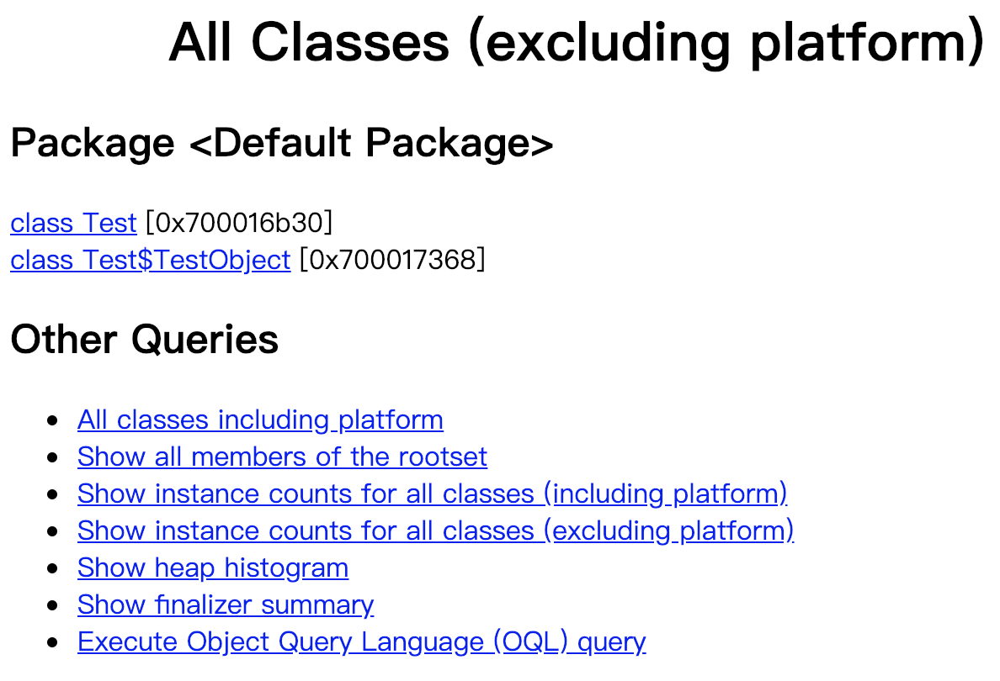

# JDK工具

## jps

JVM Process Status Tool可以列出正在运行的虚拟机进程。

对下面的代码进行编译后使用`java Test a b`运行编译后的类文件，这里的`a`、`b`是传递给`main()`方法的参数。

```java
public class Test {

    public static void main(String[] args) throws InterruptedException {
        Thread.sleep(1000000);
    }
}
```

在另一个进程中执行`jps -ml`可以看到类似以下的结果，分别是进程号、`main()`方法所在的类的名称以及传递给`main()`方法的参数。

```bash
30273 Test a b
```

## jstat

JVM Statistics Monitoring Tool用于监视虚拟机各种运行状态的信息，主要包括类装载、垃圾回收、运行时编译方面的相关信息。

用命令`jstat -gc 31030`查看31030进程的垃圾回收状况，我们会得到如下内容。

```bash
S0C    S1C    S0U    S1U      EC       EU        OC        OU       MC     MU    CCSC   CCSU   YGC    YGCT   FGC    FGCT    CGC    CGCT     GCT   
0.0    0.0    0.0    0.0   26624.0   1024.0   235520.0     0.0      0.0    0.0    0.0    0.0     0     0.000   0     0.000    0     0.000    0.000
```

- S0C：Survivor0的容量，单位KB。
- S1C：Survivor1的容量，单位KB。
- S0U：Survivor0的已用容量，单位KB。
- S1U：Survivor1的已用容量，单位KB。
- EC：Eden区的容量，单位KB。
- EU：Eden区的已用容量，单位KB。
- OC：老年代的容量，单位KB。
- OU：老年代的已用容量，单位KB。
- MC：元空间的容量，单位KB。
- MU：元空间的已用容量，单位KB。
- CCSC：压缩类空间的容量，单位KB。
- CCSU：压缩类空间的已用容量，单位KB。
- YGC：Young GC的次数。
- YGCT：Young GC总耗时。
- FGC：Full GC的次数。
- FGCT：Full GC总耗时。
- CGC：Stop-The-World的次数。
- CGCT：Stop-The-World的总耗时。
- GCT：GC总耗时。

## jstack

Stack Trace For Java工具用于生成当前时刻的线程快照，其生成的结果如下所示（截取部分结果），包括了每一个线程正在执行的方法信息。通常使用该工具查看线程长时间阻塞的原因。

```bash
"main" #1 prio=5 os_prio=31 cpu=88.25ms elapsed=36.89s tid=0x00007fe00b80b800 nid=0x2303 waiting on condition  [0x000070000c82e000]
   java.lang.Thread.State: TIMED_WAITING (sleeping)
        at java.lang.Thread.sleep(java.base@11/Native Method)
        at Test.main(Test.java:12)

   Locked ownable synchronizers:
        - None

"Reference Handler" #2 daemon prio=10 os_prio=31 cpu=0.14ms elapsed=36.87s tid=0x00007fe00c817000 nid=0x3703 waiting on condition  [0x000070000cf43000]
   java.lang.Thread.State: RUNNABLE
        at java.lang.ref.Reference.waitForReferencePendingList(java.base@11/Native Method)
        at java.lang.ref.Reference.processPendingReferences(java.base@11/Reference.java:241)
        at java.lang.ref.Reference$ReferenceHandler.run(java.base@11/Reference.java:213)

   Locked ownable synchronizers:
        - None

"Finalizer" #3 daemon prio=8 os_prio=31 cpu=0.32ms elapsed=36.87s tid=0x00007fe00c804000 nid=0x3803 in Object.wait()  [0x000070000d046000]
   java.lang.Thread.State: WAITING (on object monitor)
        at java.lang.Object.wait(java.base@11/Native Method)
        - waiting on <0x000000070ff08f80> (a java.lang.ref.ReferenceQueue$Lock)
        at java.lang.ref.ReferenceQueue.remove(java.base@11/ReferenceQueue.java:155)
        - waiting to re-lock in wait() <0x000000070ff08f80> (a java.lang.ref.ReferenceQueue$Lock)
        at java.lang.ref.ReferenceQueue.remove(java.base@11/ReferenceQueue.java:176)
        at java.lang.ref.Finalizer$FinalizerThread.run(java.base@11/Finalizer.java:170)

   Locked ownable synchronizers:
        - None
```

## jmap

Memory Map For Java用于显示Java堆中对象的统计信息以及生成Java堆快照。

下面示例代码中创建了2000个`TestObject`对象放入集合中。

```java
public class Test {

    public static void main(String[] args) throws InterruptedException {
        List<Object> list = new ArrayList<>();
        for (int i = 0; i < 2000; i++) {
            list.add(new TestObject());
        }
        Thread.sleep(1000000);
    }

    static class TestObject {
    }
}
```

我们可以用`jmap -histo <pid>`命令查看对象的统计信息，可以得到如下的结果（截取部分结果），其中2000是对象的数量，32000是其占用的字节数。

```bash
 10:          2000          32000  Test$TestObject
```

我们也可以用`jmap -dump:format=b,file=<filename> <pid>`命令把Java堆的快照保存到一个文件中，然后用`jhat`工具查看。

当我们用`jhat <filename>`命令查看导出的dump文件时，`jhat`会在本地启动一个HTTP服务，我们可以在浏览器中进行查看。



> jhat工具在JDK11中已被移除，替代方案是使用可视化工具VisualVM分析dump文件。

## 可视化工具

可视化工具推荐官方的[VisualVM](https://visualvm.github.io/)，它几乎包含了上述命令行工具的全部功能。
