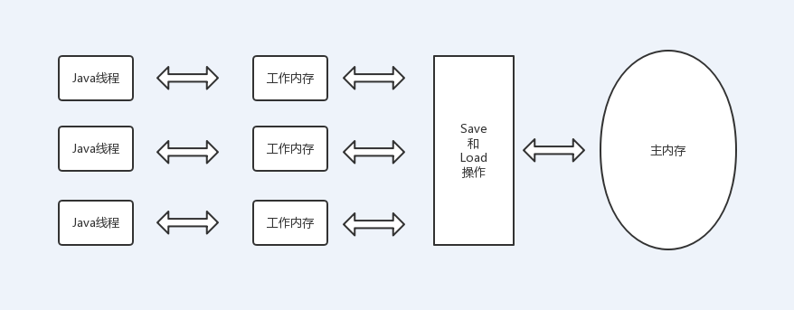
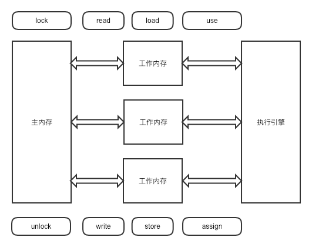
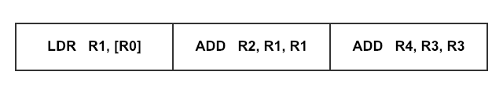
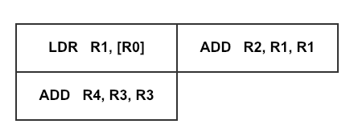
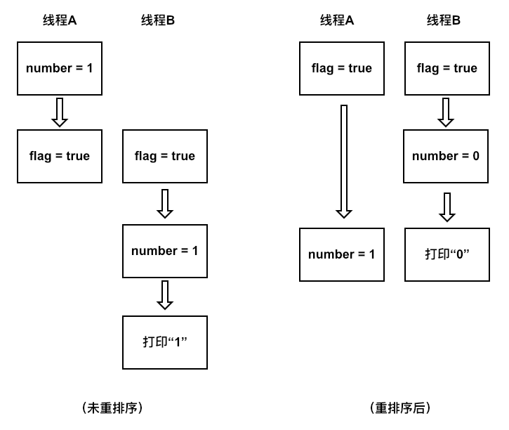

# 内存模型

## 硬件内存模型

现代的CPU通常拥有多个核心，每个核心都有自己的高速缓存（常见的有L1、L2、L3缓存），CPU在处理数据时会先把内存中的数据复制到缓存中，然后从缓存复制到CPU寄存器中，处理完成后再把CPU寄存器中的数据写回缓存，最后再把数据写回到内存中。


由于每个核心的缓存互相独立，因此带来了数据一致性的问题，不同核心的缓存对同一块内存区域的缓存数据可能不一致，比如内存中有变量`a`，它的值是1，CPU的2个核心都缓存了这个变量，记为`a'`，这时其中一个核心把`a'`的值更新为2，那么这个时候两个核心的缓存数据就不一致了，当要把变量的值写回内存是产生了冲突，不知道以哪个核心的缓存为准。

为了解决缓存一致性的问题，处理器的缓存会遵循一些协议，比如有MSI、MESI、MOSI等，在对缓存或内存进行读写操作时，CPU会遵循特定的协议进行操作，不同的CPU也会存在操作上的差异。

## Java内存模型

Java提供了自己的内存模型（Java Memory Model，简称JMM）来屏蔽不同平台上内存访问的差异，保证同样的程序在不同平台上有同样的内存访问效果。

在Java内存模型中，内存分为工作内存和主内存。每个线程有自己的工作内存，保存了线程用到的变量在主内存中的副本。线程对变量的读写操作只能作用于该变量在工作内存的副本上，而不能直接读写主内存中该变量的本体（即使是`volatile`变量也不行），线程之间也不能互相访问各自的工作内存。



Java内存模型看似和硬件内存模型非常类似，但是这两者其实并没有直接的关系，线程的工作内存可以在CPU寄存器中，也可以在缓存或内存中，主内存也是同理。

## 内存间的交互

Java内存模型定义了8种操作来实现如何把变量从主内存读到工作内存中以及如何把工作内存中的数据写回主内存中，这些操作都是原子的。

1. `lock`：锁定主内存中的变量，把它标识为被一个线程独占的状态。
2. `unlock`：释放一个在主内存中处于锁定状态的变量。
3. `read`：把一个变量的值从主内存传输到线程的工作内存中。
4. `load`：把`read`操作得到的值放入工作内存的变量副本中。
5. `use`：把工作内存中一个变量的值传递给执行引擎。
6. `assign`：把执行引擎返回的值赋给一个工作内存的变量。
7. `store`：把工作内存中一个变量的值传送到主内存。
8. `write`：把`store`操作得到的值放入主内存的变量中。



需要注意的是，虽然每一个操作都是原子的，但是操作之间并不是原子的。

### 对于long和double的特殊规则

针对没有被`volatile`修饰的64位`long`和`double`类型的变量，JMM规定`load`、`store`、`read`、`write`这4种操作可以分为2次32位的操作来执行，当多个线程同时对这些变量进行修改是读取时，就有可能读到被其它线程修改了一半的值。
虽然JMM对64位数据类型的操作没有强制要求满足原子性，但还是推荐各个虚拟机实现这么做。目前在商用虚拟机中都把64位数据的操作实现为原子操作，因此实际上在开发时并不需要把64位类型的变量声明为volatile。

## Java内存模型的特征

### 原子性

原子性是指一个操作是不可中断的，执行过程中不会被其它线程所影响。JMM使用了上面提到的几种操作保证了对基本类型操作的原子性。而对于更复杂的情况，比如多个语句的原子性操作就需要用到`synchronized`关键字。

### 可见性

可见性是指一个线程修改了共享变量的值，其它的线程能立刻得知被修改后的最新值。除了[volatile](#volatile)外，[synchronized](synchronized-lock.md#synchronized)和`final`也可以实现可见性（只针对初始化后不可被修改的基本类型对象）。

### 有序性 <a id = "ordering"></a>

CPU最后执行指令的顺序未必和我们写的代码顺序一一对应，很有可能在执行时是乱序的，这是因为编译器、处理器和内存系统为了提高性能会对指令进行重排序。

- 编译器重排序

比如编译器为了减少CPU寄存器的读写次数，改变语句的执行顺序。

在优化前，随着代码交替的读取变量`x`和变量`y`的值，CPU寄存器需要频繁地交替存储变量`x`和`y`。

```java
int x = 1;
int y = 2;
int a1 = x * 1;
int b1 = y * 1;
int a2 = x * 2;
int b2 = y * 2;
int a3 = x * 3;
int b3 = y * 3;
```

优化后，执行语句会先把变量`x`相关的读取操作执行完，再去执行变量`y`的读取操作，CPU寄存器就不需要频繁地进行切换。

```java
int x = 1;
int y = 2;
int a1 = x * 1;
int a2 = x * 2;
int a3 = x * 3;
int b1 = y * 1;
int b2 = y * 2;
int b3 = y * 3;
```

- 指令重排序

CPU可以通过对指令的重排序，提高指令执行的并发度。

比如下面代码中第1行的`LDR`指令需要从缓存中加载数据，如果缓存没有命中则需要等待从内存中读取。在等待数据读取时CPU可以先去执行第2或第3行指令，由于第2行指令依赖于第1行，因此可以选择执行第3行指令。

```assembly
LDR   R1, [R0];
ADD   R2, R1, R1;
ADD   R4, R3, R3;
```





- 内存系统重排序

内存系统重排序是指CPU的缓存数据没有即时同步到内存中，导致CPU执行的操作顺序看上去和内存中表现出的顺序不一致。也就是说一个操作即使是最先执行的，但由于是后来才同步到内存中的，如果在它同步到内存之前已经有别的操作刷新了内存，那么这个原本最先执行的操作看上去就是后来执行的。

在JMM中，单个线程中的代码是有序的，即使代码依然可能会被重排序，但是显示出的结果就和顺序执行是一样的，比如下面两行代码顺序互调对结果也不影响，并且对于单个线程而言，无法觉察到代码是否进过了重排序。

```java
int i = 1;
int j = 2;
```

但是在多线程情况下，重排序就会引发问题，比如下面的例子。

```java
public boolean flag = false;
public int number = 0;

public void read() {
    if (flag) {
        System.out.println(number);
    }
}

public void write() {
    number = 1;
    flag = true;
}
```

假设有两个线程同时执行该对象的`write()`和`read()`方法，`write()`方法中的两行代码如果被重排序，那么就有可能影响`read()`方法的输出。



## Happens-Before

除了使用`volatile`、`synchronized`之外，JMM还设立了一个称为`Happens-Before`（先行发生）的原则来保证可见性。先行发生是指如果操作A先行发生于B，那么在操作B发生之前，操作A的产生的影响可以被操作B观察到，包括共享变量值的修改、调用了方法等。先行发生原则有以下几个规则。

1. 程序次序规则：在一个线程内按照代码顺序，写在前面的操作先行发生于后面的操作。
2. 管程锁定规则：一个`unlock`操作先行发生于后面对同一个锁的lock操作。
3. volatile变量规则：对一个`volatile`变量的写操作先行发生于对它的读操作。
4. 线程启动规则：一个线程的`start()`方法调用先行发生于此线程的每一个动作。
5. 线程终止规则：一个线程中的所有操作都先行发生于此线程的终止检测，比如用`Thread.isAlive()`检测线程是否已终止。
6. 线程中断规则：一个线程的`interrupt()`方法调用先行发生于被中断线程的代码检测到中断事件的发生。
7. 对象终结规则：一个对象的构造方法调用结束先行发生于它的`finalize()`方法的开始。
8. 传递性：如果操作A现行发生于操作B，操作B现行发生于操作C，那么操作A现行发生于操作C。

## volatile <a id="volatile"></a>

上文多次提到了`volatile`关键字，现在我们来看看它的作用和原理。

`volatile`有以下3个作用：

- 保证可见性

- 保证有序性

我们在上文中提到代码的执行顺序可能因为编译器和CPU进行指令重排序导致其和编写时的顺序不一致，从而在多线程环境下产生一些问题。
`volatile`可以起到禁止指令重排序的作用

- 保证64位变量的原子性

可以保证对`long`和`double`类型变量的读写操作是原子的。Java内存模型规定虚拟机对32位数据类型的操作必须是原子的，而对于64位数据类型规定如果是`volatile`变量那么虚拟机需要保证读写操作是原子的，如果不是`volatile`变量那么虚拟机可以分成2次32位的操作而不必保证原子性。目前商用虚拟机都实现了对64位数据类型的原子操作（即使没有`volatile`），因此为了保证原子性，`volatile`并不是必要的。

## 参考

1. [《全面理解Java内存模型(JMM)及volatile关键字》](https://blog.csdn.net/javazejian/article/details/72772461)
2. [《从源代码到Runtime发生的重排序编译器重排序指令重排序内存系统重排序阻止重排序》](https://cloud.tencent.com/developer/article/1036747)
3. [《谈乱序执行和内存屏障》](https://blog.csdn.net/dd864140130/article/details/56494925)
4. [《volatile关键字的作用、原理》](https://monkeysayhi.github.io/2016/11/29/volatile%E5%85%B3%E9%94%AE%E5%AD%97%E7%9A%84%E4%BD%9C%E7%94%A8%E3%80%81%E5%8E%9F%E7%90%86/)