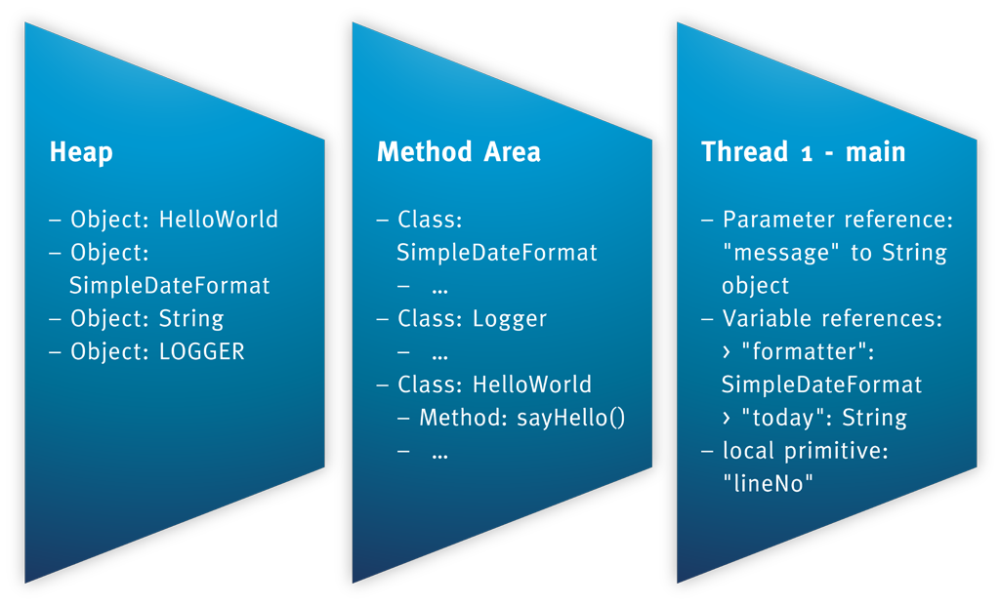

# JVM内存区域

JVM把内存划分成多个区域，每个区域有个各自的用途。在JDK7中，内存会划分为以下5种区域，如下图所示。


当我们执行下面的代码后，各个区域存储的数据如图所示。

```java
import java.text.SimpleDateFormat;
import java.util.Date;

import org.apache.log4j.Logger;

public class HelloWorld {
    private static Logger LOGGER = Logger.getLogger(HelloWorld.class.getName());

    public void sayHello(String message) {
        SimpleDateFormat formatter = new SimpleDateFormat("dd.MM.YYYY");
        String today = formatter.format(new Date());
        LOGGER.info(today + ": " + message);
    }
}
```



## 程序计数器

程序计数器记录了当前线程执行的字节码的行号，每个线程都有自己的程序计数器，因此程序计数器是线程私有的。**这是唯一一个不会发生OutOfMemoryError异常的区域。**

## Java虚拟机栈

虚拟机在执行每个方法的时候同时会创建一个栈帧，用于存储局部变量表、操作数栈、动态链接、方法的返回地址等信息，和程序计数器一样，Java虚拟机栈也是线程私有的。该区域会发生`StackOverflowError`和`OutOfMemoryError`异常。

当栈深度太深时会抛出`StackOverflowError`异常。由于每次方法调用都会创建一个栈帧，那么随着递归深度的增加，需要生成越来越多的栈帧，当达到分配给线程的栈大小上限后就会抛出栈溢出的异常，可以通过`-Xss`参数设置分配给线程的栈空间的上限；相对的，如果`-Xss`值过大，那么能够创建的线程数量可能会受到影响。

```java
static int depth;

public static void main(String[] args) {
    test();
}

static void test() {
    depth++;
    test();
}
```

> 异常：java.lang.StackOverflowError。

此外，如果创建的线程数量过多，就会抛出`OutOfMemoryError`异常，这时候可以调小`-Xss`参数的值或者调小Java堆的大小以腾出空间创建更多的线程。

## 本地方法栈

这个区域和Java虚拟机栈的功能类似，区别是本地方法栈是用来调用本地方法的。虚拟机对这个区域没有强制规定，HotSpot虚拟机的实现直接把栈和本地方法栈合二为一。该区域也会发生`StackOverflowError`和`OutOfMemoryError`异常。

## Java堆

Java程序中的大部分对象都是分配在Java堆上的，它是所有线程共享的。根据虚拟机规范，Java堆可以处于物理上不连续但是逻辑上连续的内存空间中。该区域会发生`OutOfMemoryError`异常。

当我们连续申请大对象时，会抛出`OutOfMemoryError`异常。

```java
// java -Xmx20M -Xms20M Test
public static void main(String[] args) {
    byte[] bytes1 = new byte[4 * 1024 * 1024];
    byte[] bytes2 = new byte[4 * 1024 * 1024];
    byte[] bytes3 = new byte[4 * 1024 * 1024];
    byte[] bytes4 = new byte[4 * 1024 * 1024];
}
```

> 异常：java.lang.OutOfMemoryError: Java heap space。

## 方法区

方法区用来存储已经被虚拟机加载的类的信息、常量、静态变量、即时编译器编译后的代码等数据，它是所有线程共享的。该区域会发生`OutOfMemoryError`异常。

当我们加载大量类文件时就会出现`OutOfMemoryError`异常。

> 异常： java.lang.OutOfMemoryError: PermGen space。

### 运行时常量池

运行时常量池是方法区的一部分。[类文件](classfile.md)中常量池部分的数据在加载后存放在运行时常量池中。除了在编译期间写入类文件常量池的数据，在程序运行期间也能将新的常量放入运行时常量池中，如`String`类的`intern()`方法就利用了这种特性。该区域会发生`OutOfMemoryError`异常。

## 直接内存

直接内存比较特殊，它并不属于JVM内存区域一部分。直接内存伴随NIO而出现，可以使用本地方法直接在Java堆外分配内存，然后通过Java堆中的`DirectByteBuffer`对象作为这块内存的引用进行操作，这样可以避免在Java堆和本地堆中来回复制数据，提高性能。由于是在堆外分配的堆存，因此直接内存不受Java堆大小的限制，也不受`-Xmx`等参数的限制，但它受物理内存和操作系统的限制。

## 参数

- -XX:NewRatio，新生代和老年代的比例，默认-XX:NewRatio=2，表示新生代:老年代=1:2。

## 参考

1. [JAVA的内存模型及结构](http://ifeve.com/under-the-hood-runtime-data-areas-javas-memory-model/)
