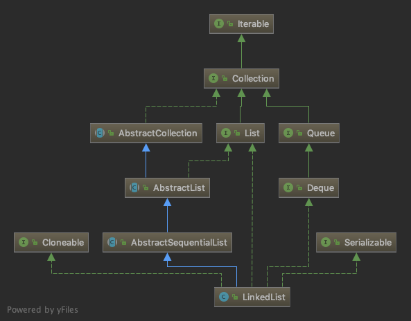

# LinkedList

`LinkedList`是一个底层使用双向循环链表实现的列表，它实现了`List`和`Deque`接口说明它既可以作为一个列表使用，又可以作为双端队列使用。`List`和`Deque`的区别是前者可以通过索引定位到元素，后者可以同时在集合首尾增加或删除元素，从而实现先进先出的队列或是后进先出的栈。它没有实现`RandomAccess`接口，这表示它不支持随机访问，只支持顺序访问，这是它和`ArrayList`最大的区别。



下面我们从构造方法看起，源码出自JDK10。

## LinkedList()

这其实是一个空方法，没有做任何事情。

```java
public LinkedList() {
}
```

## add(E)

添加一个元素到列表尾部。

```java
public boolean add(E e) {
    linkLast(e);
    return true;
}

void linkLast(E e) {
    final Node<E> l = last;
    // 创建一个新的节点，节点的prev指向最后一个节点。
    final Node<E> newNode = new Node<>(l, e, null);
    // 修改last指向刚才创建的节点。
    last = newNode;
    if (l == null)
        // 如果l为null，说明列表是空的，把first指向刚才创建的节点。
        first = newNode;
    else
        // 如果列表不是空的，那么就把原来的最后一个节点的next指向新创建的节点。
        l.next = newNode;
    // size是私有字段，记录实际的元素个数。
    size++;
    modCount++;
}

// Node是LinkedList中的内部类，一个Node就是双向循环链表中的一个节点。
private static class Node<E> {
    E item;
    // 指向下一个节点。
    Node<E> next;
    // 指向上一个节点。
    Node<E> prev;

    Node(Node<E> prev, E element, Node<E> next) {
        this.item = element;
        this.next = next;
        this.prev = prev;
    }
}
```

一个双向循环链表的结构如图所示。


## add(int, E)

把元素插入到指定位置。

```java
public void add(int index, E element) {
    // 越界检查。
    checkPositionIndex(index);
    if (index == size)
        // 如果要插入的位置正好处在链表的末尾，那么就直接调用linkLast()方法，和add(E)一样。
        linkLast(element);
    else
        // 否则找到第index个节点，并把新的节点插入到它前面。
        linkBefore(element, node(index));
}

// 检查索引是否越界。
private void checkPositionIndex(int index) {
    if (!isPositionIndex(index))
        throw new IndexOutOfBoundsException(outOfBoundsMsg(index));
}

private boolean isPositionIndex(int index) {
    return index >= 0 && index <= size;
}

// 查找指定位置的节点。
Node<E> node(int index) {
    // 如果要查找的位置更靠近first，那么就从first开始往后搜索。
    if (index < (size >> 1)) {
        Node<E> x = first;
        for (int i = 0; i < index; i++)
            x = x.next;
        return x;
    } else {
        // 如果要查找的位置更靠近last，那么就从last开始往前搜索。
        Node<E> x = last;
        for (int i = size - 1; i > index; i--)
            x = x.prev;
        return x;
    }
}

// 插入元素到指定节点前面。
void linkBefore(E e, Node<E> succ) {
    final Node<E> pred = succ.prev;
    final Node<E> newNode = new Node<>(pred, e, succ);
    succ.prev = newNode;
    if (pred == null)
        first = newNode;
    else
        pred.next = newNode;
    size++;
    modCount++;
}
```