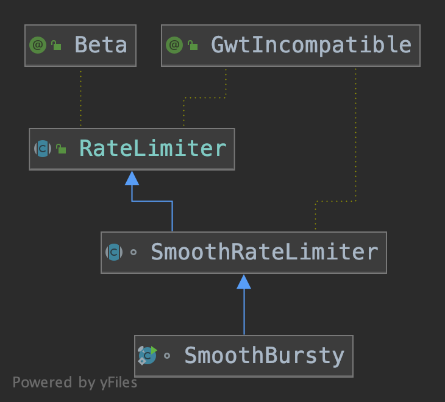

# RateLimiter


`RateLimiter`是Guava中常用的一个限流工具类，我们通常用以下方式使用它：

```java
// 每秒生成10个令牌。
RateLimiter limiter = RateLimiter.create(10);
// 通过acquire()方法以阻塞的方式获取1块令牌。
limiter.acquire();
```

`RateLimiter`有两种模式：

1. 稳定模式：令牌以恒定速度生成，对应的实现类是`SmoothBursty`。
2. 渐进模式：令牌生成速度逐步提升，最后保持在一个恒定的速度，对应的实现类是`SmoothWarmingUp`。

这两个类都继承自`SmoothRateLimiter`，而`SmoothRateLimiter`继承自`RateLimiter`，有以下几个关键字段：

```java
// 当前存储的令牌数。
double storedPermits;

// 最大存储令牌数。
double maxPermits;

// 每生成一个令牌的时间间隔，单位微秒。
double stableIntervalMicros;

// 下一次请求可以获取令牌的时间。
private long nextFreeTicketMicros = 0L;
```



## SmoothBursty

当我们用以下方式创建`RateLimiter`对象时，对应的实现类是`SmoothBursty`。

```java
RateLimiter.create(10);
```

工厂方法如下所示。

```java
public static RateLimiter create(double permitsPerSecond) {
    return create(permitsPerSecond, SleepingStopwatch.createFromSystemTimer());
}

static RateLimiter create(double permitsPerSecond, SleepingStopwatch stopwatch) {
    RateLimiter rateLimiter = new SmoothBursty(stopwatch, 1.0);
    rateLimiter.setRate(permitsPerSecond);
    return rateLimiter;
}
```

### 获取令牌

通过`acquire()`方法获取一个令牌，该方法返回获取令牌消耗的时长（单位是秒）。

```java
// com.google.common.util.concurrent.RateLimiter#acquire()
public double acquire() {
    return acquire(1);
}

// com.google.common.util.concurrent.RateLimiter#acquire(int)
public double acquire(int permits) {
    // reserve()方法返回要等待的时长。
    long microsToWait = reserve(permits);
    // 阻塞等待。
    stopwatch.sleepMicrosUninterruptibly(microsToWait);
    // 返回等待时长。
    return 1.0 * microsToWait / SECONDS.toMicros(1L);
}
```

`reserve()`方法是RateLimiter的核心。

```java
// com.google.common.util.concurrent.RateLimiter#reserve
final long reserve(int permits) {
    // 参数校验。
    checkPermits(permits);
    // 同步。
    synchronized (mutex()) {
        return reserveAndGetWaitLength(permits, stopwatch.readMicros());
    }
}

// com.google.common.util.concurrent.RateLimiter#reserveAndGetWaitLength
final long reserveAndGetWaitLength(int permits, long nowMicros) {
    // 最早拿到令牌的时间。
    long momentAvailable = reserveEarliestAvailable(permits, nowMicros);
    // RateLimit中的时间用的是相对时间，nowMicros是相对当前RateLimit对象创建时的时间，比如nowMicros为1000，则表示距离当前RateLimit对象创建时间已过去1000微秒。
    // momentAvailable - nowMicros得到需要等待的时长。
    return max(momentAvailable - nowMicros, 0);
}

// com.google.common.util.concurrent.SmoothRateLimiter#reserveEarliestAvailable
final long reserveEarliestAvailable(int requiredPermits, long nowMicros) {
    // 更新令牌库存数量和下一次可以获得令牌的时间。
    resync(nowMicros);
    long returnValue = nextFreeTicketMicros;
    // 将被消耗的令牌数。
    double storedPermitsToSpend = min(requiredPermits, this.storedPermits);
    // 需要等待被生成的令牌数。
    double freshPermits = requiredPermits - storedPermitsToSpend;
    // 计算生成令牌所需的时间，公式：所需时长 = 要生成的令牌数 * 生成一块令牌所需的时长。
    // storedPermitsToWaitTime()总是返回0。
    long waitMicros =
        storedPermitsToWaitTime(this.storedPermits, storedPermitsToSpend)
            + (long) (freshPermits * stableIntervalMicros);
    // 更新下一次可以获取令牌的时间。
    this.nextFreeTicketMicros = LongMath.saturatedAdd(nextFreeTicketMicros, waitMicros);
    // 更新令牌库存。
    this.storedPermits -= storedPermitsToSpend;
    return returnValue;
}

// com.google.common.util.concurrent.SmoothRateLimiter#resync
void resync(long nowMicros) {
    if (nowMicros > nextFreeTicketMicros) {
      // 如果当前时间已经超过下一次可以获取令牌的时间。
      // 计算这段时间内可以产生的令牌的数量，公式：产生的新的令牌数量 = 一段时长 / 产生一个令牌所需的时长。
      double newPermits = (nowMicros - nextFreeTicketMicros) / coolDownIntervalMicros();
      // 更新库存令牌数量，从这里看出RateLimiter是支持突发流量请求的。
      // maxPermits在创建SmoothBursty对象时，通过调用doSetRate()方法进行初始化，其值等于一秒产生的令牌数，因此令牌库存数量不会超过一秒产生的令牌的数量。
      storedPermits = min(maxPermits, storedPermits + newPermits);
      // 更新下一次可以获取令牌的时间。
      nextFreeTicketMicros = nowMicros;
    }
}
```

## SmoothWarmingUp

当我们用以下方式创建`RateLimiter`对象时，对应的实现类是`SmoothWarmingUp`。

```java
RateLimiter.create(10, 10, SECONDS);
```

工厂方法如下所示。

```java
public static RateLimiter create(double permitsPerSecond, long warmupPeriod, TimeUnit unit) {
    checkArgument(warmupPeriod >= 0, "warmupPeriod must not be negative: %s", warmupPeriod);
    return create(
           permitsPerSecond, warmupPeriod, unit, 3.0, SleepingStopwatch.createFromSystemTimer());
}

static RateLimiter create(
       double permitsPerSecond,
       long warmupPeriod,
       TimeUnit unit,
       double coldFactor,
       SleepingStopwatch stopwatch) {
    RateLimiter rateLimiter = new SmoothWarmingUp(stopwatch, warmupPeriod, unit, coldFactor);
    rateLimiter.setRate(permitsPerSecond);
    return rateLimiter;
}
```

### 获取令牌

`SmoothWarmingUp`类的注释中用一张图说明了令牌生成策略。其X轴表示令牌库存数量，Y轴表示产生一块令牌所需的时间（也就是速率），纵坐标越大，产生令牌的速度越慢。我们可以看到当没有请求时，令牌库存数量等于`maxPermits`，这时生成速率是`coldInterval`，它的值是`stableInterval`的三倍，达到最低，当请求过来时，令牌库存数开始减少，产生令牌的速率开始增加，直到达到稳定状态。

```java
/**
   *
   * <pre>
   *          ^ throttling
   *          |
   *    cold  +                  /
   * interval |                 /.
   *          |                / .
   *          |               /  .   ← "warmup period" is the area of the trapezoid between
   *          |              /   .     thresholdPermits and maxPermits
   *          |             /    .
   *          |            /     .
   *          |           /      .
   *   stable +----------/  WARM .
   * interval |          .   UP  .
   *          |          . PERIOD.
   *          |          .       .
   *        0 +----------+-------+--------------→ storedPermits
   *          0 thresholdPermits maxPermits
   * </pre>
   */
```

`SmoothWarmingUp`获取令牌的流程和`SmoothBursty`大体上是相同的，仅仅是对基类中部分方法的覆盖。

相比`SmoothBursty`类中`storedPermitsToWaitTime()`方法直接返回0不同，`SmoothWarmingUp`类增加了以下计算等待时间的逻辑。

```java
long storedPermitsToWaitTime(double storedPermits, double permitsToTake) {
    // 超过thresholdPermits部分的令牌数。
    double availablePermitsAboveThreshold = storedPermits - thresholdPermits;
    long micros = 0;
    if (availablePermitsAboveThreshold > 0.0) {
        // 计算超过thresholdPermits部分的令牌数所需要等待的时间。
        // 实际就是计算梯形的面积，面积 = ( 上边长 + 下边长 ) * 高 / 2。
        double permitsAboveThresholdToTake = min(availablePermitsAboveThreshold, permitsToTake);
        double length =
            permitsToTime(availablePermitsAboveThreshold)
                + permitsToTime(availablePermitsAboveThreshold - permitsAboveThresholdToTake);
        micros = (long) (permitsAboveThresholdToTake * length / 2.0);
        permitsToTake -= permitsAboveThresholdToTake;
    }
    // 计算不足thresholdPermits部分令牌数量所需要等待的时间。
    // 实际就是计算矩形的面积。
    micros += (long) (stableIntervalMicros * permitsToTake);
    return micros;
}

// 计算产生令牌所需的时间。
private double permitsToTime(double permits) {
    // stableIntervalMicros加上令牌数*斜率。
    // 这里的斜率就是上面注释图中斜线的斜率。
    return stableIntervalMicros + permits * slope;
}
```
