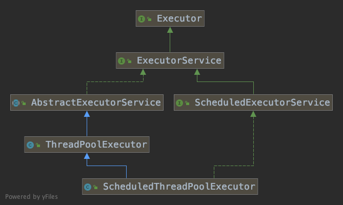
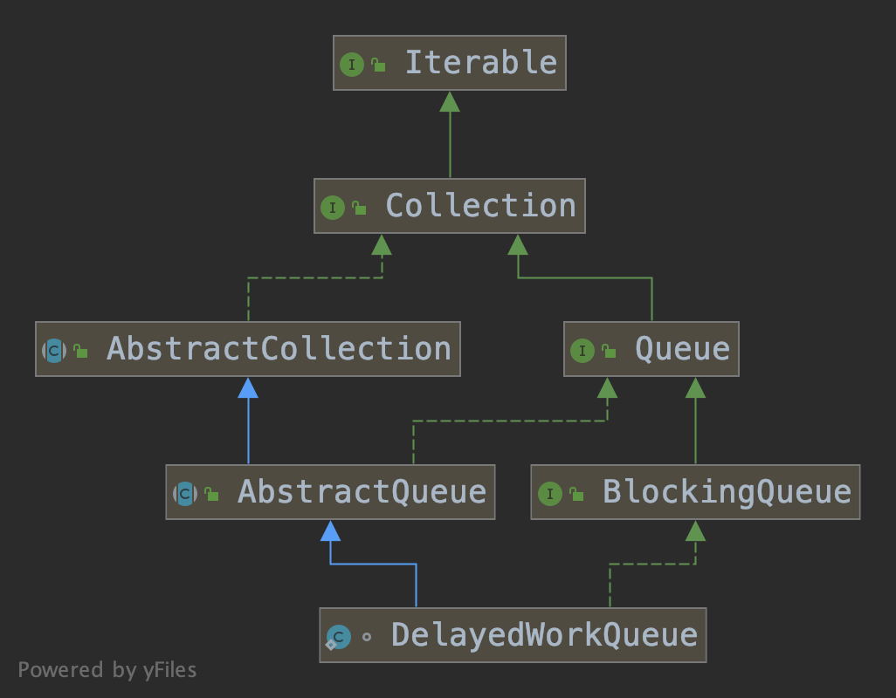
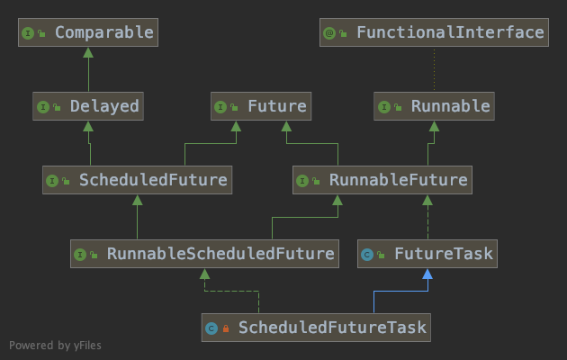

# ScheduledThreadPoolExecutor


`ScheduledThreadPoolExecutor`是一个执行定时任务的线程池，它的类结构如下。



## ScheduledThreadPoolExecutor(int)

从构造方法中可以看到，`ScheduledThreadPoolExecutor`使用了`DelayedWorkQueue`队列。

```java
public ScheduledThreadPoolExecutor(int corePoolSize) {
    super(corePoolSize, Integer.MAX_VALUE,
          DEFAULT_KEEPALIVE_MILLIS, MILLISECONDS,
          new DelayedWorkQueue());
}
```

## schedule(Runnable, long, TimeUnit)

`schedule()`方法用于延迟执行一次性的任务。

```java
public ScheduledFuture<?> schedule(Runnable command,
                                   long delay,
                                   TimeUnit unit) {
    if (command == null || unit == null)
        throw new NullPointerException();
    // 构建一个RunnableScheduledFuture对象，包含触发时间，序号等信息。
    RunnableScheduledFuture<Void> t = decorateTask(command,
        new ScheduledFutureTask<Void>(command, null,
                                      triggerTime(delay, unit),
                                      sequencer.getAndIncrement()));
    delayedExecute(t);
    return t;
}

private void delayedExecute(RunnableScheduledFuture<?> task) {
    // 如果线程池已经关闭了，那么执行拒绝策略。
    if (isShutdown())
        reject(task);
    else {
        // 把任务放入队列中，这里的队列就是DelayedWorkQueue。
        super.getQueue().add(task);
        // 判断当前任务是否可以执行。
        // 如果不能执行，那么尝试从队列中删除任务。
        // 如果删除成功那么就把任务标为已取消。
        if (!canRunInCurrentRunState(task) && remove(task))
            task.cancel(false);
        else
            // 否则开始任务。
            ensurePrestart();
    }
}

boolean canRunInCurrentRunState(RunnableScheduledFuture<?> task) {
    // 如果线程池没有被关闭，那么任务可以执行。
    if (!isShutdown())
        return true;
    // 如果线程池已经进入停止状态，那么任务不能执行。
    if (isStopped())
        return false;
    // 否则由以下两个参数决定能否执行任务。
    // 默认continueExistingPeriodicTasksAfterShutdown是false，executeExistingDelayedTasksAfterShutdown是true。
    return task.isPeriodic()
        ? continueExistingPeriodicTasksAfterShutdown
        : (executeExistingDelayedTasksAfterShutdown
            || task.getDelay(NANOSECONDS) <= 0);
}

void ensurePrestart() {
    // 获取当前工作线程的数量。
    int wc = workerCountOf(ctl.get());
    // 增加工作线程。
    if (wc < corePoolSize)
        addWorker(null, true);
    else if (wc == 0)
        addWorker(null, false);
}
```

`addWorker()`方法主要作用是创建`Worker`对象，每个对象关联一个线程，不断从工作队列中取出任务并执行，详细解析可以查看[《ThreadPoolExecutor》](https://github.com/pojozhang/playground/blob/master/problems/java/thread-pool-executor.md#submitrunnable)一文，不再赘述。

## DelayedWorkQueue

当`Worker`对象被创建后，就会不断的从工作队列中取出任务执行，下面我们看下工作队列`DelayedWorkQueue`的实现。

`DelayedWorkQueue`是`ScheduledThreadPoolExecutor`的一个静态内部类，其结构如下。



### offer(Runnable)

`offer()`方法用于把一个`Runnable`对象插入到队列的末尾。

```java
public boolean offer(Runnable x) {
    if (x == null)
        throw new NullPointerException();
    RunnableScheduledFuture<?> e = (RunnableScheduledFuture<?>)x;
    final ReentrantLock lock = this.lock;
    lock.lock();
    try {
        int i = size;
        // 队列满了就进行扩容。
        if (i >= queue.length)
            grow();
        size = i + 1;
        // 如果队列是空的，那么就设置为队列中的第一个元素。
        if (i == 0) {
            queue[0] = e;
            setIndex(e, 0);
        } else {
            // 调整二叉堆。
            siftUp(i, e);
        }
        if (queue[0] == e) {
            leader = null;
            available.signal();
        }
    } finally {
        lock.unlock();
    }
    return true;
}
```

队列的底层数据结构是一个`RunnableScheduledFuture<?>[]`类型的数组，初始容量是16，基于该数组建立了一个二叉堆。

```java
private static final int INITIAL_CAPACITY = 16;
private RunnableScheduledFuture<?>[] queue = new RunnableScheduledFuture<?>[INITIAL_CAPACITY];
```

`siftUp()`方法会把元素插入到队列中，并调整元素的顺序以满足二叉堆的定义。

```java
private void siftUp(int k, RunnableScheduledFuture<?> key) {
    while (k > 0) {
        // 二叉堆父节点的索引。
        int parent = (k - 1) >>> 1;
        // 父节点。
        RunnableScheduledFuture<?> e = queue[parent];
        if (key.compareTo(e) >= 0)
            break;
        // 如果key小于父节点，那么交换这两个节点。从这里看出构建的是小顶堆。
        queue[k] = e;
        setIndex(e, k);
        k = parent;
    }
    queue[k] = key;
    setIndex(key, k);
}
```

这里参数`key`的实际类型是`ScheduledFutureTask`，它是`ScheduledThreadPoolExecutor`的一个内部类，它的结构如下。



调整元素顺序时用到的`compareTo()`方法如下所示。

```java
// java.util.concurrent.ScheduledThreadPoolExecutor.ScheduledFutureTask#compareTo
public int compareTo(Delayed other) {
    if (other == this)
        return 0;
    if (other instanceof ScheduledFutureTask) {
        ScheduledFutureTask<?> x = (ScheduledFutureTask<?>)other;
        long diff = time - x.time;
        // 比较时间。
        if (diff < 0)
            return -1;
        else if (diff > 0)
            return 1;
        // 时间相等则比较序号。
        else if (sequenceNumber < x.sequenceNumber)
            return -1;
        else
            return 1;
    }
    long diff = getDelay(NANOSECONDS) - other.getDelay(NANOSECONDS);
    return (diff < 0) ? -1 : (diff > 0) ? 1 : 0;
}
```

首先比较两个任务的执行时间，如果执行时间相等再比较任务序号的大小，所以位于二叉堆堆顶的任务就是最先执行或者序号最小的任务。

### take()

`take()`方法用于从队列中取出一个任务，如果队列为空，那么当前线程会被阻塞。

```java
public RunnableScheduledFuture<?> take() throws InterruptedException {
    final ReentrantLock lock = this.lock;
    lock.lockInterruptibly();
    try {
        for (;;) {
            RunnableScheduledFuture<?> first = queue[0];
            if (first == null)
                available.await();
            else {
                long delay = first.getDelay(NANOSECONDS);
                if (delay <= 0L)
                    return finishPoll(first);
                first = null; // don't retain ref while waiting
                if (leader != null)
                    available.await();
                else {
                    Thread thisThread = Thread.currentThread();
                    leader = thisThread;
                    try {
                        available.awaitNanos(delay);
                    } finally {
                        if (leader == thisThread)
                            leader = null;
                    }
                }
            }
        }
    } finally {
        if (leader == null && queue[0] != null)
            available.signal();
        lock.unlock();
    }
}
```

## 参考

1. [《并发编程 —— ScheduledThreadPoolExecutor》](https://juejin.im/post/5ae75604f265da0ba56753cd)
