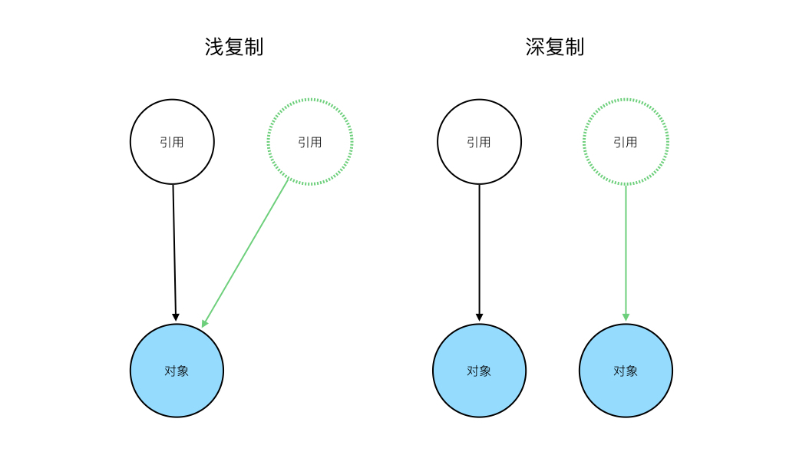

# 浅复制和深复制

浅复制和深复制都是把源对象中的每个字段复制到目标对象中。一个对象中的字段可分为基本类型和对象类型，对于基本类型而言，两种复制方式都是直接把值复制一份，比如`int`类型的字段就把4个字节的整数值复制一份，但两种复制对于对象类型字段的复制就完全不同。浅复制只复制对象的引用，深复制则是复制引用指向的对象。



## 浅复制

我们先看一个浅复制的例子：

```java
public class Person {
    public int age;
    public Address address;

     public Person(int age, Address address) {
        this.age = age;
        this.address = address;
    }

    public Person(Person source) {
        this.age = source.age;
        this.address = source.address;
    }
}

public class Address {
    public String city;

    public Address(String city) {
        this.city = city;
    }
}

public static void main(String[] args) {
    Person source = new Person(20, new Address("Shanghai"));
    Person copy = new Person(source); //通过构造函数进行复制
    source.age = 21; //改变源对象中基本类型字段的值
    System.out.println(copy.age); //此处打印“20”，可以看到复制后的对象中的值没有变化
    source.address.city = "Beijing"; //改变源对象中对象类型字段的值
    System.out.println(copy.address.city); //此处打印“Beijing”，可以看到复制后的对象中的值也发生了改变
}
```

## 深复制

保持其它部分代码不变，对Person中用于复制的构造函数进行修改：

```java
public Person(Person source) {
    this.name = source.name;
    this.address = new Address(source.address.city);
}

public static void main(String[] args) {
    Person source = new Person(20, new Address("Shanghai"));
    Person copy = new Person(source);
    source.address.city = "Beijing";
    System.out.println(copy.address.city); //此处打印“Shanghai”，可以看到复制后的对象中的值没有变化
}
```