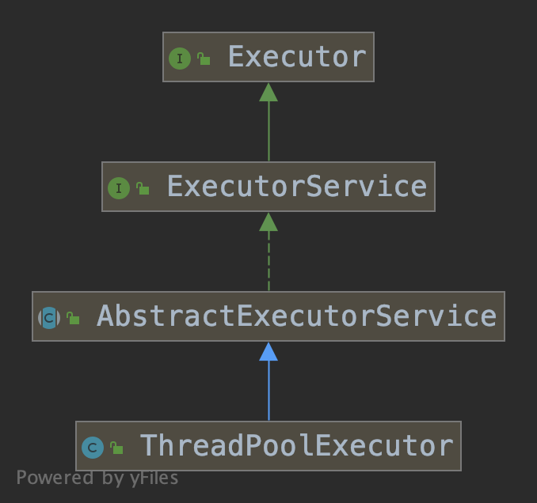
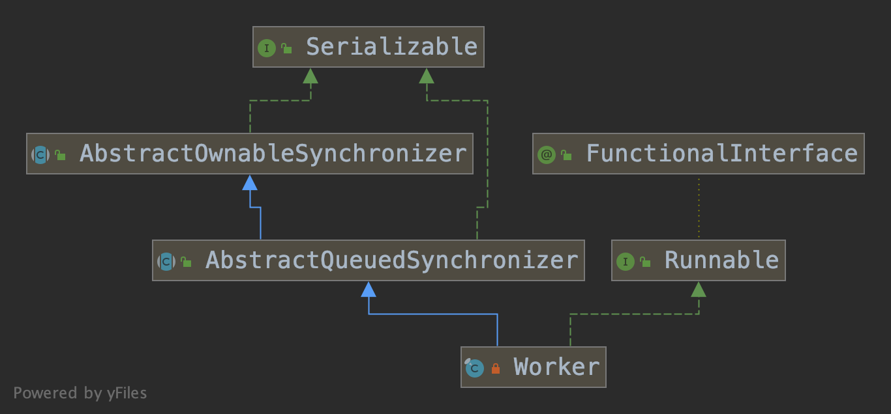

# ThreadPoolExecutor


`ThreadPoolExecutor`类提供了一个可以灵活定制的线程池，其层次结构如下。



`ThreadPoolExecutor`类最基本的一个构造方法如下所示。

```java
public ThreadPoolExecutor(int corePoolSize,
                          int maximumPoolSize,
                          long keepAliveTime,
                          TimeUnit unit,
                          BlockingQueue<Runnable> workQueue,
                          ThreadFactory threadFactory,
                          RejectedExecutionHandler handler)
```

- corePoolSize

线程池的基本大小，线程池中的线程数量的下限。

- maximumPoolSize

线程池中的线程数量的上限。

- keepAliveTime

线程的存活时间。当线程池中线程的空闲时间超过了存活时间，并且线程池中线程的数量超过`corePoolSize`，那么这些空闲的线程会被终止。

- unit

存活时间的计量单位。

- workQueue

工作队列。用来存储提交到线程池中的任务。

- threadFactory

用来创建线程的工厂。

- handler

当工作队列饱和时，`ThreadPoolExecutor`类会使用`handler`做进一步的处理。

## 创建新线程的时机

当我们向线程池提交任务时，如果此时工作队列已满，并且线程池中的线程数量还没有达到`maximumPoolSize`，那么线程池就会用`threadFactory`创建一个新的线程。

下面的代码创建了一个初始线程数为2，最大线程数为4的线程池，我们向线程池连续提交6个任务，每个任务都会阻塞10秒。

```java
public static void main(String[] args) {
    int corePoolSize = 2; // 线程池中线程数的下限。
    int maximumPoolSize = 4; // 线程池中线程数的上限。
    int taskCount = 6; // 任务数量。
    int capacity = 2; // 工作队列容量。

    ThreadPoolExecutor executor = new ThreadPoolExecutor(corePoolSize, maximumPoolSize,
            0L, TimeUnit.MILLISECONDS, new LinkedBlockingQueue<>(capacity));

    for (int i = 0; i < taskCount; i++) {
        executor.submit(() -> {
            System.out.println(Thread.currentThread().getId());
            try {
                Thread.sleep(10000);
            } catch (InterruptedException e) {
                e.printStackTrace();
            }
        });
    }
}
```

当工作队列容量为2时，线程池会创建4个线程池执行任务，这是因为在提交第1、第2个任务时线程池会创建两个线程，达到`corePoolSize`指定的值；提交第3、第4个任务时线程池会把任务放到工作队列中；当提交第5个任务时，由于队列已满，线程池会创建一个线程并从工作队列中取出一个任务执行，再把第5个任务放入队列中；当提交第6个任务时，队列还是满的，线程池会再创建一个线程并从工作队列中取出一个任务执行，再把第6个任务放入队列中。此时线程池中的线程数正好达到`maximumPoolSize`。

如果我们把队列容量改为1，那么当我们提交第6个任务时会抛出`java.util.concurrent.RejectedExecutionException`异常，这是因为工作队列已满。

而当我们把队列容量扩大为10时，我们会发现至始至终都只会有2个线程进行工作，这是因为任务数量是6，永远无法让工作队列饱和。

## 关闭线程池

通常我们用`shutdown()`或`shutdownNow()`方法关闭线程池，一旦线程池被关闭，就无法再提交新的任务，这两个方法的区别是`shutdown()`在终止线程池之前会执行已提交的任务，包括在工作队列中等待的任务；`shutdownNow()`方法会试图通过线程的`interrupt()`方法中断正在执行的任务，对于已经在工作队列中的还未执行的任务则全部取消。

## 饱和策略

当我们向线程池提交一个新的任务而线程池的工作队列已经饱和时会调用`RejectedExecutionHandler`对象执行饱和策略。

`RejectedExecutionHandler`是一个接口，它有以下几种实现。

- AbortPolicy

默认的策略，直接抛出`RejectedExecutionException`异常。

- DiscardPolicy

丢弃被拒绝的任务。

- DiscardOldestPolicy

丢弃工作队列中最旧的任务，然后重新提交被拒绝的任务。

- CallerRunsPolicy

如果线程池没有被关闭，那么当前线程（饱和策略的执行线程）直接执行任务（调用`Runnable`的`run()`方法）

## 源码分析

### submit(Runnable)

通常我们使用`submit()`方法提交任务。该方法内部会把`Runnable`参数包装成一个`RunnableFuture`对象并调用`execute()`方法进一步处理。

```java
public Future<?> submit(Runnable task) {
    if (task == null) throw new NullPointerException();
    RunnableFuture<Void> ftask = newTaskFor(task, null);
    execute(ftask);
    return ftask;
}

public void execute(Runnable command) {
    if (command == null)
        throw new NullPointerException();
    // ctl是一个AtomicInteger类型的字段。
    // 高3位存储的是线程池的状态，剩下的29位存储的是工作线程的数量。
    int c = ctl.get();
    // 如果工作线程的数量小于corePoolSize，那么就创建一个Worker。
    if (workerCountOf(c) < corePoolSize) {
        if (addWorker(command, true))
            return;
        c = ctl.get();
    }
    // 如果线程池的状态处于运行中，并且工作队列没有满，需要再次检查线程池的状态，如果线程池不再处于运行状态，需要把任务从工作队列中移除并执行拒绝策略
    if (isRunning(c) && workQueue.offer(command)) {
        int recheck = ctl.get();
        if (! isRunning(recheck) && remove(command))
            reject(command);
        else if (workerCountOf(recheck) == 0)
            // 如果没有Worker，则进行补充。
            addWorker(null, false);
    }
    // 如果无法把任务放进队列，表示队列已满，此时尝试创建新的Worker，如果创建失败，说明Worker数量已经达到上限，那么就执行拒绝策略。
    else if (!addWorker(command, false))
        reject(command);
}

private boolean addWorker(Runnable firstTask, boolean core) {
    retry:
    for (int c = ctl.get();;) {
        // 检查线程池状态以及工作队列是否为空。
        if (runStateAtLeast(c, SHUTDOWN)
            && (runStateAtLeast(c, STOP)
                || firstTask != null
                || workQueue.isEmpty()))
            return false;

        for (;;) {
            // 检查工作线程数量是否达到上限。
            // 如果参数core为true则以corePoolSize作为上限，否则以maximumPoolSize作为上限。
            if (workerCountOf(c)
                >= ((core ? corePoolSize : maximumPoolSize) & COUNT_MASK))
                return false;
            // CAS更新线程数量，如果更新成功则跳出外层循环。
            if (compareAndIncrementWorkerCount(c))
                break retry;
            c = ctl.get();
            if (runStateAtLeast(c, SHUTDOWN))
                continue retry;
        }
    }

    boolean workerStarted = false;
    boolean workerAdded = false;
    Worker w = null;
    try {
        // 创建一个Worker对象。
        w = new Worker(firstTask);
        // Work对象在初始化时会用ThreadFactory创建一个新的线程。
        final Thread t = w.thread;
        if (t != null) {
            final ReentrantLock mainLock = this.mainLock;
            mainLock.lock();
            try {
                int c = ctl.get();
                // 检查线程池状态。
                if (isRunning(c) ||
                    (runStateLessThan(c, STOP) && firstTask == null)) {
                    if (t.isAlive())
                        throw new IllegalThreadStateException();
                    // 把Worker对象加入到set集合中。
                    workers.add(w);
                    int s = workers.size();
                    if (s > largestPoolSize)
                        largestPoolSize = s;
                    workerAdded = true;
                }
            } finally {
                mainLock.unlock();
            }
            if (workerAdded) {
                t.start();
                workerStarted = true;
            }
        }
    } finally {
        if (! workerStarted)
            addWorkerFailed(w);
    }
    return workerStarted;
}
```

### Worker

`Worker`是`ThreadPoolExecutor`的内部类，是对工作线程的抽象，它继承自`AbstractQueuedSynchronizer`并实现了`Runnable`接口。



`Worker`类在构造方法中使用工厂模式创建一个线程并把自己作为参数传给该线程。

```java
Worker(Runnable firstTask) {
    setState(-1);
    this.firstTask = firstTask;
    this.thread = getThreadFactory().newThread(this);
}
```

`Worker`的运行入口是`run()`方法，它委托给`runWorker()`方法执行，`runWorker()`方法位于外部的`ThreadPoolExecutor`类中而不是`Worker`类中。

```java
// java.util.concurrent.ThreadPoolExecutor.Worker#run
public void run() {
    runWorker(this);
}

// java.util.concurrent.ThreadPoolExecutor#runWorker
final void runWorker(Worker w) {
    Thread wt = Thread.currentThread();
    Runnable task = w.firstTask;
    w.firstTask = null;
    w.unlock();
    boolean completedAbruptly = true;
    try {
        // 不断通过getTask()方法从工作队列中获取任务直到方法返回null。
        // 直到getTask()返回null当前线程才会退出，否则当前线程会不断从工作队列中获取任务并执行。
        while (task != null || (task = getTask()) != null) {
            w.lock();
            if ((runStateAtLeast(ctl.get(), STOP) ||
                    (Thread.interrupted() &&
                    runStateAtLeast(ctl.get(), STOP))) &&
                !wt.isInterrupted())
                wt.interrupt();
            try {
                // 供子类实现，这里是空实现。
                beforeExecute(wt, task);
                try {
                    // 执行任务。
                    task.run();
                    // 供子类实现，这里是空实现。
                    afterExecute(task, null);
                } catch (Throwable ex) {
                    // 供子类实现，这里是空实现。
                    afterExecute(task, ex);
                    throw ex;
                }
            } finally {
                task = null;
                w.completedTasks++;
                w.unlock();
            }
        }
        completedAbruptly = false;
    } finally {
        processWorkerExit(w, completedAbruptly);
    }
}
```

`getTask()`方法除了从工作队列中返回任务的功能外，也间接实现了回收空闲线程的功能。

```java
// java.util.concurrent.ThreadPoolExecutor#getTask
private Runnable getTask() {
    boolean timedOut = false;
    for (;;) {
        int c = ctl.get();
        if (runStateAtLeast(c, SHUTDOWN)
            && (runStateAtLeast(c, STOP) || workQueue.isEmpty())) {
            decrementWorkerCount();
            return null;
        }
        int wc = workerCountOf(c);
        // 如果参数allowCoreThreadTimeOut设置为true或者工作线程的数量大于corePoolSize时timed为true。
        boolean timed = allowCoreThreadTimeOut || wc > corePoolSize;
        if ((wc > maximumPoolSize || (timed && timedOut))
            && (wc > 1 || workQueue.isEmpty())) {
            if (compareAndDecrementWorkerCount(c))
                return null;
            continue;
        }

        try {
            // 当timed为true时，会通过阻塞队列的poll()方法获取任务，一旦超时则返回null。
            // 当超时返回null后，线程就会退出runWorker()方法中的循环，从而实现回收空闲线程的功能。
            Runnable r = timed ?
                workQueue.poll(keepAliveTime, TimeUnit.NANOSECONDS) :
                workQueue.take();
            if (r != null)
                return r;
            timedOut = true;
        } catch (InterruptedException retry) {
            timedOut = false;
        }
    }
}
```

## ExecutorService

JDK通过`ExecutorService`接口定义了线程池，通常我们用以下几个`Executors`类中的工厂方法创建`ExecutorService`对象，它们的实现都基于`ThreadPoolExecutor`。

- newSingleThreadExecutor()

创建一个单线程的线程池，按任务提交的先后顺序依次执行。

- newCachedThreadPool()

该线程池可以按需创建或重用线程，并且当线程长时间闲置后会对这些线程进行回收。

- newFixedThreadPool(int)

创建一个拥有固定线程数的线程池。

- newScheduledThreadPool(int)

创建一个可以周期性执行任务的线程池。

## 参考

1. [《深入分析java线程池的实现原理》](https://www.jianshu.com/p/87bff5cc8d8c)
2. [《分析Java线程池执行原理》](https://www.jianshu.com/p/f62a3f452869)
