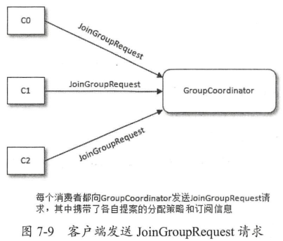
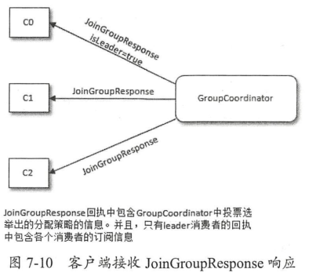
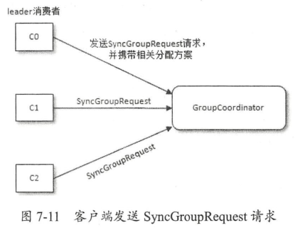

# 消费者

## 分区分配策略

消费者可以通过partition.assignment.strategy来设置和订阅主题之间的分区分配策略，内置了以下几种策略。

- RangeAssignor

RangeAssignor是默认分配策略，它的分配方式是：

1. 先把消费组内所有订阅当前主题的消费者按照名称的字典序排列。
2. 对于每一个主题，通过计算得到n=主题的分区数/消费者数，m=主题的分区数%消费者数。
3. 前m个消费者每个分配n+1个区，其余的消费者每个分配m个区。

假设有2个消费者C0和C1，它们都订阅了两个主题t0和t1，并且每个主题有4个区p0～p3，那么分配结果如下：

C0: [t0p0, t0p1, t1p0, t1p1] 
C1: [t0p2, t0p3, t1p2, t1p3]

另一种情况，假设有2个消费者C0和C1，它们都订阅了两个主题t0和t1，并且每个主题有3个区p0～p2，那么分配结果如下：

C0: [t0p0, t0p1, t1p0, t1p1] 
C1: [t0p2, t1p2]

可以看到第二种情况出现了分配不均匀的现象。

- RoundRobinAssignor

RoundRobinAssignor的分配方式是：

1. 先把消费组内所有订阅当前主题的消费者按照名称的字典序排列。
2. 通过轮询的方式逐个把分区分配给每个消费者。

假设有2个消费者C0和C1，它们都订阅了两个主题t0和t1，并且每个主题有3个区p0～p2，那么分配结果如下：

C0: [t0p0, t0p2, t1p1] 
C1: [t0p1, t1p0, t1p2]

这种策略在一个消费组内存在消费者订阅不同的主题的情况时会出现分配不均匀的现象。假设有3个消费者C0、C1和C2以及3个主题t0、t1和t2，它们各自有1、2、3个分区，C0订阅了t0，C1订阅了t1，C2则全部订阅，那么分配结果如下：

C0: [t0p0] 
C1: [t1p0] 
C2: [t1p1, t2p0, t2p1, t2p2]

可以看到最后的分配结果也不是最优解，因为t1p1可以分配给C1进行消费。

- StickyAssignor

StickyAssignor策略一个主要的改进点是针对发生分区重分配的情况，尽量让前后两次分配相同。

假设有3个消费者C0、C1和C2，它们都订阅了两个主题t0、t1、t2和t3，并且每个主题有2个区p0、p1，那么分配结果如下：

C0: [t0p0, t1p1, t3p0] 
C1: [t0p1, t2p0, t3p1] 
C2: [t1p0, t2p1]

可以看到结果和用RoundRobinAssignor策略是一样的，但如果此时C1脱离了消费组并触发了再均衡操作，分区就会发生重分配，如果用RoundRobinAssignor策略则会得到以下结果：

C0: [t0p0, t1p0, t2p0, t3p0] 
C2: [t0p1, t1p1, t2p1, t3p1]

如果用StickyAssignor策略则会得到以下结果：

C0: [t0p0, t1p1, t3p0, t2p0] 
C2: [t1p0, t2p1, t0p1, t3p1]

可以看到采用StickyAssignor策略后可以减少不必要的分区移动。

实际上在没有遇到分区重分配时，它和RoundRobinAssignor策略也是不同的，比如针对上文中RoundRobinAssignor策略没有得到的最优解，用StickyAssignor策略可以实现，得到以下结果：

C0: [t0p0]
C1: [t1p0, t1p1]
C2: [t2p0, t2p1, t2p2]

> Kafka允许自定义分区分配策略，通过自定义的分区分配策略甚至可以打破“一个分区只能被同一个消费组内的一个消费者消费”的限制。

## 再均衡

当遇到以下几种情况时会触发再均衡的操作：

- 有新的消费者加入消费组。
- 有消费者主动退出消费组，比如消费者取消了对某些主题的订阅。
- 有消费者下线，可以是物理下线，也可以是broker长时间收不到消费者的心跳。
- 消费组对应的GroupCoordinator节点发生了变更（GroupCoordinator用来管理消费组）。
- 消费组内订阅的任一主题或主题的分区数量发生了变化。

Kafka通过GroupCoordinator（组协调器）对消费组进行管理，每个GroupCoordinator可以管理多个消费组。

一次再均衡操作可以分为下面几个阶段：

1. FIND_COORDINATOR

在这一阶段，消费者需要找到其所属的消费组对应的GroupCoordinator所在的broker。首先消费者会向集群中负载最小的节点发送请求，broker收到请求后会计算该消费组对应的__consumer_offsets主题中分区号，计算公式是：`abs(hash(消费组编号)) % __consumer_offsets分区数`，再通过该__consumer_offsets主题分区号找到对应的leader副本所在的broker。

2. JOIN_GROUP

如果是原有的消费者重新加入消费组，那么消费者在向GroupCoordinator发送请求前还需要执行以下步骤：

1) 如果消费者开启了位移自动提交功能，那么需要阻塞提交位移。
2) 调用消费者的自定义再均衡监听器（如果存在的话）。
3) 停止心跳检测。

消费者向GroupCoordinator发送请求，该请求报文中包含了消费组编号、心跳超时时间、再平衡超时时间、分区分配策略、member_id等信息。GroupCoordinator收到请求后，如果发现member_id为空（比如首次加入时），则会为其生成一个member_id。

GroupCoordinator会为消费组选出一个leader，选举算法是：如果消费组内还没有leader，那么第一个加入消费组的消费者就成为leader；如果leader由于某些原因退出了消费组，那么重新选举一个leader，Kafka内部把消费者的成员存放在一个Map里，此时Map中的首个成员就成为leader（可以认为是随机的）。

由于每个消费者都可以指定自己的分区分配策略，因此要从中选择一种每个消费者都认可的策略进行分区分配。选举过程如下：

1) 每个消费者支持的所有分配策略组成候选集合。可以通过partition.assignment.strategy参数配置消费者支持的策略。
2) 每个消费者从候选集合中找出第一个自身支持的策略并为其投上一票。
3) 投票最多的即为消费组的分区分配策略。如果有消费者不支持选出的策略则抛异常。

需要注意的是，以上选举步骤都是在GroupCoordinator内部执行的，并不需要和消费者进行交互。GroupCoordinator把选举出的策略返回给各个消费者，而对于leader还会返回各个成员的信息。





3. SYNC_GROUP

在这一阶段，leader消费者需要实施在上一阶段选举出的分配策略。leader消费者并不是直接把分配方案告知各个消费者，而是把分配方案告知GroupCoordinator，随后各个消费者会向GroupCoordinator再次发起请求来同步分配方案。



GroupCoordinator收到leader消费者发来的分配方案后会把它和整个消费组的元数据一起存到__consumer_offsets主题中，然后再向各个消费者返回分配方案。

消费者再收到分配方案后会执行分区分配策略以及再均衡监听器中相关的方法，并开启心跳任务定期向GroupCoordinator发送心跳。

4. HEARTBEAT

在开始消费前，消费者需要确定再均衡后拉取消息的起始位置，此时可以发送OffsetFetchRequest请求获取上一次提交的消费位移。
消费者通过向GroupCoordinator发送心跳来维持和消费组的从属关系以及对分区的所有权，如果超过session.timeout.ms时间GroupCoordinator没有收到来自消费者的任务消息，那么就认为该消费者宕机，进而触发再均衡。还有一个参数max.poll.interval.ms，如果消费者两次拉取消息的时间间隔超过该值，那么会被视作失败进而触发再均衡。

## __consumer_offsets

当集群中有消费者第一次消费消息时会自动创建__consumer_offsets主题，其副本因子和分区数可以通过offsets.topic.replication.factor和offsets.topic.num.partitions指定。通过offsets.retention.minutes可以指定消费位移的保留时长。

## 自动提交


```java
public void maybeAutoCommitOffsetsAsync(long now) {
    if (autoCommitEnabled) {
        nextAutoCommitTimer.update(now);
        if (nextAutoCommitTimer.isExpired()) {
            nextAutoCommitTimer.reset(autoCommitIntervalMs);
            doAutoCommitOffsetsAsync();
        }
    }
}
```

## 参考

1. 《深入理解Kafka：核心设计与实践原理》
