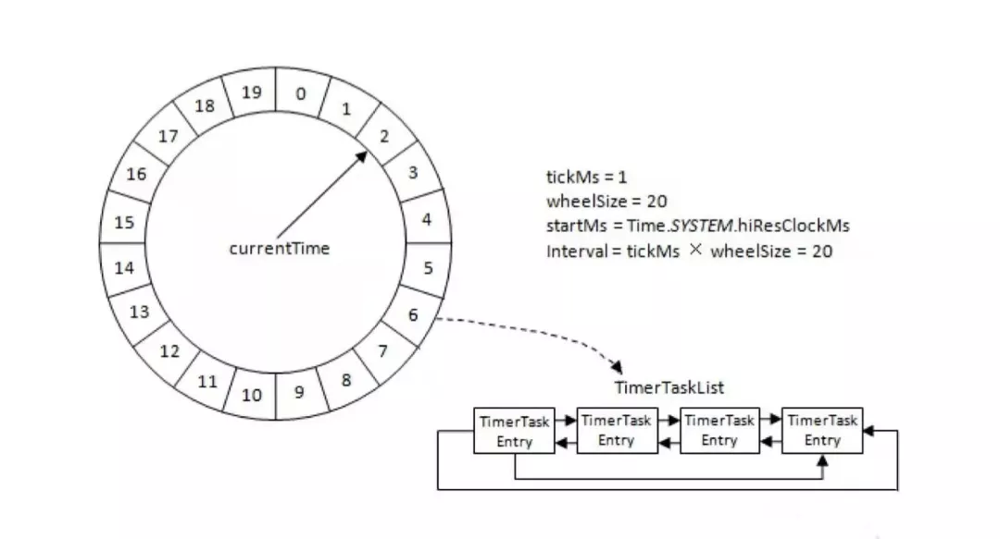
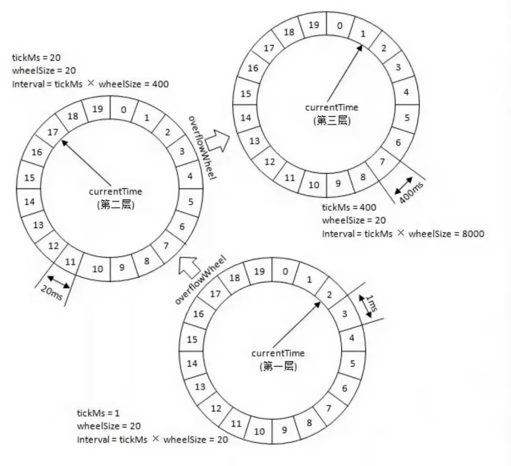

# 延时操作

Kafka中存在大量延时操作，比如延时生产、延时拉取等，JDK自带的DelayQueue的插入和删除操作的时间复杂福是O(nlogn)无法满足性能要求，因此Kafka引入了时间轮作为底层数据结构，可以把对应操作的时间复杂度降低到O(1)。

> 延时生产: 当客户端发送消息时，如果acks参数设置为-1，那么当leader副本将消息写入日志文件后需要等待ISR中其他follower副本拉取到这条消息才能返回正确响应给客户端。如果follower副本没有在超时时间内完成则强制返回给客户端。
> 延时拉取: follower副本先leader副本拉取消息时，leader副本会先读取一次日志文件，如果消息不够多，那么就会等待一段时间，等到消息足够了再返回。

## 时间轮

我们可以把时间轮想像成时钟，它由多个时间格组成，时间格的数量是固定的（wheelSize），每个时间格代表基本的时间单位（tickMs），通过tickMs*wheelSize就可以计算出时间轮的时间跨度（interval）。每个时间格中存放一个定时任务列表（TimerTaskList），该列表是环形双向链表，链表中的每一项代表一个定时任务。此外还有一个指针指向时间轮当前所处的时间（currentTime），它把时间轮分为到期部分和未到期部分（当前所指向的时间格也属于到期部分）。随着时间的推移，currentTime会不断推进，每到一个时间格就需要把对应的定时任务列表中的任务执行到期操作。

一个时间轮表示的时间段随着时间的推移也在不断后移，它能够表示的时间范围总是在currentTime和currentTime+interval之间，比如一个tickMs=1，wheelSize=20，currentTime=0的时间轮，它能够表示0和20毫秒之间的范围，如果此时插入一个延时350毫秒的任务就会发现没有可用的时间格能够插入。

为此Kafka引入层级时间轮，上层时间轮的tickMs就是下层时间轮的interval，以此类推。位于上层时间轮的定时任务，随着时间的推移会逐渐超出所在时间轮的时间范围而被降级下放到下层的时间轮中。

Kafka通过DelayQueue来实现时间推移的功能，每个用到的定时任务列表都会放到DelayQueue中，并按照队列的超时时间排序，最早过期的定时任务队列放在DelayQueue的头部。
Kafka中有一个线程从DelayQueue中获取到期的任务列表并对每个任务列表中的定时任务执行过期操作，此外该线程也负责定时任务在时间轮之间的降级操作。

## 参考

1. 《深入理解Kafka：核心设计与实践原理》
