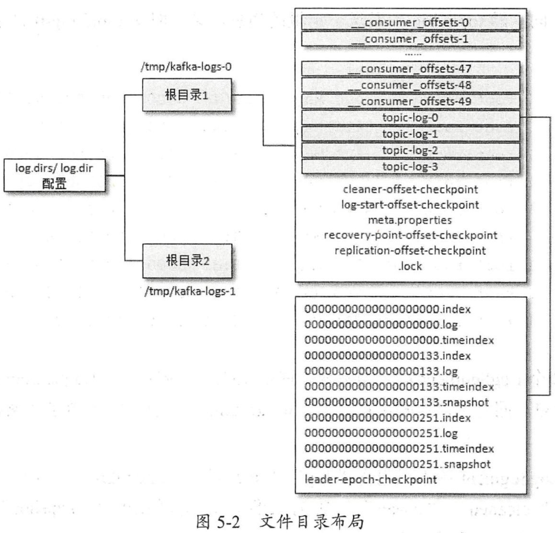
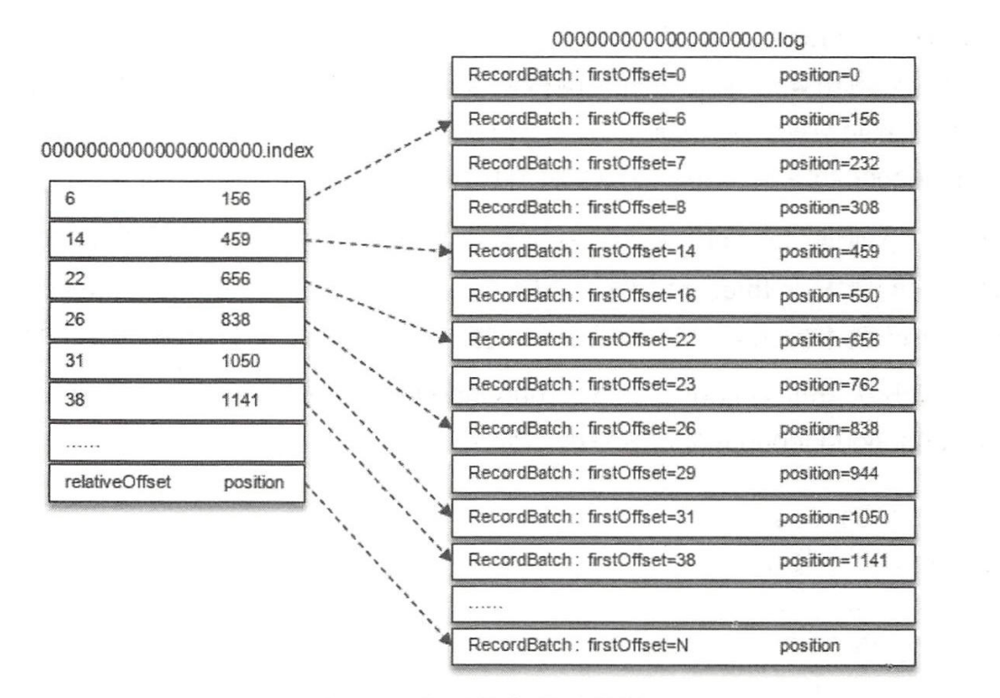
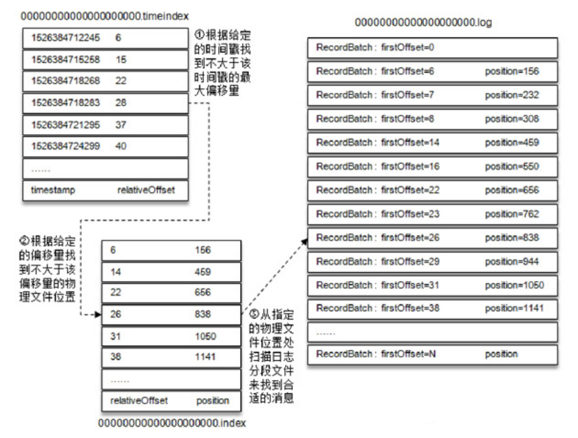
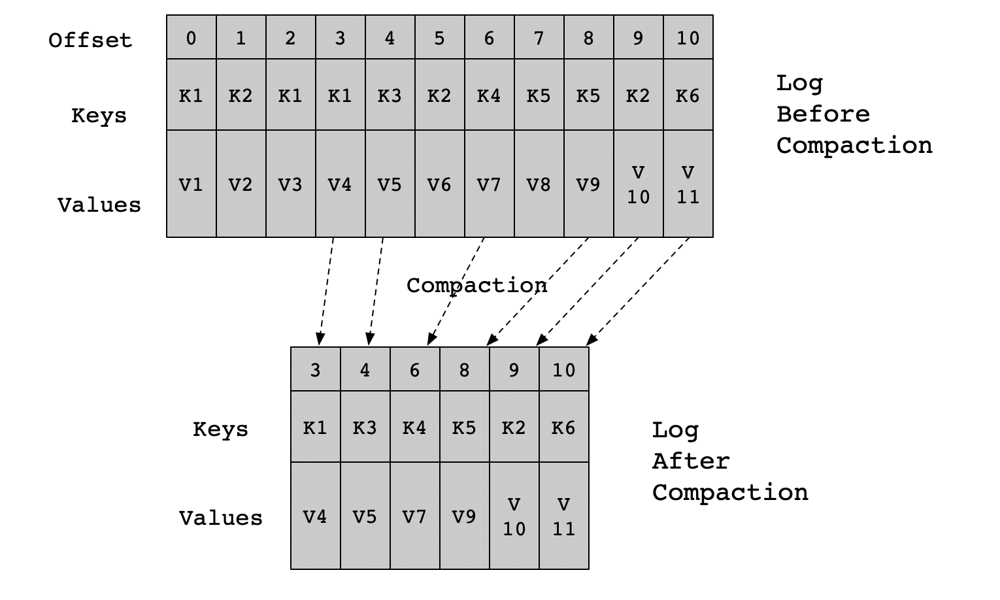

# 日志

Kafka的日志文件目录如下图所示：

为了避免单个日志文件太大，按照`<topic_name>-<partition_id>`的格式划分成多个目录。每个目录中包含`.log`、`.index`、`.timeindex`等文件。

每个目录中的日志文件(`.log`文件)按`<baseOffset>.log`的形式命名，`baseOffset`是日志文件中第一条消息的offset，因此第一个日志文件是00000000000000000000.log。

## 消息结构

kafka消息结构（v2版本）如下图所示：

对于外层的Record Batch有以下几个主要的字段：

- first offset：起始位移。
- length：从partition leader epoch字段到末尾的长度。
- 从partition leader epoch：分区leader纪元（可以看成是leader配置的版本号）。
- attributes：消息的属性，用来表示时间戳类型、是否处于事务中等信息。
- last offset delta：最后一个Record的offset和first offset的差值。
- first timestamp：第一条Record的时间戳。
- max timestamp：最大的时间戳，通常是最后一条Record的时间戳。
- producer id：PID，用来支持幂等和事务。
- producer epoch：和producer id一样，用来支持幂等和事务。
- first sequence：和producer id、producer epoch一样，用来支持幂等和事务。
- records count：Record的个数。

对于每条消息（Record）有以下几个主要字段：

- length：消息总长度。
- attributes：弃用。
- timestamp delta：相对于外部Record Batch起始时间戳的差值。
- offset delta：相对外部Record Batch起始位移的差值。
- headers：用于存储应用层额外的键值对。

## 日志索引

每一个日志文件还对应两个索引文件：`.index`文件以及`.timeindex`文件，分别用来通过偏移量和时间戳来快速定位一条消息。`.index`文件记录偏移量和消息物理地址的映射关系，`.timeindex`文件记录时间戳和偏移量的映射关系。

Kafka并不保证每条消息都在索引文件中有对应的条目，默认每当写入一定量的消息时才会在索引文件中增加一个索引项，可以通过log.index.interval.bytes参数指定，默认是4096，即4KB。

`.index`偏移量索引文件中的每个索引分为两部分：相对offset（4字节）和索引消息在日志文件中对应的物理位置（4字节）。相对offset是指相对于baseOffset的偏移量，比如在20.log日志文件中offset是23的消息在索引文件中的相对offset就是23-20=3。

`.timeindex`时间戳索引文件则先通过时间戳得到消息的相对偏移量，再通过相对偏移量定位到消息。

## 日志切分

只要满足以下任意一个条件就会触发日志文件的切分：

1. 日志分段文件大小超过阈值（通过log.segment.bytes配置，默认1G）。
2. 日志分段文件中消息的最大时间戳与当前时间戳的差值大于阈值（通过log.roll.ms或log.roll.hours配置，默认7天）。
3. 日志分段文件对应的索引文件的大小超过阈值（通过log.index.size.max.bytes配置，默认10MB）。
4. 消息的偏移量不能再转化为相对偏移量，即offset-baseOffset>Integer.MAX_VALUE。

## 日志清理

Kafka会通过定时任务周期性的检查符合清理条件的日志文件：

1. 日志文件在一段时间内没有被修改；
2. 日志文件超过了一定的大小。

在删除时，日志分段文件对应的所有文件（包括日志文件和索引文件）会被加上`.deleted`后缀并由一个定时任务进行删除。

## 日志压缩

Kafka默认采用删除日志文件的方式清理过期数据，此外也可以用日志压缩的方式对数据进行清理（__consumer_offsets主题就是用这种方式）。

对于key相同的消息，日志压缩策略会只保留最后一个版本。保留下来的消息的偏移量和原先的一致，但压缩后的偏移量不再是连续的（因为key相同的消息并合并了）。Kafka日志目录下有一个叫做cleanr-offset-checkpoint的文件用来记录每个分区中已清理的偏移量。

Kafka使用一种叫做SkimpyOffsetMap的数据结构存储key的哈希值和偏移量之间的映射关系。在写入时先根据哈希值找到Map中对应的槽，如果冲突则用线性探测法寻找下一个空的槽位写入，需要注意的是，如果两个不同的key它们的哈希值正好相同，那么其中一个key对应的消息就会丢失（概率较小）。

Kafak在执行日志压缩时会把日志分段进行分组，规则是每个组中日志分段的总大小不能超过log.segment.bytes（默认1G）并且对应的索引文件总大小不超过log.index.size.max.bytes（默认10MB）。同一个组的日志分段文件压缩后会生成一个新的日志分段文件。生成新的日志分段文件的步骤如下：把需要保留的消息写入到`.clean`文件中（如00000000000000000000.log.clean），然后把`.clean`文件重命名为`.swap`文件（如00000000000000000000.log.swap），最后删掉原来的日志分段文件，并把新文件的`.swap`后缀去掉。

## 刷盘策略

Kafka会通过一个后台线程周期性的把日志刷新到磁盘上

## 参考

1. 《深入理解Kafka：核心设计与实践原理》
