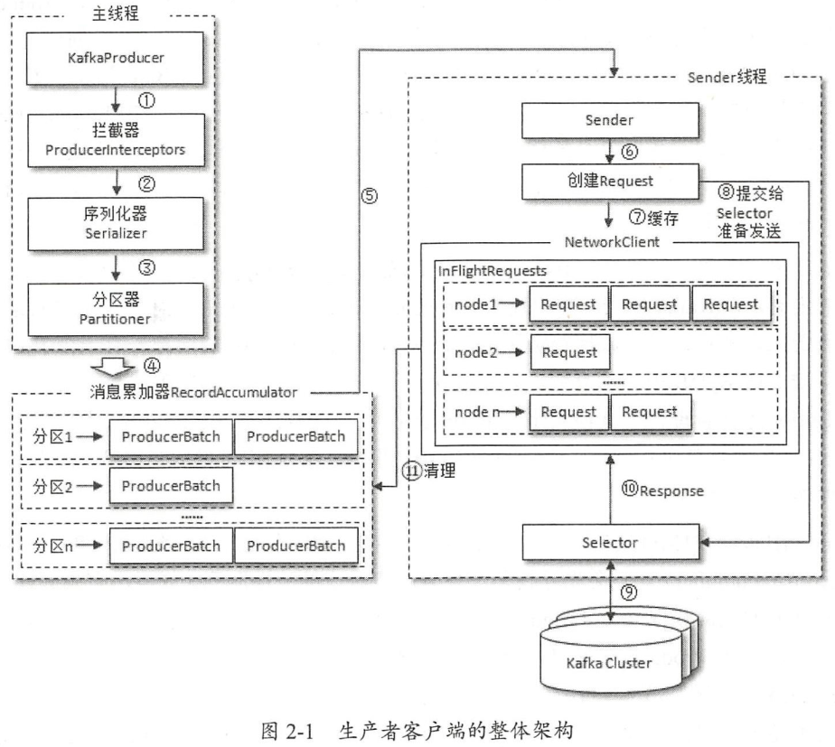
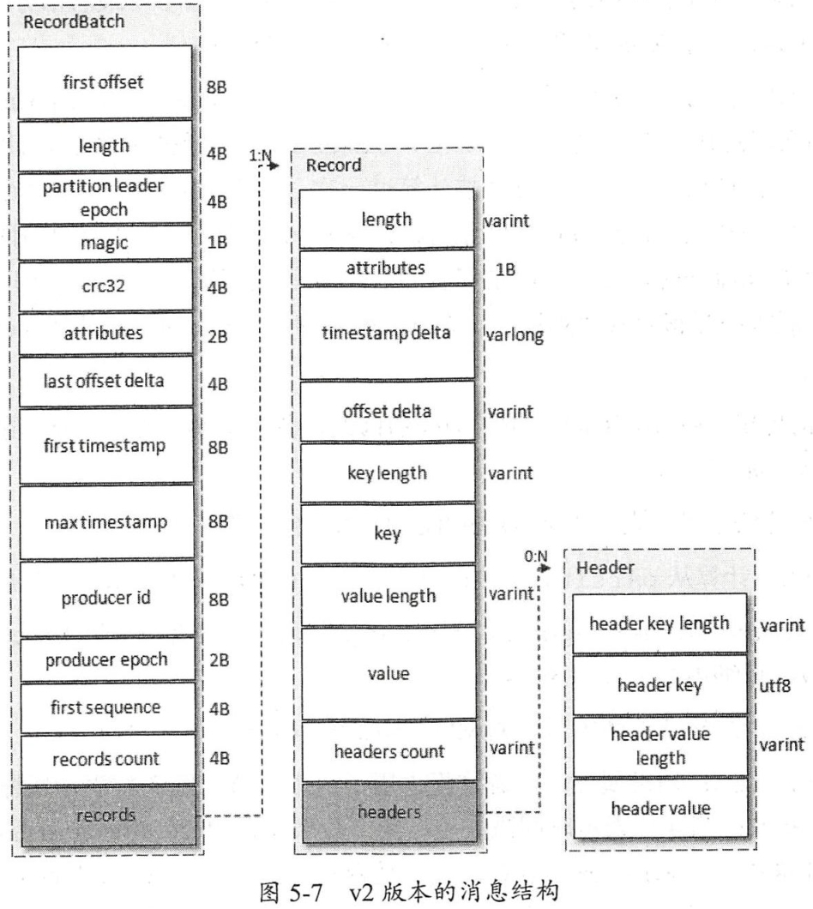
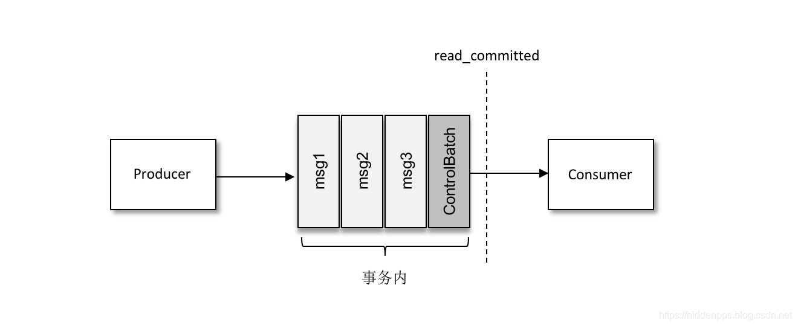

# 生产者

Producer的整体架构如下图所示：



Producer在发送消息时并不会直接将请求发到服务器，而是把一个或多个消息组成ProducerBatch对象缓存在消息收集器RecordAccumulator中，默认最多可以缓存32MB（可以通过buffer.memory配置修改），如果消息生产的速度过快导致缓存空间不足，在调用KafkaProducer的send()方法时会被阻塞并最多等待60s（可以通过max.block.ms配置修改），等待超时后会抛出异常。

Producer采用java.io.ByteBuffer实现消息内存的创建和释放，并实现了一个BufferPool以复用ByteBuffer，但默认只会针对16KB大小的ByteBuffer进行缓存（可以通过batch.size配置修改），其他大小的ByteBuffer不会被缓存。该参数和ProducerBatch对象的大小也有关系，在创建ProducerBatch对象时其大小不会小于batch.size的值。

Sender线程负责发送缓存在RecordAccumulator中的消息，并将那些已经发送出去但还没有收到响应的请求保存在InFlightRequests中。

Producer在投递消息时首先要决定把消息投递到Topic的哪一个分区中。如果用户指定了分区那就投递到指定的分区中；如果消息的key不为空，则对key值进行哈希（murmur2算法）后与分区数量进行取模来确定目标分区；如果用户没有指定分区并且消息的key为空，那么通过一个计数器与分区数量进行取模来确定目标分区，计数器会不断自增。

## 生产者参数

1. acks

用来指定分区中必须有多少个副本收到消息才会认为该消息写入成功。

- acks = 1（默认），只要leader副本写入消息就认为写入成功。如果leader副本在写入消息后崩溃，并且此时还没有follower副本同步该消息，此时消息丢失。
- acks = 0，发送消息后不需要等待服务器的响应。优点是吞吐量高。
- acks = -1，需要等ISR中的所有副本都写入消息后才会收到服务器的成功响应。注意，ISR中可能仅包含leader副本本身，在这种情况下等同于acks = 1，依然可能发生消息丢失的情况，需要配合broker的min.insync.replicas参数避免这种情况的发生。
- acks = all，同acks = -1。

2. max.in.flight.requests.per.connection

指定每个连接最多缓存的请求数，也就是InFlightRequests中每个broker对应的请求数。如果需要保证消息的顺序，则建议把该值设为1。

3. retries

指定重试次数，另外可以通过retry.backoff.ms指定两次重试的间隔。

4. connections.max.idle.ms

指定在多久后关闭闲置的连接，默认是9分钟。

5. linger.ms

消息延迟发送的时间，默认是0，即立刻发送。如果该参数不为0，则在发送前会等待更多的消息加入到ProducerBatch中，从而提高吞吐量。

6. bootstrap.servers

broker地址。生产者在发送消息前先通过bootstrap.servers中配置的broker获取Kafka集群元数据信息，然后再向目标broker发送消息。

## 幂等

一般情况下如果生产者发生了重试，那么就可能会造成消息的重复写入，在开启了幂等功能后就可以避免这种情况。

我们只需要为生产者配置以下参数即可开启幂等功能。

```java
properties.put("enable.idempotence", true);
```

Kafka通过在生产者的报文中增加producer id(PID)和序列号实现幂等功能。



生产者在初始化时会由broker分配一个PID，对于每个分区都会有一个对应的序列号，每发送一条消息就会把对应的序列号加1。broker则会在内存中为每一对<PID, 分区>维护一个序列号，只有当收到的消息的序号恰好比broker维护的序号大1时才会接受该消息。如果新消息的序号比broker记录的小，那么就抛弃该消息；如果大于1，则会抛出异常。

## 事务

事务用来保证对多个分区写入的原子性。Kafka引入了事务协调器（TransactionCoordinator）负责处理事务，它会把事务的状态都持久化到__transaction_state主题中。

一个事务通常包含以下几个阶段：

1. 查找事务协调器

在使用事务功能时，生产者在初始化时需要分指定一个事务ID，通过以下公式计算它对应的__transaction_state主题的分区号：`abs(hash(事务ID)) % __transaction_state分区数`，再通过该__transaction_state主题分区号找到对应的leader副本所在的broker，这个和查找组协调器的过程是类似的。

2. 获取PID

事务协调器会为生产生分配一个PID，并把事务ID、PID以及其他信息存储到__transaction_state主题中，在向生产者返回PID之前还会提交或中止之前的生产者未完成的事务。

3. 开启事务

生产者调用beginTransaction()方法后会在本地标记开启了一个事务，只有当它发送第一条消息后事务协调器才会认为该事务开启。

4. 发送消息

生产者在给一个新的分区发消息前需要先向事务协调器发送一个请求，事务协调器会把事务ID和分区的对应关系存到__transaction_state主题中，随后生产者在发送消息的报文内会带上事务ID。

5. 提交或中止事务

在收到提交或中止事务的请求后，事务协调器会先将PREPARE_COMMIT或PREPARE_ABORT消息写入__transaction_state，然后向事务中各个分区的leader节点发送请求，让它们把控制消息COMMIT或ABORT写入__consumer_offsets中。最后事务协调器将COMPLETE_COMMIT或COMPLETE_ABORT消息写入__transaction_state表明事务已结束。

控制消息是一种特殊的消息，它用来表示事务已提交或已中止。消费者也可以通过控制消息判断在当前隔离级别下是否可以将消息返回给上层应用。



## 参考

1. 《深入理解Kafka：核心设计与实践原理》
