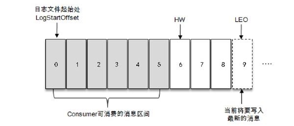
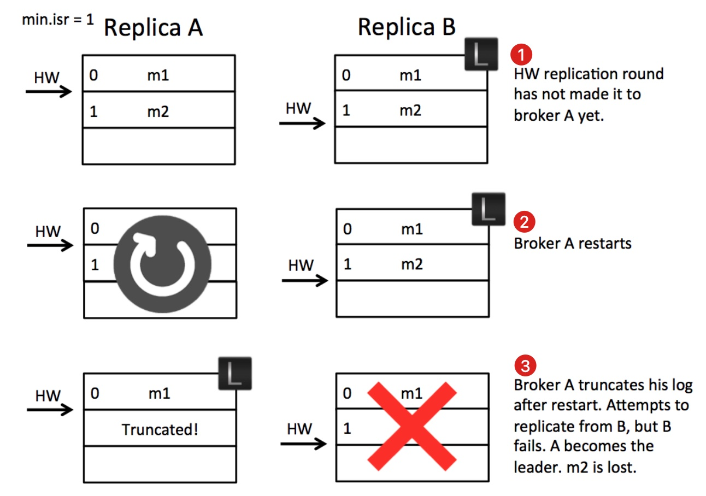
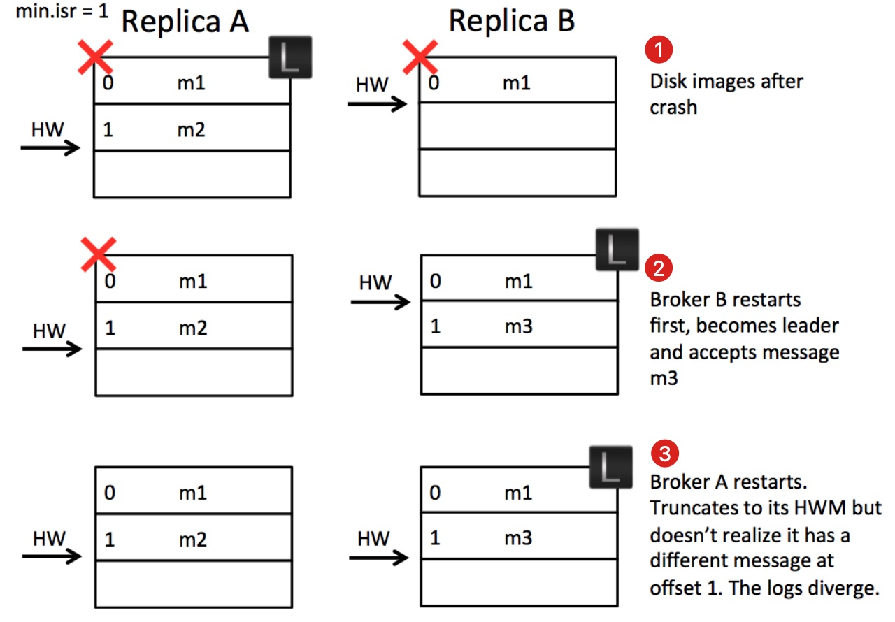
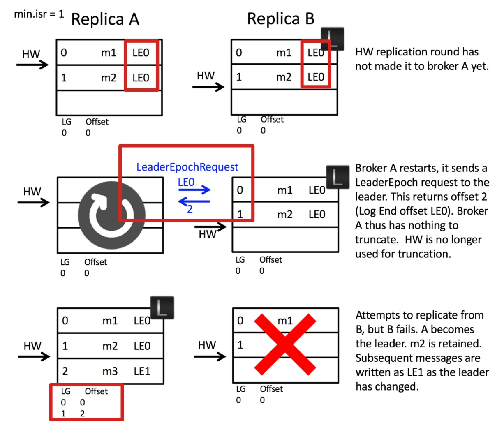
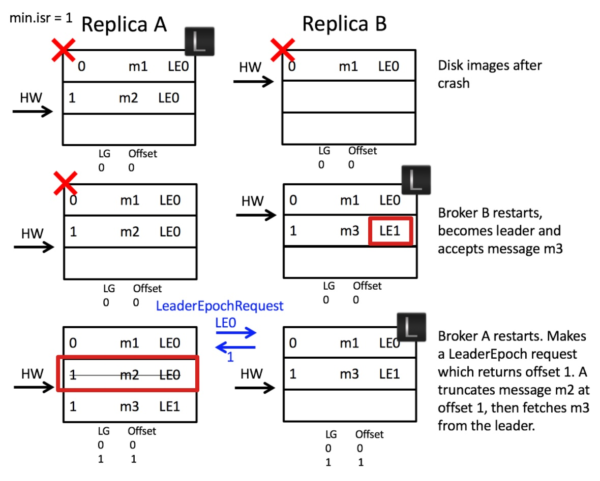

# 可靠性

## 副本

Kafka采用一主多从的架构提升容灾能力，leader副本负责读写请求，follower副本负责从leader副本那里同步消息而不参与读写请求的处理，当leader副本发生故障时，从follower副本中重新选举新的leader副本对外提供服务。

一个分区中所有的副本称为AR(Assigned Replicas)，与leader保持一定程度同步的副本（包括leader和follower）组成ISR(In-Sync Replicas)，与leader同步滞后的副本组成OSR(Out-of-Sync Replicas)，AR=ISR+OSR，在正常情况下OSR为空。

leader副本会维护follower副本的同步状况，从而决定一个follower副本应该处在ISR集合还是OSR集合中。在默认配置下只有处在ISR集合中的follower副本才有资格被选举为新的leader。

ISR集合中的每个副本都会维护一个LEO值(Log End Offset)，相当于当前日志分区中最后一条消息的offset+1，也就是下一条待写入的消息的offset。ISR集合中最小的LEO称为HW(High Watermark，高水位)，消费者只能拉取到HW之前的消息。follower副本每次向leader副本发送请求拉取消息时会带上自己的LEO信息，leader副本会先从日志文件中读取数据，然后更新follower副本的LEO，最后再把数据返回给follower副本。

Kafka中有定时任务把所有分区的LEO和HW持久化到文件中，分别对应recovery-point-offset-checkpoint和replication-offset-checkpoint文件。

## ISR伸缩

Kafka会周期性的检测每个分区是否需要缩减其ISR集合。当检测到ISR集合中有失效副本时就会触发收缩ISR集合的操作，它会将变更后的数据写到ZooKeeper的节点（/brokers/topic/<topic>/partition/<partition>/state）中并更新本地的isrChangeSet缓存。Kafka通过一个单独的定时任务周期性的检查isrChangeSet，如果发现有ISR集合变更的记录就会在ZK的/isr_change_notification路径下创建一个持久顺序节点（比如/isr_change_notification/isr_change_0000000000）并把isrChangeSet中的信息保存到该节点中。由于Kafka控制器对该节点进行了监听，因此控制器可以感知到发生了变化，它会向其他broker发送更新元数据的请求，最终删除/isr_change_notification下已经处理过的节点。

为了避免频繁触发ISR集合的伸缩，Kafka添加了额外的限定条件：

1. 上一次ISR集合变化距离当前已超过5秒。
2. 上一次写入ZK的时间距离现在超过60秒。

满足以上两个条件之一才能把ISR集合的变化写入ZK节点。

如果不在ISR集合中的follower副本的同步进度追上了leader副本，即follower副本的LEO大于等于leader副本的HW，此时就会触发扩充ISR集合的操作，步骤和收缩时类似。

## Leader Epoch

基于LEO和HW同步机制存在数据丢失以及leader副本和follower副本数据不一致的问题，考虑以下数据丢失的情况：

有A、B两个副本，其中B是leader副本，A是B的follower副本。B中有两条消息m1、m2，A已经把这两条消息同步过来，此时两个副本的LEO都是2，HW都是1。此时A再发向B发起拉取消息的请求，该请求中会带上自己的LEO消息，B由于没有更多的消息，在更新HW为2后返回空消息给A，A同样根据B的返回值更新自身的HW为2。

如果A在更新HW之前宕机了，那么A重启后它的HW仍旧是1，此时它会把m2这条消息删除（日志截断）并向B拉取消息。如果此时B也宕机了，那么A就会被选举为新的leader，而B在恢复后就会成为A的follower，由于follwer副本的HW不能高于leader副本的HW，因此B的HW会被调整为1，这样m2消息就发生了丢失。

再考虑以下数据不一致的情况：

有A、B两个副本，其中A是leader副本，B是A的follower副本。A有两条消息m1、m2，它的LEO和HW都是2，B有一条消息m1，它的LEO和HW都是1。假设A、B同时宕机并且B率先恢复并成为leader，之后B写入第二条消息m3并把LEO和HW更新为2。此时A恢复过来并向B发送拉取消息的请求，由于A的LEO是2，因此m3这条消息无法同步过来，这就导致了A中是m1、m2，B中是m1、m3的情况。

为了解决以上两个问题，Kafka引入leader epoch（以下简称LE）的概念，每当leader副本变更一次，LE的值就会加1，相当于是leader的版本号。

下面来看一下针对第一种情况增加了LE后的变化：

可以看到每条消息中都带有LE，A在重启后不会直接截断日志，而是向B询问LE0（A当前的LE）的最新偏移量是多少，此时B就会返回2，这样A就知道它不需要截断日志。

> 如果A向B发起询问时B宕机了，那么此时A会被选举为leader副本，leader副本不会进行日志截断，只有follower副本会进行截断操作，因此消息不会丢失。

再来看第二种情况：

当B成为leader后，LE从LE0更新为LE1，因此消息m3的LE就是LE1，此时A恢复过来并向B询问LE0的最新偏移量是多少，此时B会返回1，这样A就会把日志进行截断，删除消息m2，从而让A、B数据一致。

## 消息可靠性

为保证消息可靠性，可以在创建主题时配置副本数大于1，通常可以设置成3。生产者在初始化时可以把ack配置为-1，每次发消息时只有当所有ISR集合中的副本都写入成功才算成功，此外为了避免ISR集合中只有leader副本本身，在broker端还需要配置min.insync.replicas参数大于1，以保证除了leader副本外存在follower副本也写入了消息。最后还需要配置unclean.leader.election.enable为false从而保证当leader副本宕机时不会将不在ISR集合中节点选举为新的leader导致数据丢失。

## 参考

1. 《深入理解Kafka：核心设计与实践原理》
2. (《为什么Kafka需要Leader Epoch？
》)[https://t1mek1ller.github.io/2020/02/15/kafka-leader-epoch/]
