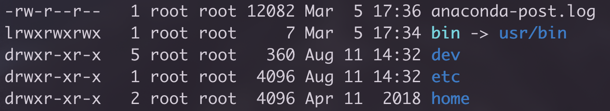

# 权限

在查看Linux的文件权限时，我们经常可以看到通过`ll`命令得到类似下图的结果。

我们以第3行数据为例进行说明。

其中，第一列的首字母代表文件的类型，有以下几个值：

- d，表示文件
- l，表示连接
- -，表示文件
- b，表示可供储存的接口设备
- c，表示串行端口设备，比如键盘、鼠标等

在这里dev是一个文件夹，因此首字母的值是d。

紧跟着的rwxr-xr-x表示三组权限，分别是rwx、r-x以及r-x，r代表可读权限，w代表可写权限，x代表执行权限，每一组的固定顺序是rwx，如果没有某一个权限，那么在对应的位置上用-表示。三组权限中的第一组代表文件拥有者的权限，第二组是同权限组的权限，第三组是其它权限。

第二列的数字表示有多少文件连接到当前文件。

第三列的用户名代表该文件的拥有者。

第四列代表该文件的所属群组，如果某一群组对该文件有写权限，那么该群组中的所有用户都对此文件有写权限。

第五列表示文件的大小，单位是字节。

第六列表示文件的最近修改时间。

最后一列就是文件名。

## 参考

1. [《鸟哥的Linux私房菜 - 第六章、Linux的文件权限与目录配置》](http://cn.linux.vbird.org/linux_basic/0210filepermission.php#filepermission)
