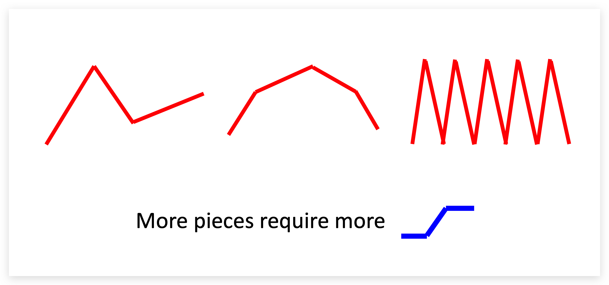

# 概念

## 机器学习

机器学习的目的是自动寻找一个适合的函数来解决某个特定问题（通过历史数据产生一个模型，将新的数据输入这个模型得到一个输出）。深度学习是机器学习的一种方式。

函数的输入可以是一个向量、矩阵、序列，输出可以是一个数字（regression）、类别（classification）或者其他形式的数据（比如文档、图形）。
根据输入和输出的类型可以对这些函数进行分类：

- Regression
输出一个数字。例如通过过去几天的气温数值预测明天的气温。
- Classification
从给定的几个选项中输出一个选项。例如判断一个邮件是不是垃圾邮件，函数输出一个布尔值。
如果只有两个选项，则可以称为binary classification；如果有两个以上的选项则称为multi-class classification。
- Structed Learning
输出结构化的数据，例如文档、图形。例如让机器产出一篇文章。

- Supervised Learning
- Self-supervised Learning
- Unsupervised Learning
- Reinforcement Learning
- Meta Learning：学习如何学习。

## 基本术语

- 数据集（data set）：进行机器学习需要先有数据，由一系列数据组成的集合称为数据集。
- 样本（sample）：每条数据称为样本。
- 特征（feature）：反映对象在某方面的表现或性质的事项称为特征或属性，例如长度、宽度。每条记录可以包含多个特征。
- 训练（training）：从数据中学得模型的过程称为学习或训练。训练过程中使用的数据称为训练数据（training data），每个样本称为一个训练样本（training sample），训练样本组成的集合称为训练集（training set）.
- 标记（label）：训练模型时除了样本的各项特征信息，还需要结果信息，称为标记，例如：色泽是青绿，根蒂是蜷缩的西瓜是好瓜。这里的“好瓜”就是标记信息。拥有标记信息的样本称为样例（example）。根据训练数据是否有标记信息可以把学习任务分成两大类：监督学习和无监督学习。

## 机器学习的步骤

### 建模

在进行机器学习时首先需要对问题进行建模，即寻找一个可能的公式。例如，通过历史的视频点击量来预测第二天的点击量，我们可以寻找如下的公式：

> $y = b + wx_1$

这样的一个公式也可以称为`Model`，它仅仅是我们猜想的一种可能满足上述场景的公式，当然也可以存在其他形式的公式。公式中的x1表示上一天的视频点击量，y表示下一天的视频点击量。
公式中的已知参数称为`Feature`，如上述公式中的x1；与`Feature`相乘的未知参数称为`Weight`，如上述公式中的w；没有和`Feature`相乘的未知参数称为`Bias`，如上述公式中的b。

### 定义Loss函数

寻找一个函数 $L(b,w)$ ，函数的值代表参数 $b$ 、 $w$ 的优劣。针对上述模型，假设给定一组参数 $b$ 、 $w$ ，通过输入历史的每一天的视频点击量即可以计算出第二天的点击量 $y$ ，再把计算值和实际的点击量 $\hat{y}$ 作比较（比如两者相减后取绝对值），就可以得到这一天的偏差量 $e_i$ 。

> 我们把实际的值称为Label。

Loss： $L$ = 所有数据的偏差值的平均数 $\displaystyle\frac{1}{N}\sum_{n=1}e_n$ 。Loss越大说明参数 $b$ 、 $w$ 的效果越差。通过穷举不同的 $b$ 、 $w$ 的值，计算所有的 $L$ ，使得 $L$ 尽可能的小。

我们可以有多种方法计算每一个数据的偏差值，上述例子用的是相减后取绝对值的方式 $|(y-\hat{y})|$ ，这种方式称为MAE（Mean Absolute Error）；还可以用 $(y-\hat{y})^2$ 的方式，这种方式称为MSE（Mean Square Error）。

### 优化

找出一组 $w$ 、 $b$ 能使得 $L$ 最小，满足条件的 $w$ 、 $b$ 记为 $w^\star$ 、 $b^\star$ 。

#### 梯度下降

我们可以先随机找一个初始的 $w$ 计作 $w^0$ ，计算这一点的斜率，如果斜率小于0，那么增加 $w$ 的值；如果斜率大于0，那么减小 $w$ 的值。每次调整的增量（图中 $w^1-w^0$ ）由 $\eta \frac{\partial L}{\partial w}|_ {w = w^0}$ 决定，其中 $\displaystyle\eta$ 是学习速率（learning rate），它的值需要人工设定。 $\frac{\partial L}{\partial w} |_{w = w^0}$ 是微分，代表斜率。

> 在机器学习中需要人工设定的参数称为超参数（hyperparameters）。

当我们不停的寻找能让 $L$ 变小的 $w$ 的值时，在有限的条件内（例如最多尝试100万次）不一定能找到令 $L$ 最小的 $w$ （global minima），而是找到了极小值（local minima）。

#### 激活函数

线性模型的问题是 $x$ 和 $y$ 的关系总是一条直线，导致 $x$ 和 $y$ 的趋势始终保持一致，例如： $x$ 越大， $y$ 总是越大。这并不能满足所有场景的需求，在实际情况下 $x$ 和 $y$ 可能是这样的关系（下图红色线段所示）：

很显然我们无法用一个线性模型来表示上图中的分段函数。我们可以把红色部分的图案进行分解，通过一个常数叠加几个S型的函数（图中用蓝色表示）来表示。

下图中的红色函数可以由4个蓝色函数叠加后表示。

红色函数转折的点越多，那么就需要拆解出更多的蓝色函数。像这样的红色函数称为分段线性曲线（piecewise linear curve）。

我们可以通过分段线性曲线来逼近任何连续的曲线。

蓝色函数可以用sigmoid函数 $y = c\frac{1} {1 + e^{-(b+wx_1)}}$ 近似表示。

通过调整参数 $w$ 、 $b$ 、 $c$ 来获得不同的函数图像。

通过叠加多个sigmoid函数，就可以把红色函数表示成如下形式： $\displaystyle y = b + \sum_{i}c_i sigmoid(b_i + w_i x_1)$ 。通过不同的 $w$ 、 $b$ 、 $c$ 参数组合就可以构造出不同的曲线。

#### 扩展特征

在上面的例子中只使用了一个特征，即通过前一天的视频点击量 $x_1$ 预测下一天的点击量 $y$ 。我们可以加入更多特征进行预测，例如加入前三天的视频点击量，即 $y = b + wx_1 + wx_2 + wx_3$ ，简化后得到 $\displaystyle y = b + \sum_{j}w_j x_j$ ，加入激活函数后得到 $\displaystyle y = b + \sum_{i}c_i sigmoid(b_i + \sum_{j}w_{ij} x_j)$ 。

假设 $i$ 和 $j$ 的取值范围都是[1,3]，即有3个特征 $x_1$ 、 $x_2$ 、 $x_3$ ，并且有3个蓝色函数构成模型。展开 $\displaystyle b_i+\sum_{i} w_{ij} x_j$ 部分得到：

- $r_1 = b_1 + w_{11}x_1 + w_{12}x_2 + w_{13}x_3$
- $r_2 = b_2 + w_{21}x_1 + w_{22}x_2 + w_{23}x_3$
- $r_3 = b_3 + w_{31}x_1 + w_{32}x_2 + w_{33}x_3$

用矩阵表示：
$\begin{bmatrix}
    r_1 \\
    r_2 \\
    r_3
\end{bmatrix} = \begin{bmatrix}
    b_1 \\
    b_2 \\
    b_3
\end{bmatrix} + \begin{bmatrix}
    w_{11} & w_{12} & w_{13} \\
    w_{21} & w_{22} & w_{23} \\
    w_{31} & w_{32} & w_{33}
\end{bmatrix} \begin{bmatrix}
    x_1 \\
    x_2 \\
    x_3
\end{bmatrix}$

进一步简化： $\textbf{\textit{r}} = \textbf{\textit{b}} + \textbf{\textit{w}} \textbf{\textit{x}}$ 

原式 $\displaystyle y = b + \sum_{i}c_i sigmoid(b_i + \sum_{j}w_{ij} x_j)$ 简化为 $\displaystyle y = b + \sum_{i}c_i sigmoid(r_i)$ 。将 $sigmoid(r_i)$ 写做 $\sigma(\textbf{\textit{r}}) = \textbf{\textit{a}}$ ，得到 $y = b + c_1a_1 + c_2a_2 + c_3a_3$ ，简化成 $y = b +\textbf{\textit{c}}^T \textbf{\textit{a}}$ 。

最后，将向量 $\textbf{\textit{a}}$ 代入后得到 $y = b + \textbf{\textit{c}}^T \sigma(\textbf{\textit{b}} + \textbf{\textit{w}}\textbf{\textit{x}})$ 。
