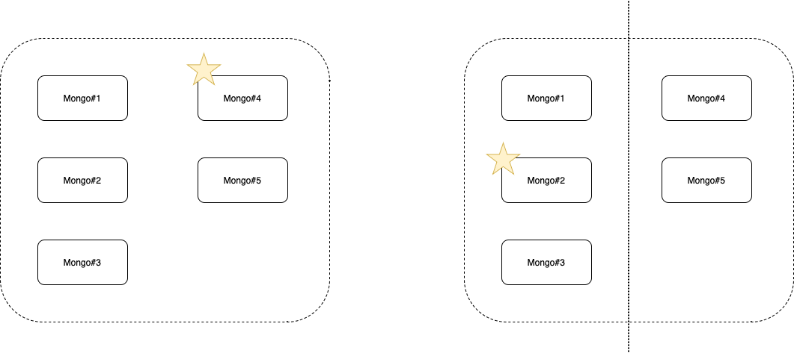

# 复制

Mongo通过多副本的方式，将一份数据复制到多个进程中，以保证服务的高可用。多个Mongo进程组成一个副本集，一个副本集中只能有一个用于接收写操作的主节点，和若干个拷贝数据的从节点。

当主节点下线时会从从节点中选举出一个新的主节点，只有在得到大多数（一半以上）节点支持时才能成为主节点。如果一个节点当前是主节点，由于故障导致得到大多数的节点支持时就会退位成从节点，这是为了避免一个副本集中出现多个主节点，这样会有多个节点接收数据写入致使集群的数据发生混乱，例如下图的场景，在一个有5个节点的副本集中，原本Mongo#4是主节点，在发生网络分区故障后，Mongo#2被选举为新的主节点，Mongo#4退位成从节点，避免了该副本集中出现两个主节点的情况。

