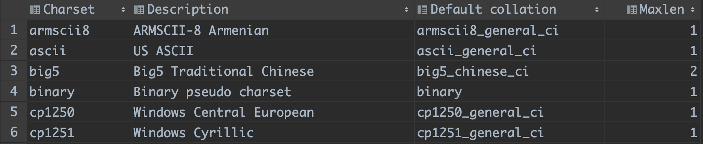
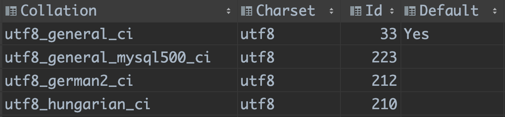

# 字符集和比较规则

我们可以用以下命令查询当前版本的数据库支持的字符集：

```sql
-- 查询字符集
show charset like 'charset_name';
```

查询结果如下（截取部分）：



查询结果中从左到右依次是字符集名称、描述、默认比较规则以及该字符集最多需要用多少个字节来表示一个字符。

我们可以用以下命令查询当前版本的数据库支持的比较规则：

```sql
-- 查询比较规则
show collation like 'collation_name';
```



查询结果中`Default`列是`YES`的比较规则就是对应字符集的默认比较规则，如`utf8`的默认比较规则就是`utf8_general_ci`。

比较规则的命名逻辑是`字符集_语言_后缀`，比如`utf8mb4_polish_ci`表示`utf8mb4`字符集下波兰语的比较规则，`ci`表示不区分大小写(Case Insensitive)，常用后缀还有`bin`，表示以二进制方式进行比较。
