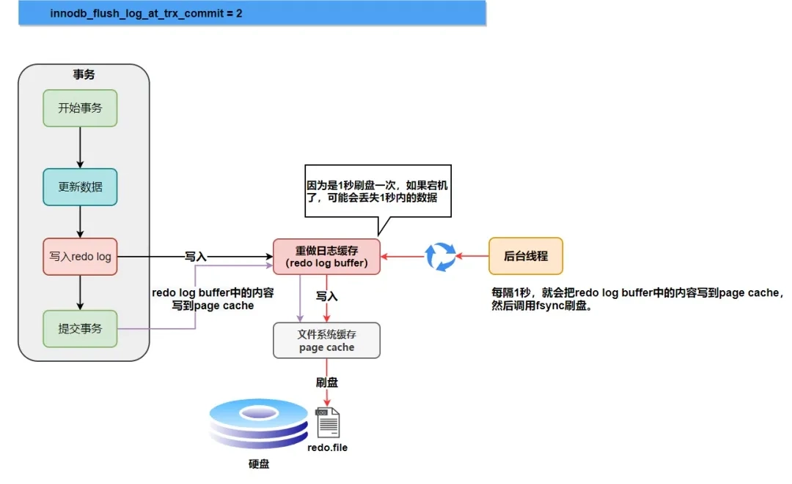
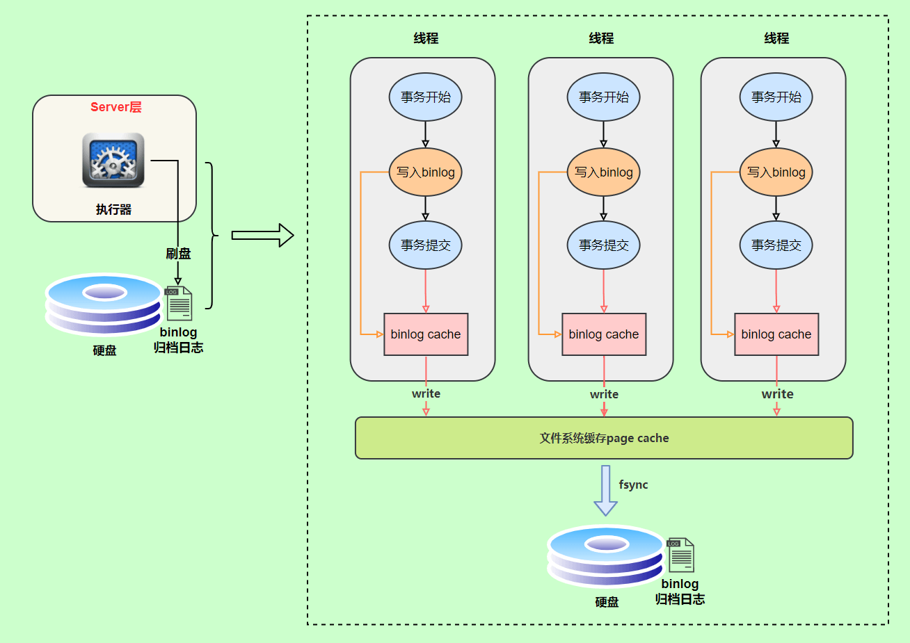

# redolog、undolog、binlog

## redolog

redo日志让数据库拥有崩溃后恢复的能力。当我们对数据库中的页进行修改后，出于性能考虑，变更并不是马上刷入磁盘的，而是先修改内存中Buffer Pool中对应的页，如果此时发生故障，这些变更过的数据就会丢失。因此引入了redo日志，通过它可以在数据库恢复后把数据还原到故障发生之前的时刻。无论是对数据页的修改还是对undo日志页的修改都会生成对应的redo日志。

redo日志的格式很多，我们主要看两种。

第一种是执行Insert语句时的redo日志，主要记录了插入时需要的参数，MySQL恢复数据时会根据这些参数执行插入操作。

第二种比较直接，记录了在某个表空间的某个页的偏移位置写入数据。

如果在Insert时也采用第二种方式，那么由于插入操作可能会引起多个页的变更（比如更新多个索引、引起页分裂等），会导致redo日志记录的数据比较多。

有时候执行一条语句会产生多条redo日志，有一些redo日志必须以原子的方式执行，如果在数据库发生故障前只记录了部分redo日志，那么在数据库重启后会恢复到不正确的状态。比如在插入数据时，还没来得及新增目录项记录，数据库就发生了宕机，此时的redo日志是不完整的，在数据库重启后通过这部分不完整的redo日志就会把系统恢复到一个不正确的状态。redo日志中用一个比特位来表示是否是单一的日志，如下图所示：

如果不是单一日志，则在多个redo日志的最后一定有一个类型为`MLOG_MULTI_REC_END`的redo日志，表示这一组redo日志需要被原子的执行。在数据库重启进行恢复时，只有当解析到类型为`MLOG_MULTI_REC_END`的redo日志，才认为解析到了一组完整的redo日志，才会进行恢复。否则的话直接放弃前面解析到的redo日志。

redo日志并不是每生成一条就立刻刷盘的，而是写到一个缓冲区中，称为`Log Buffer`。
 

当满足以下任意一个条件时才会刷盘：

- `Log Buffer`空间不足。
- 事务进行提交。这种场景取决于`innodb_flush_log_at_trx_commit`参数。
  - 值为0: 提交事务时不刷盘。
    
  - 值为1（默认）: 每次提交事务时刷盘（fsync）。
    
  - 值为2: 媒体提交事务只把日志写入文件系统缓存。
    
- 后台线程定时刷盘：约以每秒1次的频率，因此一个未提交的事务也可能刷盘。
  
- 正常关闭数据库时。
- 做Checkpoint时。

> 未提交的事务对应的redo日志也会刷盘，如果在未提交前数据库发生了故障，那么事务需要在下一次重启后进行回滚，回滚则由undo日志执行。

在写redo日志文件时，先写入第1个文件，等第1个文件满了就去写第2个文件，依次类推，直到最后一个文件也写满，再回过头去写第1个文件（覆盖），这里文件的数量是可以进行配置的。

对于那些已经从Buffer Pool刷到磁盘的脏页，这部分的redo日志显然是可以丢弃的，因为已经持久化到硬盘，即使数据库发生故障重启后也不需要再通过redo日志把这部分脏页恢复。因此如果redo日志已经刷到磁盘，而对应的脏页还在Buffer Pool中，如果把这部分脏页也刷到磁盘上那么对应的的redo日志就可以被覆盖了（redo日志文件循环使用，因此容量是有限的），这一过程被称为Checkpoint。

## undolog

undo日志让数据库拥有回滚事务的能力。InnoDB在进行增删改操作时会先把对应的undo日志记下来，通常一条记录的一次改动对应一条undo日志，有时也会对应2条。undo日志所在的页可以从系统表空间分配，也可以从专门存放undo日志的表空间分配。

### Insert

一个Insert语句对应的undo日志结构如下：

当我们插入记录后，记录中有一个专门的字段`roll_pointer`指向对应的undo日志。

在回滚Insert操作时，只需要知道对应的主键信息，把聚簇索引和二级索引中对应的记录删去。

### Delete

当我们删除记录时，并不是立刻将这条记录从磁盘上删去，而是经历以下两个步骤：

1. 在事务提交前，MySQL会把记录的删除标识置为1，此时这条记录并没有被加到垃圾链表中（加入到垃圾链表中的记录占的存储空间可以被新的记录重新复用）。这个步骤称为delete mark。我们称这条记录处于中间状态。

2. 在事务提交后，会有专门的线程把该记录从正常记录链表中移出，并加入到垃圾链表中。这个步骤被称为purge。此时该记录所占的空间可以被复用。

因为步骤2已经提交了事务，所以在回滚Delete操作时只需要回滚步骤1中的操作。

Delete操作对应的undo日志结构如下：

### Update

针对更新记录的undo日志需要分以下几种情况讨论：

1. 不更新主键，原地更新

如果一条记录更新前后每个列占用的空间都一样，那么就可以在原记录的位置上进行更新。

2. 不更新主键，非原地更新

如果一条记录更新前后有任意一列占用的空间不同，那么就无法原地更新，此时需要原记录删除再插入一条新记录。

3. 更新主键

如果一条记录的主键被更新，则原记录需要被执行delete mark操作（也就是先打标记，不立刻删除），然后再插入一条新的记录。

Update操作对应的undo日志结构如下：

### undo页

Undo日志记录在类型为FIL_PAGE_UNDO_LOG的页中，其结构如下图所示：

其中Undo Page Header部分记录了undo日志的类型、第一条undo日志在本页中的偏移量、最后一条undo日志结束时的偏移量，以及指向上一个页和下一个页的指针。

undo日志分为2大类：

- TRX_UNDO_INSERT：类型为TRX_UNDO_INSERT_REC的undo日志属于此大类，一般由INSERT语句产生，或者在UPDATE语句中有更新主键的情况也会产生此类型的undo日志。

- TRX_UNDO_UPDATE：除了类型为TRX_UNDO_INSERT_REC的undo日志，其他类型的undo日志都属于这个大类。一般DELETE、UPDATE语句会产生此类型的undo日志。

一个undo日志页只能存储一种类型的undo日志，不能两种类型混用。

一个事务可能包含多个语句，一个语句可能对若干条记录进行改动，对每条记录进行改动前都会记录1条或2条的undo日志，如果undo日志比较多导致一个页存放不下，那么就需要有多个页进行存储，这些页之间就会形成一个链表。

由于一个undo日志页只能存储一种类型的undo日志，因此undo日志的页链表也要分成2个分别存储TRX_UNDO_INSERT和TRX_UNDO_UPDATE类型的undo日志。

InnoDB规定针对普通表和临时表的undo日志要分别记录，因此一个事务中最多会有4个undo日志页组成的链表。这些链表只有在用到的时候才会进行分配，在事务刚开始时是不会立刻分配的。

事务之间的undo日志链表是相互独立的，每个事务都有自己的链表。

大部分事务可能只修改了少量的数据，如果每个事务在开始后都需要创建一个undo日志链表（只包含一个undo日志页），那么就比较浪费空间，因此为了提高空间利用率，在满足一定条件下可以复用undo日志页。

1. 链表中只包含一个undo日志页。
2. 该undo页已经使用的空间小于整个页空间的3/4。

对于普通表来说，在写undo日志前会先写对应的redo日志，这样在数据库崩溃重启后才能恢复到之前的状态，但对于临时表，在写undo日志时并不需要记录对应的redo日志。

针对那些在数据库发生故障时还未提交但对应的redo日志已经刷盘的事务，在数据库重启后需要根据undo日志对事务产生的页的更改全部回滚掉，这样就保证了事务的原子性。

## binlog

binlog让数据库拥有集群间数据同步、数据备份、恢复数据的能力。binlog是数据库的Server层产生的，并非存储引擎层产生。无论用了哪一种存储引擎，只要发生了表数据更新就会产生binlog。

redolog中的记录描述物理层面的修改，例如：对某个数据页的某个记录做了某些修改；而binlog中的记录描述逻辑层面的修改，例如：对某表的ID为X的数据行做了某些修改。

所有未提交的事务产生的binlog会先记录到内存中，当事务被提交时再把内存中的记录写入binlog文件中。

### 记录格式

binlog有三种格式，可以通过`binlog_format`参数指定。

- `statement`：记录SQL原文，例如执行`UPDATE TABLE SET update_time = now() WHERE ID = 1`，记录的内容如下：
  
当从库同步这条记录时，由于语句中的`now()`会取当前时间，因此会和主库的数据不一致。
- `row`：除了原始SQL语句，还包含了具体的参数，从而解决了`statement`格式下遇到的问题，记录的内容如下：
  

- `mixed`：`row`格式解决了`statement`遇到的问题，但是需要占用更多的空间，所以有了`mixed`这种折中的格式，记录的内容是前两者的混合。MySQL会判断执行的SQL语句是否可能引起数据不一致，如果是那么就用`row`格式，否则用`statement`格式。

### 持久化

事务执行过程中会先把日志写入`binlog cache`，当事务提交时再把缓存中的内容写入binlog文件中。一个事务的binlog文件无法被拆开，无论多大都要确保一次性写入。MySQL会给每个线程分配一个块内存空间作为`binlog cache`。可以通过`binlog_cache_size`参数控制单个线程`binlog cache`大小，如果内容超过了这个参数，就会通过Swap机制暂存到磁盘。

bin log的落盘时机由数据库配置`sync_binlog`控制：

- `sync_binlog` = 0时，由操作系统决定落盘的时机，如果在落盘前系统宕机，那么这部分数据会丢失。
- `sync_binlog` = 1时，每次事务提交时落盘。
- `sync_binlog` = N（N > 1）时，表示每N个binlog日志进行1次落盘。

### 两阶段提交

一个事务的执行流程如下图所示，其中前后两次写redolog被称为两阶段提交。

假设目前`sync_binlog`参数设置为1，也就是事务提交时对binlog落盘。那么假设现在对一条数据进行了更新操作并提交了事务，此时MySQL会先写redolog，将其标记为prepare阶段，然后写binlog并落盘，此时MySQL发生了宕机重启，这时就需要决定刚才未完成的事务需要回滚还是提交（也就是把处于prepare状态的redolog标记为已提交）。MySQL的策略是对比redolog和binlog是否在逻辑上达成一致，具体方式是：在redolog中存在一个标识事务的XID，如果在binlog结束的位置上也有一个相同的XID，那么就认为这两者逻辑上一致。如果一致那么提交事务，否则进执行滚。

假设不用两阶段提交，那么可能有以下两种情况：

1. 先写binlog，再写redolog  
这种情况下如果写完binlog后数据库宕机，那么由于binlog中已经存在数据，会被从库同步到该条数据，但是主库由于没有redolog，因此在恢复后主库没有该条数据，导致主从数据不一致。
2. 先写redolog，再写binlog  
这种情况下如果写完redolog后数据库宕机，那么由于binlog中不存在数据，从库无法同步到数据，因此也会导致主从数据不一致。

所以综上所述，两阶段提交的目的是保证redolog和binlog的数据一致性。

## 参考

1. 《MySQL是怎样运行的》
2. [《MySQL架构图》](https://zhuanlan.zhihu.com/p/338685772)
3. [《MySQL的 binlog有啥用？在哪里？谁写的？怎么配置？》](https://mp.weixin.qq.com/s/DN1shuyxPJ6BkE_RLezAnA)
4. [《MySQL两阶段提交》](https://www.cnblogs.com/ZhuChangwu/p/14255838.html)
5. [《MySQL为什么需要两阶段提交》](https://segmentfault.com/a/1190000041624620)
6. [MySQL三大日志(binlog、redo log和undo log)详解](https://github.com/Snailclimb/JavaGuide/blob/main/docs/database/mysql/mysql-logs.md)
