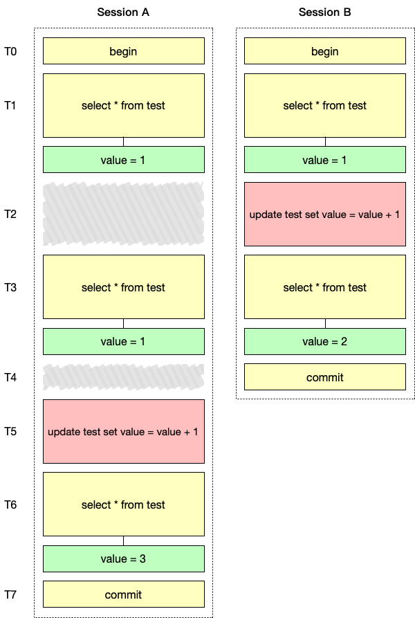

# MVCC

MVCC(Multi-Version Concurrency Control)中文名多版本并发控制。比如在Repeatable Read隔离级别下，一个事务中同一个查询语句无论执行多少次其结果都跟事务开始时的查询结果一致，这就是通过MVCC实现的。

在引入MVCC之前，只有多个读操作可以并发，读操作与写操作以及多个写操作之前都是阻塞的，MVCC的意义在于它使得读写操作可以并发执行，提升了并发性能，因此MVCC也称一致性非锁定读，因为当要读取的数据行上因为UPDATE或DELETE操作而被上锁时，读取操作不会等待锁释放。

## 原理

在聚簇索引中，对于每一行记录，MySQL会在其后面增加以下3列。


- `DB_TRX_ID`

事务ID。记录了最后一次对该行数据进行过修改的事务ID，修改操作包括增、删、改，其中删除操作会把改行标记为已删除，而不是直接物理删除。新建一个事务时事务ID会递增，因此`DB_TRX_ID`列也可以用来比较事务间的先后顺序。

- `DB_ROLL_PTR`

指向了undo日志中的一条记录。

当我们对表中数据进行更新时就会产生undo日志，它记录了当前操作的反向操作，比如当前是INSERT语句，那么undo日志中会记录一条DELETE语句，对于UPDATE语句则会记下更新前的旧值。如果对一行记录有多次修改，那么就会有多条undo日志。我们可以简单理解为undo日志存储了一行记录的历史版本，多条undo日志组成了一个版本链。


- `DB_ROW_ID`

行ID。当往表中插入新的记录时，如果表中没有指定主键或者非`null`的唯一键时，MySQL会生成单调递增的行号记录在`DB_ROW_ID`中，否则该列没有值。

### Read View

在Repeatable Read隔离级别下执行一个SELECT语句时，MySQL会先创建一个Read View，用于判断版本链中哪个版本对当前事务可见。

Read View有3个关键的属性。

- `m_ids`

在创建Read View时，当前系统中活跃的事务ID集合(活跃事务是指启动后还没有提交的事务)。

- `min_trx_id`

在创建Read View时，当前活跃事务中最小的事务ID，也就是m_ids中的最小值。

- `max_trx_id`

在创建Read View时，应该分配给下一个事务的事务ID。

- `creator_trx_id`

创建该Read View的事务的事务ID。

有个了Read View之后，只需要按照下面几个规则来判断一个版本是否对当前事务可见：

1. 如果版本的`trx_id`等于Read View的`creator_trx_id`，则版本对当前事务可见。
2. 如果版本的`trx_id`小于Read View的`min_trx_id`，说明版本对应的事务在生成Read View之前已经提交，因此版本对当前事务可见。
3. 如果版本的`trx_id`大于等于Read View的`max_trx_id`，说明版本对应的事务在生成Read View之后才开启，因此版本对当前事务不可见。
4. 如果版本的`trx_id`在Read View的`min_trx_id`和`max_trx_id`之间，则需要判断版本的`trx_id`是否在`m_ids`中，如果存在则说明版本对应的事务未提交，对当前事务不可见；反之则说明，版本对应的事务已提交，对当前事务可见。

## 隔离级别

**MVCC只适用于Repeatable Read和Read Committed这两个隔离级别**，它们的区别是：在Repeatable Read隔离级别下当执行第一个SELECT语句时才会创建Read View，而在Read Committed隔离级别下每次执行SELECT语句都会重新创建Read View。在这一点上Read Committed会消耗更多的资源。对于Read Uncommitted级别只需要每次读取最新的记录即可。

## 当前读

需要注意的是，只有普通的查询语句才遵循以上规则，当我们在事务中对数据进行更新时才会采用“当前读”的规则，看下面的例子。

我们首先创建一张表，并往里插入一条数据。

```sql
CREATE TABLE `test` (
  `id` int(11) NOT NULL AUTO_INCREMENT,
  `value` int(11) DEFAULT NULL,
  PRIMARY KEY (`id`)
)

INSERT INTO test (value) VALUES (1);

+----+-------+
| id | value |
+----+-------+
|  1 |     1 |
+----+-------+
```

我们开两个会话分别进行以下的操作。



可以看到在T2时刻Session B把`value`的值更新为2并提交了事务，随后Session A查询出的`value`的值依然是事务开始时的1，但是随后Session A也更新`value`的值，此时T6时刻却发现`value`的值是3而不是2，也就是说Session A读到了Session B提交的值，那是不是就违背了可重复度的规则呢？实际上更新数据采用了“当前读”的规则，更新操作基于记录的最新版本，而不是事务开始时的版本，此外，如果使用`SELECT FOR UPDATE`语句也会采用“当前读”的规则。

## 二级索引

上面讲的情况都是针对聚簇索引的，如果我们使用二级索引来执行查询语句，因为二级索引没有`trx_id`和`roll_pointer`列，因此步骤略有区别：

1. 二级索引页中有一个称为`PAGE_MAX_TRX_ID`的属性，记录修改该二级索引页的最大事务ID，当对该页进行增删改操作时就会更新该值。因此当执行查询语句时，我们先比较Read View的`min_trx_id`是否大于`PAGE_MAX_TRX_ID`，如果是，则表示页中所有的记录对当前事务都可见。
2. 如果不满组1，则需要进行回表操作，找到聚簇索引的版本链中对当前Read View可见的第一个版本，并判断版本中的二级索引中对应的列的值是否和查询语句中该列的值一致，如果不一致则跳过该记录。

## Purge

undo日志不会一直保留下去，实际上只要undo日志对应的事务完成了提交，并且不再有Read View访问他们，那么就可以清除掉。这一步骤称为purge。

> 此外，对于被打了删除标记的记录，如果没有Read View再需要访问他们，那么也可以彻底删除。

为了做到这一点，我们只要保证对于系统中最早的Read View，在它创建之前已经提交的事务的undo日志都可以清除（因为已经提交，只需要读取最新的记录即可）。
InnoDB定义了一个名为事务no的值，用来表示事务提交的顺序，no值越小表示提交的越早。此外InnoDB还把所有Read View按创建时间排序组成一个链表。当执行purge操作时，就把创建时间最早的Read View取出，然后把它的no值（创建Read View时，它的no值等于当前最大的事务no值加1）与undo日志的no值进行比较，如果undo日志的no值较小，那么就进行清除，如果undo日志包含对记录打上删除标记所产生的undo日志，那么需要将对应的记录也进行删除。

## 参考

1. [《MySQL-InnoDB-MVCC多版本并发控制》](https://segmentfault.com/a/1190000012650596)
2. [《Mysql InnoDB引擎逻辑存储与MVVC实现》](https://www.meiwen.com.cn/subject/mjpqyftx.html)
3. [《MySQL·引擎特性·InnoDB undo log漫游》](http://mysql.taobao.org/monthly/2015/04/01/)
4. [《InnoDB多版本(MVCC)实现简要分析》](http://hedengcheng.com/?p=148#_Toc322691905)
5. 《MySQL是怎样运行的》
