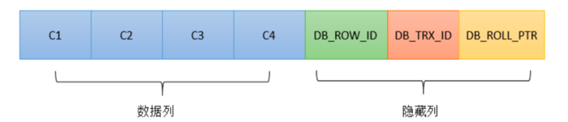

# MVCC

MVCC(Multi-Version Concurrency Control)中文名多版本并发控制。比如在Repeatable Read隔离级别下，一个事务中同一个查询语句无论执行多少次其结果都跟事务开始时的查询结果一致，这就是通过MVCC实现的。

在引入MVCC之前，只有多个读操作可以并发，读操作与写操作以及多个写操作之前都是阻塞的，MVCC的意义在于它使得读写操作可以并发执行，提升了并发性能，因此MVCC也称一致性非锁定读，因为当要读取的数据行上因为UPDATE或DELETE操作而被上锁时，读取操作不会等待锁释放。

## 原理

对于每一行数据，MySQL会在其后面增加以下3列。

- `DB_TRX_ID`

事务ID。记录了最后一次对该行数据进行过修改的事务ID，修改操作包括增、删、改，其中删除操作会把改行标记为已删除，而不是直接物理删除。新建一个事务时事务ID会递增，因此`DB_TRX_ID`列也可以用来比较事务间的先后顺序。

- `DB_ROLL_PTR`

指向了undo日志中的一条记录。

当我们对表中数据进行更新时就会产生undo日志，它记录了当前操作的反向操作，比如当前是INSERT语句，那么undo日志中会记录一条DELETE语句，对于UPDATE语句则会记下更新前的旧值。如果对一行记录有多次修改，那么就会有多条undo日志。我们可以简单理解为undo日志存储了一行记录的历史版本。

- `DB_ROW_ID`

行ID。当往表中插入新的记录时，如果表中没有指定主键或者非`null`的唯一键时，MySQL会生成单调递增的行号记录在`DB_ROW_ID`中，否则该列没有值。

### Read View

在Repeatable Read隔离级别下执行一个SELECT语句时，MySQL会先创建一个Read View，用于判断可见性（哪些数据对当前事务可见）。

Read View有3个关键的属性。

- `up_limit_id`

当前活跃事务中最小的事务ID。

- `low_limit_id`

未开启的事务ID，也就是当前最大事务ID加1。

- `trx_ids`

当前活跃的事务ID集合。

如果读取到的数据的`DB_TRX_ID`小于`up_limit_id`，说明数据在当前事务开始前已经提交了，因此对当前事务可见，比如`DB_TRX_ID`是5，当前活跃事务中最小的事务ID是6，说明事务5已经被提交了；如果读取到的数据的`DB_TRX_ID`大于等于`low_limit_id`，说明数据在当前事务开始前还没有提交，因此对当前事务不可见，比如当前活跃事务中最大的事务ID是10，`DB_TRX_ID`是11，说明数据是在当前事务开始之后才被提交的；如果读取到的数据的`DB_TRX_ID`在[`up_limit_id`，`low_limit_id`)区间内那么需要查询`trx_ids`集合中是否存在`DB_TRX_ID`，如果存在则表示在当前事务开始时，数据还没有被提交，因此对当前事务不可见，反之则说明数据已被提交，对当前事务可见。

如果数据不可见，那么需要通过`DB_ROLL_PTR`找到undo日志中对当前Read View可见的历史版本。

## 隔离级别

**MVCC只适用于Repeatable Read和Read Committed这两个隔离级别**，它们的区别是：在Repeatable Read隔离级别下当执行第一个SELECT语句时才会创建Read View，而在Read Committed隔离级别下每次执行SELECT语句都会重新创建Read View。在这一点上Read Committed会消耗更多的资源。

## 参考

1. [《MySQL-InnoDB-MVCC多版本并发控制》](https://segmentfault.com/a/1190000012650596)
2. [《Mysql InnoDB引擎逻辑存储与MVVC实现》](https://www.meiwen.com.cn/subject/mjpqyftx.html)
3. [《MySQL·引擎特性·InnoDB undo log漫游》](http://mysql.taobao.org/monthly/2015/04/01/)
4. [《InnoDB多版本(MVCC)实现简要分析》](http://hedengcheng.com/?p=148#_Toc322691905)
