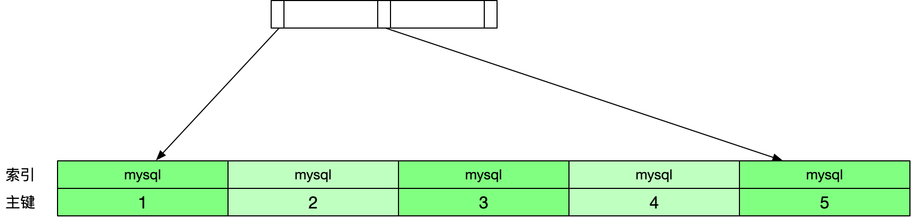
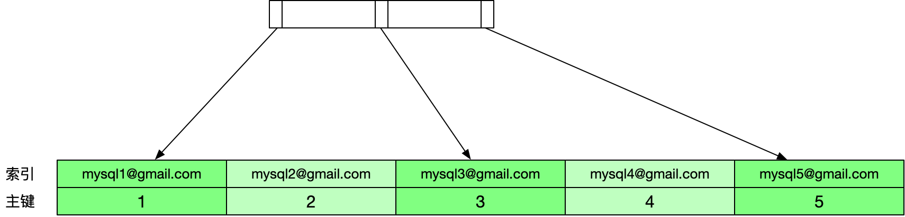

# 前缀索引

前缀索引由于只对字符串的前面若干个字符建立索引，因此可以减小索引文件的大小，但是倘若使用不当，则会影响查询效率，比如下面的例子。

首先创建一张用户表，包含自增主键`id`和`email`列，并且在`email`列上建立一个长度为5的索引。

```sql
CREATE TABLE `user` (
  `id` int(11) NOT NULL AUTO_INCREMENT,
  `email` varchar(30) DEFAULT NULL,
  PRIMARY KEY (`id`),
  KEY `user_email_index` (email(5))
)
```

然后插入几条数据。

```sql
INSERT INTO user (email) VALUES ('mysql1@gmail.com');
INSERT INTO user (email) VALUES ('mysql2@gmail.com');
INSERT INTO user (email) VALUES ('mysql3@gmail.com');
INSERT INTO user (email) VALUES ('mysql4@gmail.com');
INSERT INTO user (email) VALUES ('mysql5@gmail.com');

+----+------------------+
| id | email            |
+----+------------------+
|  1 | mysql1@gmail.com |
|  2 | mysql2@gmail.com |
|  3 | mysql3@gmail.com |
|  4 | mysql4@gmail.com |
|  5 | mysql5@gmail.com |
+----+------------------+
```

表中数据对应的索引数据如下图所示。



这时我们根据`email`列进行查询，MySQL的执行步骤如下。

```sql
SELECT * FROM user WHERE email = 'mysql5@gmail.com';
```

1. 目标值`mysql5@gmail.com`的前5个字符是`mysql`，因此MySQL从索引树上找到第一个索引值为`mysql`的节点。


2. 根据找到的节点上的主键回表查询，找到`id`为1的数据行，该行的`email`列的值为`mysql1@gmail.com`，不等于`mysql5@gmail.com`，丢弃该行记录。
3. 取索引树的下一个节点，索引值是`mysql`，`id`是2，回表查询`id`为2的数据行，对比`email`列的值，发现依然不等，同样丢弃该行记录。
4. 重复上面的步骤，直到最后一个索引值是`mysql`的节点，`id`是5，对应的`email`的值等于目标值，把该行记录加入到结果集中。
5. 取索引树的下一个节点，发现已经没有后续节点，查询结束。

可以看到上面的查询需要回表查询5次才能得到查询结果。

作为对比，如果使用完整的索引，索引树如下所示。



依然用上面的语句进行查询，这次MySQL的执行步骤如下。

```sql
SELECT * FROM user WHERE email = 'mysql5@gmail.com';
```

1. 找到索引树上满足索引值为`mysql5@gmail.com`的第一个节点。


2. 根据主键回表查询，判断该行的`email`列的值是否和目标值相等。这里`id`为5的数据行的`email`列的值为`mysql5@gmail.com`，和目标值相等，因此该行记录放入结果集中。
3. 取索引树上下一个节点，发现已经没有后续节点，查询结束。

可以看到当使用完整索引时只需1次回表查询就得到了最终的结果。

我们可以通过提高区分度的方法提升利用前缀索引进行查询时的效率。区分度是指不重复的数据占所有数据的百分比，范围是[0,1]，比如以下语句就可以计算出`email`列上索引的区分度。

```sql
SELECT COUNT(DISTINCT LEFT(email, 5)) / COUNT(*) FROM user;
```

由于`email`列中前5个字符均为`mysql`，因此区分度仅为0.2。为了提高区分度我们可以把索引的长度从5改为6，此时计算得到的区分度为1，我们可以用以下语句进行评估。

```sql
SELECT COUNT(DISTINCT LEFT(email, 6)) / COUNT(*) FROM user;
```

当索引的大小改为6后，MySQL在执行之前的查询语句时就会从索引书中找索引值为`mysql5`的节点，满足这一条件的节点只有1个，因此也只需要1次回表操作，这里不再展开。

需要注意的是使用前缀索引虽然可以减小索引文件的大小，但也会带来以下这些副作用。

1. 无法使用覆盖索引，因为索引只包含了部分数据。即使索引的部分已经包含了完整的数据，比如某列数据长度都不超过5，在该列上建立一个长度为10的索引，虽然索引长度足以包含所有的数据，但是此时MySQL依旧无法判断数据的完整性，因此仍然需要进行回表操作。
2. 不能在ORDER BY和GROUP BY语句中使用前缀索引。
