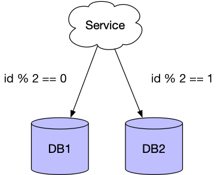
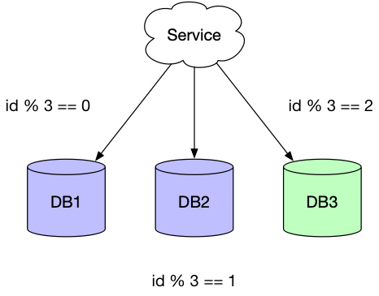
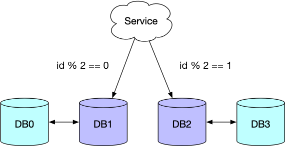
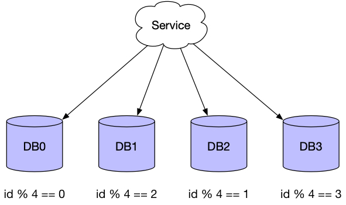
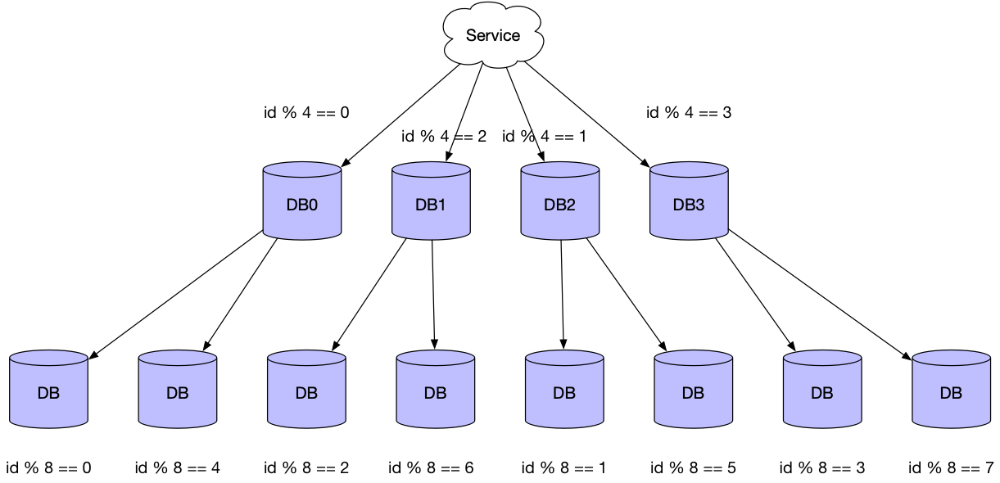
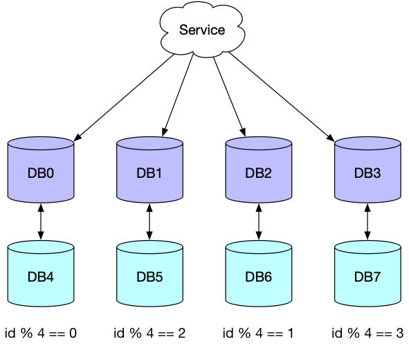

# 平滑扩容方案

## 基于主从的免迁移扩容方案

最常见的分库分表策略就是根据业务键进行取模运算，然后把数据存储到对应的库中，比如有2个库，根据用户ID对2进行取模可以把所有的数据分为两组，一组是id%2等于0，另一组是id%2等于1，如下图所示。

随着业务的发展，我们渐渐发现2个库已不足以支撑业务的需求，因此我们需要再增加一个数据库。

这个时候问题就来了，原来的策略是对2取模，现在变为对3取模，那么同样的一条数据就有可能需要迁移到其它的库中，比如用户ID是2的数据，原来在DB1中，现在需要迁移到DB3中。

为了避免大量数据的迁移，我们可以采取双倍扩容的方案，首先我们为每个主库配置一个从库。

当进行扩容时，将两个从库提升为主库，并修改服务的分片策略。原来id%2等于0的数据会被拆分为id%4等于0以及id%4等于2的两组数据，原来id%2等于1的数据会被拆分为id%4等于1以及id%4等于3的两组数据。

当然我们还可以继续扩容。

由于被拆分的数据来自一组主从库，因此每个库拥有相同的数据，当服务层的分片策略更新完成后，就可以取消主从数据库之前的同步，并清理各自的冗余数据，最后需要配置新的从库。

## 基于Snowflake的分片方案

## 参考

1. [《数据库分库分表（三）扩容无须数据迁移的分片算法》](https://www.jianshu.com/p/d296fa2bf61b)
2. [《水平分库如何做到平滑扩展》](http://database.51cto.com/art/201801/563567.htm)
3. [《数据库分库分表(sharding)系列(五) 一种支持自由规划无须数据迁移和修改路由代码的Sharding扩容方案》](https://blog.csdn.net/bluishglc/article/details/7970268)
