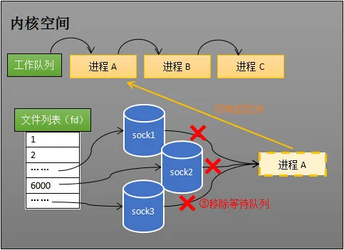

# epoll的实现原理

## 解决的问题

早期的socket处理方式如下面代码块所示，每来一个客户端连接就需要创建一个线程进行处理，当连接数较多时，例如：1000个连接需要1000个线程，就会占用比较多的系统资源：线程所需的内存空间开销以及线程上下文切换的时间开销。基于这种情况引入了select和epoll机制，只用一个线程处理多个socket连接，这种模型也被称为IO多路复用，这里的复用指复用同一个线程。

```c
ClientSocket socket = accept(ServerSocket);
new Thread(socket, function(){
    while(have data) {
        socket.read();
        socket.send('msg');
    }
    socket.close();
});
```

## 实现原理

为了更好的理解Epoll的工作原理，从以下几个视角理解Epoll的原理：

### 网卡接收数据

网卡收到从网线传输过来的数据，写入到内存中的某个地址上。


### 网卡通知操作系统

网卡把数据写入内存后，会向CPU发送一个中断信号，操作系统就能知道有新的数据到来，再通过网卡中断程序去处理数据。

通常硬件产生的信号（例如键盘信号、网卡信号、断电信号）优先级较高，需要CPU立刻回应，CPU会立刻中断掉正在执行的用户程序，完成对硬件的响应，重新执行用户程序。


### 操作系统进程调度

操作系统拥有对进程的调度能力，分时执行多个进程，由于切换速度比较快，看上去就好像同时执行多个进程。操作系统把进程状态分为运行、等待等几种状态。运行状态说明进程获得CPU的使用权，等待状态说明进程因为某种原因被阻塞，例如正在等待数据的到来。
运行中的进程会被放进操作系统的工作队列中，如下图所示。


其中进程A正在执行以下代码块。

```c
//创建socket
int s = socket(AF_INET, SOCK_STREAM, 0);   
//绑定
bind(s, ...)
//监听
listen(s, ...)
//接受客户端连接
int c = accept(s, ...)
//接收客户端数据
//阻塞直到收到数据才会继续执行
recv(c, ...);
//将数据打印出来
printf(...)
```

进程A首先创建了一个socket对象，该对象包含发送缓冲区、接收缓冲区、等待队列等字段。


进程A调用recv方法时，操作系统会把进程A从工作队列移动到socket的等待队列中。此时CPU依然会分时执行进程B和进程C，但不会执行进程A。进程A此时进入等待状态（也就是被阻塞），不再占用CPU资源。


当数据到来后，操作系统把该socket上等待队列中的进程重新放回工作队列中，此时进程恢复到运行状态，继续执行代码，即从recv方法恢复执行。

### 内核接收数据全过程


    1. 网卡从网线接收数据。
    2. 网卡将数据写入内存。
    3. 网卡通过中断信号通知CPU有数据到达。
    4. CPU执行中断程序，将数据写入到对应socket的接收缓冲区中。操作系统通过<源IP，源端口，目标IP，目标端口，通信协议>五元组确定一个socket对象。
    5. 操作系统唤醒进程，重新把进程放入工作队列中。


### 同时处理多个socket - select

在文章一开始提到可以通过一个线程一个socket的方式同时处理多个socket，只是不够高效，后来出现了select的方式。

select的用法如下所示：

```c
int s = socket(AF_INET, SOCK_STREAM, 0);  
bind(s, ...)
listen(s, ...)

int fds[] =  存放需要监听的socket

while(1){
    int n = select(..., fds, ...)
    for(int i=0; i < fds.count; i++){
        if(FD_ISSET(fds[i], ...)){
            //fds[i]的数据处理
        }
    }
}
```

处理流程：

1. 把所有要监视(监视是否有数据到来)的socket传给select方法。
2. 如果所有socket都没数据，那么select会一直阻塞，直到任意一个socket接收到数据。
3. select方法返回，进程被唤醒。
4. 用户判断是哪个socket收到了数据，然后进一步处理。

例如：进程A同时监视sock1、sock2、sock3三个socket，在调用select后操作系统会把进程A放入这三个socket的等待队列中。


当sock2收到数据后，会执行中断程序从而唤醒进程。


被唤醒的进程从所有socket的等待队列中移除并放回工作队列中。



select的缺点主要有：

1. 调用select时需要把进程加入所有监视的socket的等待队列中（一次遍历）。
2. 进程唤醒时需要从所有监视的socket的等待队列中将进程移除（二次遍历）。
3. 当select返回后，用户需要遍历socket检查是哪些socket收到了数据（三次遍历）。

可以看出select需要多次遍历才能完成整个处理流程，由于遍历操作开销大，因此select默认只能监视1024个socket。

### 同时处理多个socket - epoll

epoll对select的缺点进行了改进，其用法如下所示：

```c
int s = socket(AF_INET, SOCK_STREAM, 0);   
bind(s, ...)
listen(s, ...)

int epfd = epoll_create(...);
epoll_ctl(epfd, ...); //将所有需要监听的socket添加到epfd中

while(1){
    int n = epoll_wait(...)
    for(接收到数据的socket){
        //处理
    }
}
```

首先从用法上看，epoll将select方法的功能进行了拆分，将select的“放入等待队列”和“阻塞等待数据”拆成了epoll_ctl（放入等待队列）和epoll_wait（阻塞等待数据）方法。

当进程调用epoll_create方法时，操作系统会创建一个eventpoll对象。


通过epoll_ctl方法添加要监视的socket，操作系统会把前面创建的eventpoll对象加到这些socket的等待队列中。


当socket收到数据后，执行中断程序，把socket加到eventpoll对象的就绪列表中。当进程被唤醒时只要遍历就绪列表就知道哪些socket收到了数据，不必再遍历所有监视的socket。就绪队列的底层数据结构是双链表，以满足快速插入和删除socket引用的目的。


当执行epoll_wait时，如果就绪列表不为空则立刻返回，否则阻塞进程。

目前只描述了socket和epoll的关系，接下来再看和进程的关系。

当进程调用epoll_wait时会加入到eventpoll对象的等待队列中。


当socket接收到数据后，中断程序会把socket加入到eventpoll的就绪列表中，并唤醒eventpoll等待队列中的进程。


## 参考

1. [《I/O多路复用技术（multiplexing）是什么？》](https://www.zhihu.com/question/28594409)
2. [《如果这篇文章说不清epoll的本质，那就过来掐死我吧！》](https://zhuanlan.zhihu.com/p/63179839)
