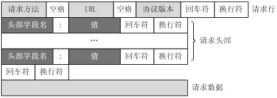

# HTTP

## 协议格式

一个典型的HTTP请求报文如下：

```bash
GET /blog/understanding-http-messages/ HTTP/1.1
Host: www.yaohaixiao.com
Connection: keep-alive
Upgrade-Insecure-Requests: 1
User-Agent: Mozilla/5.0 (Macintosh; Intel Mac OS X 10_15_7) AppleWebKit/537.36 (KHTML, like Gecko) Chrome/115.0.0.0 Safari/537.36
Accept: text/html,application/xhtml+xml,application/xml;q=0.9,image/avif,image/webp,image/apng,*/*;q=0.8,application/signed-exchange;v=b3;q=0.7
Referer: https://www.google.com.hk/
Accept-Encoding: gzip, deflate
Accept-Language: zh-CN,zh;q=0.9,en;q=0.8,ja;q=0.7
```

一个HTTP请求报文由以下几部分组成：

- 请求行（request line）：由请求方法（`GET`/`POST`等），URI（`/blog/understanding-http-messages/`）和协议版本（`HTTP/1.1`）组成。
- 请求头部（header）：包含各种K-V键值对。
- 空行：隔开请求头部和请求数据。
- 请求数据：报文主体，可以是任意数据或为空。



以上HTTP请求的响应报文如下：

```bash
HTTP/1.1 200 OK
Content-Type: image/x-icon
Last-Modified: Wed, 19 May 2021 06:08:08 GMT
Accept-Ranges: bytes
ETag: "c028c156754cd71:0"
X-Powered-By: SDWAF
Date: Mon, 24 Jul 2023 15:26:34 GMT
Content-Length: 1150
```

一个HTTP请求的响应报文由以下几部分组成：

- 状态行：由协议版本（`HTTP/1.1`）、状态码（`200`）和状态消息（`OK`）组成。
- 响应头：包含各种K-V键值对。
- 空行：隔开响应头和响应体。
- 响应体：响应报文主体，可以是任意数据或为空。

## 参考

1. [《HTTP协议格式详解》](https://www.jianshu.com/p/8fe93a14754c)
