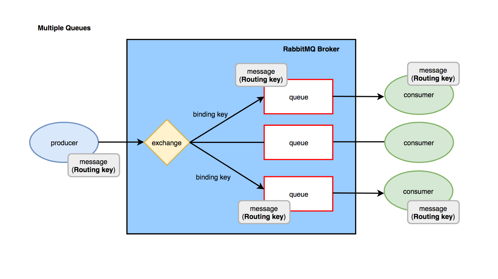
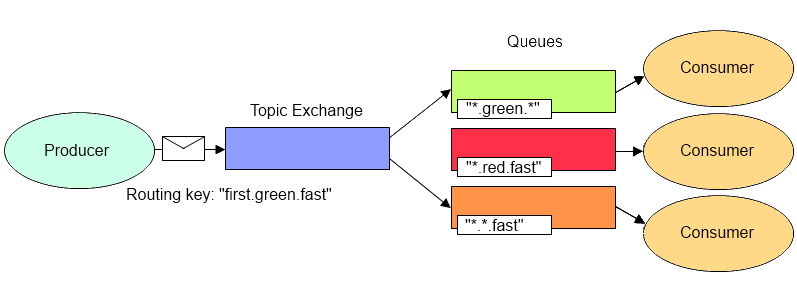

# Exchange

在RabbitMQ中，生产者不会直接把消息投递到队列中，而是先把消息交给一个Exchange（交换器），不同类型的Exchange会根据不同的规则把消息投递到对应的队列中。

通常，在创建队列时我们会通过Binding操作把队列和一个或多个Exchange进行绑定，并为每个绑定关系设置一个Binding Key，当生产者向Exchange发送消息时会指定一个Routing Key，最后，Exchange根据Routing Key和Binding Key按照一定的规则把消息投递到一个或多个队列中。

Exchange的类型主要有以下几种。

- **Direct**

Direct Exchange会把消息投递到Binding Key和Routing Key完全一致的队列中。

- **Fanout**

Fanout Exchange会把消息广播到所有和它绑定的队列中，完全忽略Binding Key和Routing Key。

- **Topic**

Topic Exchange在Direct Exchange的基础上支持通配符，它对于Binding Key和Routing Key有如下的约定。

1. Binding Key和Routing Key是由`.`分隔成多个单词的字符串，比如`com.rabbitmq.client`就包含了三个单词`com`、`rabbitmq`以及`client`。
2. Binding Key支持通配符`*`和`#`。通配符`*`匹配一个单词，比如`com.rabbitmq.*`可以匹配`com.rabbitmq.client`；通配符`#`匹配0个或多个单词，比如`com.#`可以匹配`com.rabbitmq.client`。

> 关于这三种类型的Exchange的使用，可以在[这里](https://github.com/pojozhang/playground/blob/master/solutions/java/src/test/java/playground/rabbitmq/ExchangeTest.java)查看示例代码。
