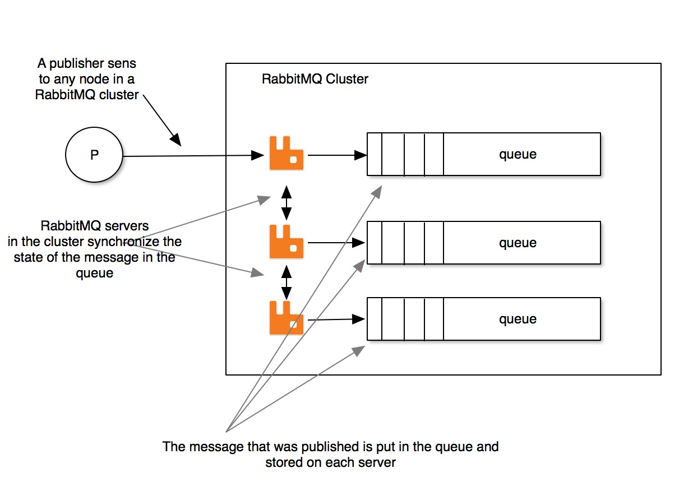

# 镜像队列

RabbitMQ的高可用一般通过镜像队列实现。在这种模式下，当你创建了一个队列，集群中的多个节点都会有该队列的一个**完整镜像**，也就是说多个节点拥有该队列的完整数据，消费者可以连接其中任意一个节点进行消费，当向队列中写入消息时RabbitMQ会自动同步到其它节点上。镜像节点的数量是允许配置的，可以是集群中的所有节点，也可以是指定数量的节点进行同步。

当一个队列有多个镜像节点时，最先声明该队列的节点成为Master节点，剩下的充当Slave节点，Master和Slave之间通过心跳检查连接是否断开。当一个Master节点宕机后，会从Slave节点中选举启动时间最长的节点作为新的Master节点接替它的工作（越早启动的节点和主节点之前的数据越一致），当之前的Master节点恢复后会成为新的Master节点的从节点。

当客户端向集群中的一个节点发送请求时，除了`publish`命令，其它的请求都会经过Master节点，如果当前接收请求的是Slave节点，它会转发给Master，从Master节点得到返回值后再返回给客户端。当客户端进行消费时，Master在把该消息从本机移除的同时还会向所有Slave发送广播，通知Slave完成相同的操作。

## 参考

1. [《RabbitMQ高可用之镜像队列》](https://juejin.im/post/5c2712afe51d45778a5ca4cd)
2. [《rabbitmq高可用-镜像队列模式》](https://www.opsdev.cn/post/rabbitmq-ha-mirror.html)
