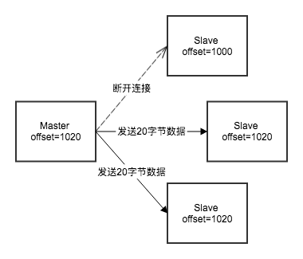

# 集群

## 复制模式（Replication）

复制功能是让一台Redis服务器复制另一台服务器，也就是Master-Slave模式，通常用于实现读写分离。该功能有两种实现，分别对应2.8版本之前的老版本，和2.8（包括）之后的新版本。

### 2.8版本之前的实现

复制功能分为同步和命令传播两个操作。

- 同步：将从服务器的数据库更新至主服务器当前所处的数据库状态，其步骤如下：
1. 从服务器发送`SYNC`命令。
2. 主服务器收到`SYNC`命令，执行`BGSAVE`在后台生成一个RDB文件，并用缓冲区记录从现在开始执行的所有写命令。
3. 当RDB文件准备好时，把该文件发送给从服务器。
4. 从服务器阻塞载入RDB文件（这段时间从服务器不能处理任何请求）。
5. 主服务器把缓冲区里的命令发送给从服务器

- 命令传播：主服务器把写命令传播到从服务器，使得主从服务器的数据库状态一致。比如当主服务器执行`DEL key`时，会异步的把该命令发送给从服务器，使两者状态最终一致。

缺点：如果从服务器中途短线，重连后需要重新执行一遍同步操作，效率较低（生产RDB文件需要耗费大量I/O、CPU资源）。

### 2.8及之后版本的实现

新版本使用`PSYNC`命令替代`SYNC`，该命令具有完整重同步和部分重同步两种模式。其中完整重同步的步骤跟旧版本的`SYNC`的命令类似不再赘述，下面主要讲部分重同步功能。

新版本的实现中，主从服务器分别维护一份复制偏移量，记录当前复制的进度。当主服务器向从服务器发送N个字节的数据时就把自己的偏移量加上N，当从服务器接收到N个字节的数据时就把自己的偏移量也加上N，如果主从服务器数据处于一致，那么它们的偏移量也是一致的。


如果从服务器出现了连接断开的状况，那么复制偏移量就会和主服务器不一致：



为了解决从服务器意外断开连接后能够快速恢复到跟主服务器一致的状态（之所以说快速是因为旧版本的实现效率太低，断开后需要全量同步），Redis使用了复制积压缓冲区来记录最近执行的写命令，以便在从服务器恢复连接后能通过缓冲区把丢失的写命令找回并发送到从服务器。该缓冲区是一个固定长度的先进先出队列，默认大小是1MB，当缓冲区大小不够时会将位于队首的元素抛弃，队列保存了一部分最近传播的写命令，每个字节的偏移量都会记录在内，其构造如图所示：


当从服务器断线重连后会发送自己的复制偏移量给主服务器，如果偏移量+1存在主服务器缓冲区中，那么主服务器会把这部分数据发送给从服务器；反之会执行完整重同步。

这里存在一个问题，从服务器重连后如何知道是否是之前的那台主服务器？
其实Redis在启动时会生成一个随机的服务器运行ID，当从服务器连接到主服务器后便会记下这个ID，下次连接时如果发现ID对不上就会执行完整重同步。

在命令传播阶段，从服务器默认每秒向服务器发送心跳，并带上自己的复制偏移量，如果主服务器超过1秒没有收到心跳，说明网络出现了问题。此外如果主服务器发送的写命令意外丢失，那么主服务器通过心跳返回的偏移量就可以知道主从服务器状态不一致，然后通过复制挤压缓冲区补发缺失的命令，使两者再次一致。

> Redis2.8版本之前没有这一机制，如果主服务器向从服务器发送的命令出现了丢失，两者都不会注意到。

## 哨兵模式（Sentinel）

上文介绍的复制功能可以把Master的读压力分散到其它Slave上，但是当Master发生故障后，需要手动把一台Slave提升为Master，客户端也很有可能需要修改连接地址如果你没有服务发现这样的基础设施的话，因为你不知道是哪一台Slave被提升为Master。
Redis提供了sentinel（哨兵）来解决以上问题。它会监控所有的Redis节点，并提供故障转移机智，是一种高可用解决方案。


### 初始化Sentinel

通过以下命令启动sentinel。

```bash
redis-sentinel /path/to/your/sentinel.config
//等价于
//redis-server /path/to/your/sentinel.config --sentinel
```

配置文件如下所示。

```bash
//sentinel.conf

//监控主服务器的名字为master1，地址是127.0.0.1，端口是6379
//判断实例为客观下线所需要的支持投票数是2
sentinel monitor master1 127.0.0.1 6379 2

//master1若在30000毫秒内无响应则判断为下线
sentinel down-after-milliseconds master1 30000

//master1发生故障后，它的从服务器同时只有1台能从新的master进行同步
sentinel parallel-syncs master1 1

//故障迁移超时时间900000毫秒
sentinel failover-timeout master1 900000
```

sentinel本质是一个特殊的Redis服务器，因此初始化过程可以看作是初始化一台普通的Redis服务器，但在某些方面会有所区别，比如它不会使用数据库因而不会载入RDB或AOF文件。哨兵只支持7种命令：`PING`、`SENTINEL`、`INFO`、`SUBSCRIBE`、`UNSUBSCRIBE`、`PSUBSCRIBE`、`PUNSUBSCRIBE`。

> sentinel的一些状态会持久化到配置文件中(sentinel.conf)，因此无需担心sentinel重启。

### 连接Master

初始化后sentinel会和每一个被监视的master创建两个连接，一个用于收发命令，一个用于订阅master的`__sentinel__:hello`频道。


连接建立后，sentinel会以10秒一次的频率向master发送`INFO`命令，通过返回值可以得到master的运行ID、角色（master/slave）以及所有slave（可以看作是服务发现）。

### 连接Slave

通过master发现了所有slave之后，sentinel会建立和slave的连接，同样是每个slave两个连接。连接建立后同样会以10秒一次的频率向slave发送`INFO`命令，并且得到运行ID、master地址、复制偏移量等信息。

### 连接Sentinel

上面提到sentinel会和master和slave保持两个连接，一个用于收发命令，一个用于发布订阅指定的频道。sentinel以2秒一次的频率通过第2个连接向所有监控的服务器发送以下格式的命令：

```bash
PUBLISH __sentinel__:hello "<sentinel_ip>,<sentinel_port>,<sentinel_runid>,<sentinel_epoch>,<master_name>,<master_ip>,<master_port>,<master_epoch>"
```

- 以sentinel开头的参数是sentinel本身的信息。
- 以master开头的参数是主服务器的信息，如果sentinel发送命令的对象是主服务器，那么就是该主服务器本身的信息；如果发送命令的对象是从服务器，那么就是该从服务器正在复制的主服务器的信息。

每一个sentinel既是`__sentinel__:hello`频道的发布者，同时也是订阅者。这种设计的作用是，当一个服务器被多个sentinel监控时，任意一个sentinel发送的消息都会被其它sentinel接收到。当其它sentinel接收到消息后就会发现新的sentinel，通过这种方式，每个sentinel都知道它监控的某个master还在被哪些sentinel监控。sentinel会和其它sentinel建立1个连接，最终，同一个master的所有sentinel互连。


### 判断下线

一个sentinel会以每秒1次的频率向所有建立连接的服务器发送`PING`命令，包括主从服务器和其它sentinel。如果在一段时间内（由配置的`down-after-milliseconds`指定）一直收到无效回复（有效回复有3种，`+PONG`、`-LOADING`、`-MASTERDOWN`，此外都是无效回复，没有回复也是无效回复）那么sentinel就会认为该实例已经下线，sentinel会将其标为主观下线`SDOWN`（Subjectively Down）。

> 同一个master被多个sentinel监控时，因为每个sentinel的主观下线时长可能配置了不同的值，因此不同的sentinel对于同一个master的下线状态可能有不同的判断。

当sentinel认为一个master已经下线后，它会询问该服务器的其它sentinel是否也认为该服务器已经下线，如果得到的确认数量超过了配置的`quorum`的值，sentinel就会把master标为客观下线`ODOWN`（Objectively Down）。

> sentinel仅会对master进行故障转移，如果是slave下线了，sentinel会把它标为SDOWN，并且不会询问其它的sentinel。

## 集群模式（Cluster）
