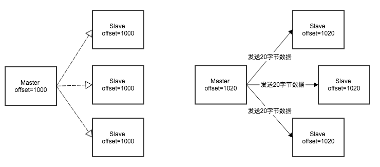
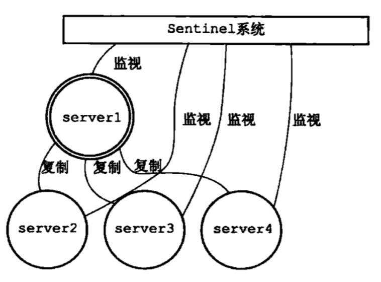
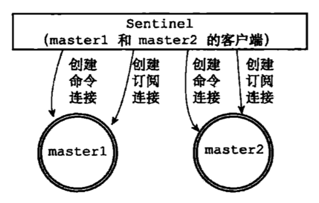
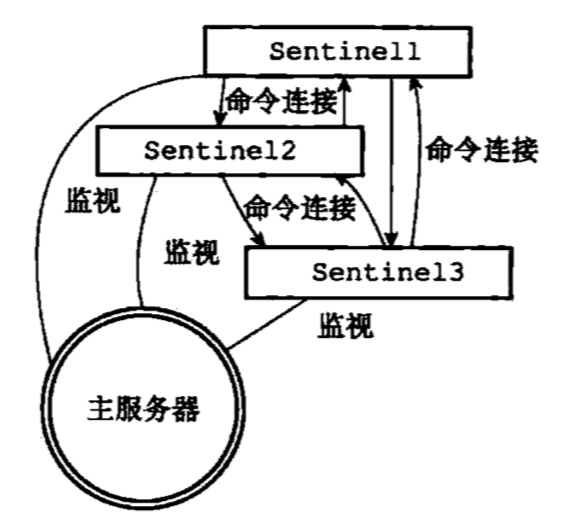
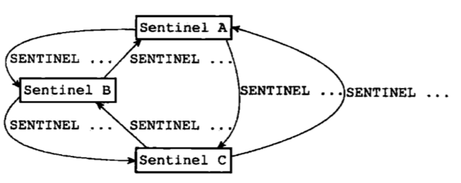

# 高可用

## 复制模式（Replication）

复制功能是让一台Redis服务器复制另一台服务器，也就是Master-Slave模式，通常用于实现读写分离。该功能有两种实现，分别对应2.8版本之前的老版本，和2.8（包括）之后的新版本。

### 2.8版本之前的实现

复制功能分为同步和命令传播两个操作。

- 同步：将从服务器的数据库更新至主服务器当前所处的数据库状态，其步骤如下：

1. 从服务器发送`SYNC`命令。
2. 主服务器收到`SYNC`命令，执行`BGSAVE`在后台生成一个RDB文件，并用缓冲区记录从现在开始执行的所有写命令。
3. 当RDB文件准备好时，把该文件发送给从服务器。
4. 从服务器阻塞载入RDB文件（这段时间从服务器不能处理任何请求）。
5. 主服务器把缓冲区里的命令发送给从服务器

- 命令传播：主服务器把写命令传播到从服务器，使得主从服务器的数据库状态一致。比如当主服务器执行`DEL key`时，会异步的把该命令发送给从服务器，使两者状态最终一致。

缺点：如果从服务器中途短线，重连后需要重新执行一遍同步操作，效率较低（生产RDB文件需要耗费大量I/O、CPU资源）。

### 2.8及之后版本的实现

新版本使用`PSYNC`命令替代`SYNC`，该命令具有完整重同步和部分重同步两种模式。其中完整重同步的步骤跟旧版本的`SYNC`的命令类似不再赘述，下面主要讲部分重同步功能。

新版本的实现中，主从服务器分别维护一份复制偏移量，记录当前复制的进度。当主服务器向从服务器发送N个字节的数据时就把自己的偏移量加上N，当从服务器接收到N个字节的数据时就把自己的偏移量也加上N，如果主从服务器数据处于一致，那么它们的偏移量也是一致的。



如果从服务器出现了连接断开的状况，那么复制偏移量就会和主服务器不一致：


为了解决从服务器意外断开连接后能够快速恢复到跟主服务器一致的状态（之所以说快速是因为旧版本的实现效率太低，断开后需要全量同步），Redis使用了复制积压缓冲区来记录最近执行的写命令，以便在从服务器恢复连接后能通过缓冲区把丢失的写命令找回并发送到从服务器。该缓冲区是一个固定长度的先进先出队列，默认大小是1MB，当缓冲区大小不够时会将位于队首的元素抛弃，队列保存了一部分最近传播的写命令，每个字节的偏移量都会记录在内，其构造如图所示：


当从服务器断线重连后会发送自己的复制偏移量给主服务器，如果偏移量+1存在主服务器缓冲区中，那么主服务器会把这部分数据发送给从服务器；反之会执行完整重同步。

这里存在一个问题，从服务器重连后如何知道是否是之前的那台主服务器？
其实Redis在启动时会生成一个随机的服务器运行ID，当从服务器连接到主服务器后便会记下这个ID，下次连接时如果发现ID对不上就会执行完整重同步。

在命令传播阶段，从服务器默认每秒向主服务器发送心跳，并带上自己的复制偏移量，如果主服务器超过1秒没有收到心跳，说明网络出现了问题。此外如果主服务器发送的写命令在传输时意外丢失，那么主服务器通过心跳返回的偏移量就可以知道主从服务器状态不一致，然后通过复制挤压缓冲区补发缺失的命令，使两者再次一致。

> Redis2.8版本之前没有这一机制，如果主服务器向从服务器发送的命令出现了丢失，两者都不会注意到。

## 哨兵模式（Sentinel）

上文介绍的复制功能可以把master的读压力分散到其它slave上，但是当master发生故障后，需要手动把一台slave提升为master，客户端也很有可能需要修改连接地址如果你没有服务发现这样的基础设施的话，因为你不知道是哪一台slave被提升为master。
Redis提供了sentinel（哨兵）来解决以上问题。它会监控所有的Redis节点，并提供故障转移机智，是一种高可用解决方案。



### 初始化Sentinel

通过以下命令启动sentinel。

```bash
redis-sentinel /path/to/your/sentinel.config
//等价于
//redis-server /path/to/your/sentinel.config --sentinel
```

配置文件如下所示。

```bash
//sentinel.conf

//监控主服务器的名字为master1，地址是127.0.0.1，端口是6379
//判断实例为客观下线所需要的支持投票数是2
sentinel monitor master1 127.0.0.1 6379 2

//master1若在30000毫秒内无响应则判断为下线
sentinel down-after-milliseconds master1 30000

//master1发生故障后，它的从服务器同时只有1台能从新的master进行同步
sentinel parallel-syncs master1 1

//故障迁移超时时间900000毫秒
sentinel failover-timeout master1 900000
```

sentinel本质是一个特殊的Redis服务器，因此初始化过程可以看作是初始化一台普通的Redis服务器，但在某些方面会有所区别，比如它不会使用数据库因而不会载入RDB或AOF文件。哨兵只支持7种命令：`PING`、`SENTINEL`、`INFO`、`SUBSCRIBE`、`UNSUBSCRIBE`、`PSUBSCRIBE`、`PUNSUBSCRIBE`。

> sentinel的一些状态会持久化到配置文件中(sentinel.conf)，因此无需担心sentinel重启。

### 连接Master

初始化后sentinel会和每一个被监视的master创建两个连接，一个用于收发命令，一个用于订阅master的`__sentinel__:hello`频道。



连接建立后，sentinel会以10秒一次的频率向master发送`INFO`命令，通过返回值可以得到master的运行ID、角色（master/slave）以及所有slave（可以看作是服务发现）。

### 连接Slave

通过master发现了所有slave之后，sentinel会和slave建立连接，同样是每个slave两个连接。连接建立后同样会以10秒一次的频率向slave发送`INFO`命令，并且得到运行ID、master地址、复制偏移量等信息。

### 连接Sentinel

上面提到sentinel会和master和slave保持两个连接，一个用于收发命令，一个用于发布订阅指定的频道。sentinel以2秒一次的频率通过第2个连接向所有监控的服务器发送以下格式的命令：

```bash
PUBLISH __sentinel__:hello "<sentinel_ip>,<sentinel_port>,<sentinel_runid>,<sentinel_epoch>,<master_name>,<master_ip>,<master_port>,<master_epoch>"
```

- 以sentinel开头的参数是sentinel本身的信息。
- 以master开头的参数是主服务器的信息，如果sentinel发送命令的对象是主服务器，那么就是该主服务器本身的信息；如果发送命令的对象是从服务器，那么就是该从服务器正在复制的主服务器的信息。

每一个sentinel既是`__sentinel__:hello`频道的发布者，同时也是订阅者。这种设计的作用是，当一个服务器被多个sentinel监控时，任意一个sentinel发送的消息都会被其它sentinel接收到。当其它sentinel接收到消息后就会发现新的sentinel，通过这种方式，每个sentinel都知道它监控的某个master还在被哪些sentinel监控。sentinel会和其它sentinel建立1个连接，最终，同一个master的所有sentinel互连。



### 判断下线

一个sentinel会以每秒1次的频率向所有建立连接的服务器发送`PING`命令，包括主从服务器和其它sentinel。如果在一段时间内（由配置的`down-after-milliseconds`指定）一直收到无效回复（有效回复有3种，`+PONG`、`-LOADING`、`-MASTERDOWN`，此外都是无效回复，没有回复也是无效回复）那么sentinel就会认为该实例已经下线，sentinel会将其标为主观下线`SDOWN`（Subjectively Down）。

> 同一个master被多个sentinel监控时，因为每个sentinel的主观下线时长可能配置了不同的值，因此不同的sentinel对于同一个master的下线状态可能有不同的判断。

当sentinel认为一个master已经下线后，它会询问该服务器的其它sentinel是否也认为该服务器已经下线，如果得到的确认数量超过了配置的`quorum`的值，sentinel就会把master标为客观下线`ODOWN`（Objectively Down）。

> sentinel仅会对master进行故障转移，如果是slave下线了，sentinel会把它标为SDOWN，并且不会询问其它的sentinel。

### Leader选举

当一个master被标为客观下线时，监视这个服务器的各个sentinel会协商选举出一个leader sentinel，由leader执行故障转移。

我们假设有3个sentinel组成哨兵系统，为了选出leader，3个sentinel再次向其它两个sentinel发送命令，要求对方把自己设为leader。如果接收到命令的sentinel还没有设置过leader的话就会把接收到的sentinel设置为leader并回复消息。收到回复的sentinel就可以知道有多少sentinel选举自己当leader，如果获得了半数以上（大于等于sentinel数量/2+1）的投票，那么就算选举成功。如果在给定时间内选举失败，那么会在一段时间后重新选举直到选出leader为止。



> Leader选举算法请参考Raft算法。

### 故障转移

leader会从下线主服务器的所有从服务器中选出一台并转换为主服务器，有以下几个筛选条件：

1. slave处于在线状态。
2. 最近5秒内回复过leader发出的`INFO`命令，以保证leader和该slave最近成功进行过通讯。
3. slave与已经下线的master连接断开时间不超过`down-after-milliseconds * 10`毫秒，以确保slave没有过早和master断开连接，其保存的数据是相对较新的。

筛选完成后，如果没有可用的slave那么就终止此次故障转移，否则leader会根据slave的优先级进行排序，选出优先级最高的slave。如果有多个slave优先级相同，那么选出复制偏移量最大的slave；如果多个slave复制偏移量相同，那么选出运行ID最小的slave。

> slave的优先级可以在配置文件中通过`slave-priority`属性进行修改，默认是100，**该值越低，优先级越高，而0是一个特数值，如果优先级设成0，那么节点永远不会当选master**。可以通过`INFO`命令查看slave的优先级。

slave被选中后，leader会向它发送`SLAVEOF no one`命令，同时以1秒1次的频率发送`INFO`命令，观察slave的角色从`slave`变成`master`。此时leader就知道该slave已经提升为master。如果这一步超时了，就终止此次故障转移。

下一步，leader向已下线master的其它slave发送`SLAVEOF`命令，让它们复制新的master。最后，当已下线的master重新上线后，leader会向它发送`SLAVEOF`命令让它成为新master的从服务器。

### 客户端处理流程

官方推荐的客户端处理流程如下。

1. 当客户端尝试连接到一个sentinel系统时，依次尝试连接sentinel实例，并发送`SENTINEL get-master-addr-by-name master-name`命令获得master信息，如果连接sentinel失败或sentinel返回的master信息为`null`，那么继续连接下一个sentinel，直到成功获取master信息。
2. 向master发送`ROLE`命令确认该实例是master，否则重复步骤1。
3. 客户端向sentinel订阅频道，当master被切换后可以收到新的master信息。
4. 如果有读写分离的需求，那么可以通过`SENTINEL slaves master-name`命令获取slave列表。

## 集群模式（Cluster）

相比上文提到的哨兵模式，集群模式主要提供了数据分片的功能，因为一台服务器总有物理容量的限制。分片功能支持把数据分散的存储在多台实例上，突破了单个节点的物理限制。

### 握手

建立集群的第一步是握手，通过以下命令让远程实例加入当前实例所在的集群。

```bash
CLUSTER MEET <ip> <port>

# 当前实例 127.0.0.1 6379
# CLUSTER MEET 127.0.0.1 6380
# CLUSTER MEET 127.0.0.1 6381
# 以上三个节点形成集群
```

当实例A向实例B发送`MEET`消息并握手成功后，A会把B的信息以Gossip协议传播给集群中的其它节点，最终所有节点都会知道B的存在。

### 槽

集群模式下，整个数据库被划分为16384个槽，每个键占用其中的一个槽，每个节点分配0个或多个槽。**只有当所有的槽都有节点在处理时，集群才处于上线状态。**因此虽然使用`CLUSTER MEET`命令建立了集群，但此时集群仍然处于下线状态。

我们可以使用以下命令分配槽。

```bash
CLUSTER ADDSLOTS <slot>
# 分配0-5槽
# CLUSTER ADDSLOTS 0 1 2 3 4 5
```

> 以上命令只分配了6个槽，可以配合shell脚本分配全部的16384个槽。**这里推荐使用redis-trib工具自动建立集群并分配槽。**

每个Redis节点除了记录自己处理的槽外也会记录分配给其它节点的槽，在`CLUSTER ADDSLOTS`命令执行完毕后，节点会把自己拥有的槽的信息发送给其它的节点。

### 键

集群模式下，每个键都归属于一个槽，一个槽可以对应多个键。Redis使用CRC16算法将键映射到一个槽，算法如下：

```cpp
CRC16(key) & 16383
```

可以通过以下命令查看键所属的槽：

```bash
CLUSTER KEYSLOT <key>
```

当节点计算出键属于哪个槽后，它会检查键所在的槽是不是自己负责处理，如果是，那么就执行客户端发来的命令；否则，节点会查找处理该槽的节点并向客户端返回`MOVED`错误指引它转向正确的节点。

```bash
MOVED <slot> <ip>:<port>
```

客户端收到`MOVED`错误后会根据ip和端口信息转向目标节点并重新发送命令。

> 客户端也区分集群模式和单机模式。单机模式会直接打印出`MOVED`错误而不会重定向。集群模式需要加上`-c`参数。

### 数据库

集群模式和单机模式下的数据库一个重要的区别是：**集群模式只能使用0号数据库**。

集群模式下的键值对以及过期时间的存储和普通模式下的一样。除此之外集群模式下的节点会用一个跳跃表存储槽和键的关系，用于对某些槽的键进行批量操作。跳跃表里的分值就是槽号，值就是键。下面是一个例子：


### 重新分片

当新增或移除节点时，需要对集群进行重新分片。我们使用`redis-trib`工具对集群进行在线重新分片操作，其主要步骤是：

1. 向目标节点发送`CLUSTER SETSLOT <slot> IMPORTING <source_id>`命令，让其做好准备。
2. 向源节点发送`CLUSTER SETSLOT <slot> MIGRATING <target_id>`命令，让其做好迁移的准备。
3. 向源节点发送`CLUSTER GETKEYSINSLOT <slot> <count>`命令，获得最多count个位于slot槽的键。
4. 对于步骤3中返回的每一个键，向源节点发送一个`MIGRATE <target_ip> <target_port> <key_name> 0 <timeout>`命令将选中的键原子地迁移到目标节点。
5. 重复步骤3和4直到所有的键都已被迁移。
6. 向集群中任意一个节点发送`CLUSTER SETSLOT <slot> NODE <target_id>`命令，将slot指派给目标节点，这一消息随后会发送到所有的节点。
7. 如果有多个slot需要迁移，那么继续对剩下的slot进行上面的操作。

### ASK

在迁移过程中，当客户端访问源节点数据库的某个键时，源节点会先在自己的数据库中查找，如果没有找到则检查该键所属槽的迁移状态。如果发现该键所属的槽正在迁移，那么它会向客户端返回`ASK <target_ip>:<target:port>`指引向目标节点。客户端收到`ASK`命令后会向目标节点发送`ASKING`消息然后再重新执行之前发给源节点的命令。

`ASKING`命令的用处是打开客户端的`REDIS_ASKING`标志以让目标节点强制执行命令。如果按正常流程，此时槽还没有完成迁移，仍旧属于源节点，所以如果不打开特殊标志，目标节点会返回`MOVED`错误。

> 当命令执行完毕后，`REDIS_ASKING`标志会被移除。这是一个一次性的标志，如果下一次客户端访问时迁移仍未完成，那么仍旧会出现上面`ASK`的流程。

### 复制

集群模式下节点也分为主节点和从节点，从节点复制主节点并在主节点下线时接替它继续处理请求。

通过向节点发送`CLUSTER REPLICATE <master_id>`让接收命令的节点成为主节点的从节点，然后执行复制，这部分逻辑和单机模式下是一样的。节点间的复制关系会通过Gossip协议发送给集群中的其它节点，最后所有节点都会了解到其它节点间的复制关系。

### 故障转移

节点之间会定期向集群中其它节点发送`PING`消息检测在线状态，如果对方在一定时间内没有回复`PONG`消息，那么节点就会把对方标为疑似下线状态。各个节点之间会通过Gossip协议交换节点状态，当某个主节点收到其它主节点发来的下线报告时，会把该报告存在一个链表中。如果在下线报告链表中有半数以上的主节点都认为某个主节点疑似下线，那么就把它标记为已下线，并向集群广播一条`FAIL`的消息，收到该消息的节点也立刻把该节点标记为已下线。

当下线主节点的一个从节点收到`FAIL`消息后就开始对下线主节点进行故障转移，步骤如下：

1. 从节点会向集群广播一条`CLUSTERMSG_TYPE_FAILOVER_AUTH_REQUEST`的消息，要求所有收到消息并有投票权（**集群中负责处理slots的主节点才有投票权**）的主节点向该从节点投票。
2. 主节点收到投票请求后，如果尚未投票给其它节点，那么返回一条`CLUSTERMSG_TYPE_FAILOVER_AUTH_ACK`消息表示投支持票。
3. 如果获得半数以上主节点的支持票，那么从节点就当选为leader。
4. leader节点执行`SLAVEOF no one`命令成为新的主节点，然后撤销所有对已下线主节点的slot，并把这些slot指派给自己。
5. 新的主节点向集群广播一条`PONG`消息，让其它节点意识它已经成为了主节点，并接管了下线节点处理的slot。下线主节点的其它从节点会改为复制新的主节点。
6. 下线的主节点重新上线后会成为新主节点的从节点。

### 客户端处理流程

假设客户端执行`GET key`命令，它将会执行以下几个步骤。

1. 客户端在初始化时会配置一些节点的信息，这些节点被称为种子节点。

```java
RedisURI node1 = RedisURI.create("node1", 6379);
RedisURI node2 = RedisURI.create("node2", 6379);
RedisClusterClient clusterClient = RedisClusterClient.create(Arrays.asList(node1, node2));
```

2. 客户端会计算键`key`所在的槽，假设键`key`属于槽1000。
3. 如果客户端已经缓存了槽1000所在的节点的信息，那么客户端就可以直接向该节点发起请求，否则需要向种子节点询问当前集群槽的分布状态。
4. 客户端向槽1000所在的节点发送请求。
5. 对可能存在的`MOVED`以及`ASK`错误进行进一步处理。

### 例子

#### 快速搭建集群

Linux上可以使用docker快速搭建一个有三个master节点的集群。

```bash
# 以下脚本须在linux中执行
# 因为docker的host模式问题，mac下需要安装linux虚拟机下面的脚本才能正常执行

# 创建3个redis-server
docker run --name redis1 --net=host -itd redis redis-server --port 6379 --cluster-enabled yes --cluster-node-timeout 60000
docker run --name redis2 --net=host -itd redis redis-server --port 6380 --cluster-enabled yes --cluster-node-timeout 60000
docker run --name redis3 --net=host -itd redis redis-server --port 6381 --cluster-enabled yes --cluster-node-timeout 60000

# 使用redis-trib工具启动集群
docker run --rm --net=host -it zvelo/redis-trib create  127.0.0.1:6379 127.0.0.1:6380 127.0.0.1:6381
```

#### 重新分片

```bash
# 新增1个redis节点
docker run --name redis4 --net=host -itd redis redis-server --port 6382 --cluster-enabled yes --cluster-node-timeout 60000

# 使用redis-trib把新的节点加入到集群中
docker run --rm --net=host -it zvelo/redis-trib add-node  127.0.0.1:6382 127.0.0.1:6369

# 重新分片，分配1000个slot到新的节点上
# --from可以指定节点，为了均匀分配，可以使用all，从所有旧的节点上平均的取出一部分slot迁移到新的节点上
# --slots指定本次迁到新节点的slot数量
docker run --rm --net=host -it zvelo/redis-trib reshard --from all --to <new_node_id>  --slots 1000 --yes 127.0.0.1:6379
```
