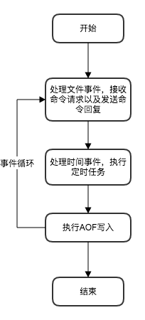

# 持久化策略

Redis有两种持久化策略，分别是RDB和AOF。RDB是对所有数据的快照，AOF则是记录了所有的写入命令。

## RDB

我们可以使用`SAVE`或者`BGSAVE`命令创建RDB文件，两者的区别是`SAVE`命令由服务器进程执行，执行时会阻塞进程，在此期间Redis会阻塞来自客户端的请求，直到RDB文件创建完毕；`BGSAVE`命令则由子进程执行，执行完毕后会通知服务器进程，因此不会阻塞客户端的请求。

处了上述两个命令之外，我们还可以通过配置来让Redis自动创建RDB文件，其本质是自动执行`BGSAVE`命令。

```bash
#自动执行BGSAVE命令的默认配置
save 900 1
save 300 10
save 60 10000
```

如果你进行了上面的配置，那么只要满足下面三个条件的任意一个，服务器就会执行`BGSAVE`命令：

- 900秒内数据库进行了至少1次修改。
- 300秒内数据库进行了至少10次修改。
- 60秒内数据库进行了至少10000次修改。

## AOF

当执行完一个写命令后，服务器会把命令以协议格式追加到AOF缓冲区的末尾，在每一个事件循环结束前会将AOF缓冲区中的内容写到AOF文件。



但是写入文件不代表写入磁盘，现代操作系统中为提高效率，通常在写文件时会把数据写入内存缓冲区，等到缓冲区满时或者超过一定时间后才会真正写入磁盘，这一操作称为同步。

虽然每次事件循环都会写入AOF文件，但是并不是每次都会执行同步操作，Redis提供了`appendfsync`配置项，有以下3个选项：

- `always`：每一次事件循环都进行同步。
- `everysec`：每隔一秒进行同步。
- `no`：由操作系统决定是否同步。

在用AOF还原数据时，Redis会创建一个没有网络连接的伪客户端，依次执行AOF文件中的命令，执行完毕后数据库就恢复了之前的状态。

### AOF重写

如果AOF文件中存储的命令不断增长下去，那么AOF文件会越来越大，载入时间会越来越长。Redis提供了一种重写AOF文件的方法，可以把多条命令合并成一条（或几条）生成一个新的AOF文件，并替换原文件。

```bash
RPUSH list "A" "B"
RPUSH list "C"
RPUSH list "D" "E"
LPOP list
LPOP list
RPUSH list "F" "G"
```

上面的5条语句经过重写后可以合并成下面一行命令：

```bash
RPUSH list "C" "D" "E" "F" "G"
```

Redis通过读取数据库当前键值对的方式进行AOF文件重写，而不是分析原来的AOF文件。
重写过程中会产生大量的写操作，为了不阻塞进程，Redis在子进程中进行重写工作。这样导致的一个问题是，当AOF重写正在进行时，可能会有新的命令被服务器执行，导致新的AOF文件和数据库状态不一致。Redis的解决方法是：除了AOF缓冲区外再增加一个AOF重写缓冲区，这个缓冲区只在开启子进程后使用，服务器把执行的写命令同时追加到这两个缓冲区的末尾，当子进程完成重写后通知服务器进程，服务器把重写缓冲区中的内容全部写入新的AOF文件，然后原子地替换原来的AOF文件。

## 如何选择

RDB的优点是备份文件大小相比AOF较小，数据恢复较快；缺点是数据的备份周期较长，一但Redis宕机，那么可能会丢失较多的数据。

AOF的优点是数据备份的频率高，一但Redis宕机，也只有少部分数据可能丢失；缺点是因为备份的频率高，经常要写磁盘，从而导致会损失一些性能。

通常情况下会同时开启RDB和AOF，当需要恢复数据时优先用AOF恢复数据，因为它丢失数据的风险低，如果AOF文件损坏那么可以用RDB进行恢复。
