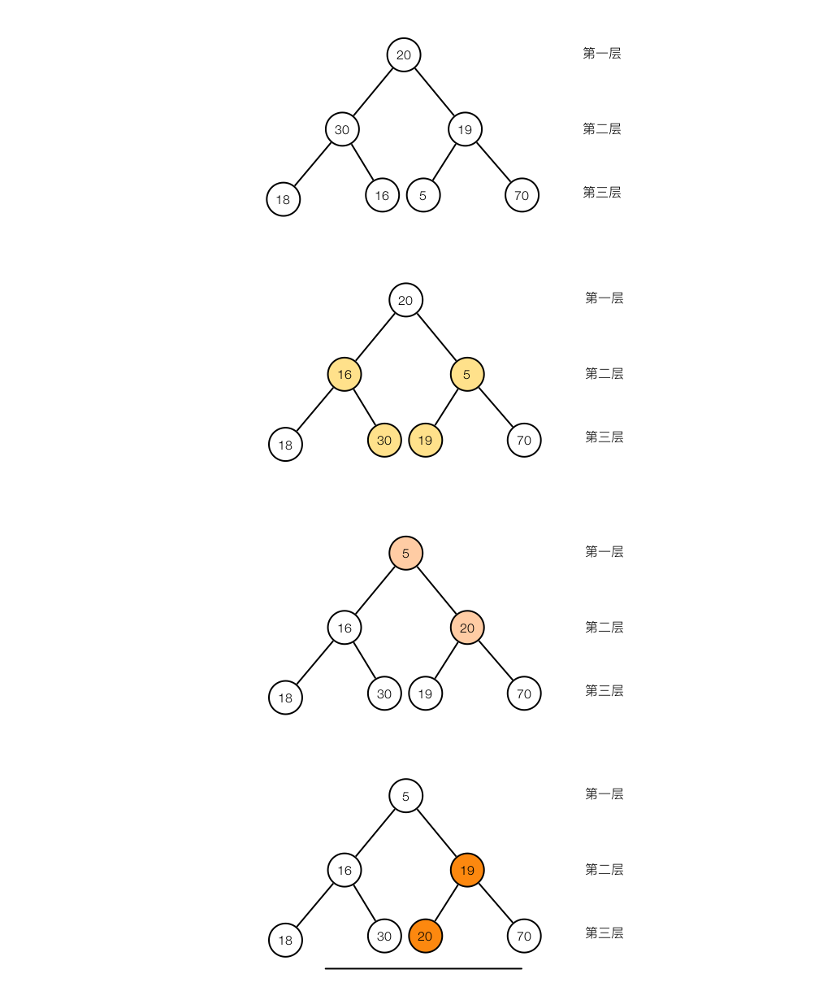

# 堆

## 建堆

建堆的过程是从最后一个非叶子节点开始向前遍历，对于每个节点从上而下进行堆化。以小顶堆为例，堆化就是从当前遍历的节点（当前节点可以看作父节点）及其两个子节点中找出最小的元素，把父节点和最小的元素所在的子节点进行交换，然后递归的对交换后的子节点进行堆化。伪代码如下所示。

```java
for (int i = (array.length / 2) - 1; i >= 0; i--) {
    heapify(array, i);
}
```

堆化（即`heapify()`方法）是一个递归的过程，这是因为在初始建堆时数据都是乱的，当把父节点和子节点交换后可能破坏堆的定义，需要再次调整，可以看下面这个例子。



## 应用场景

- [堆排序](https://github.com/pojozhang/playground/blob/master/problems/algorithm/heap-sort.md)。
- 优先级队列。
- 求最大或最小的K个数。
- 求中位数。

## 实现

- [Java](https://github.com/pojozhang/playground/blob/master/solutions/java/src/main/java/playground/structure/Heap.java)
